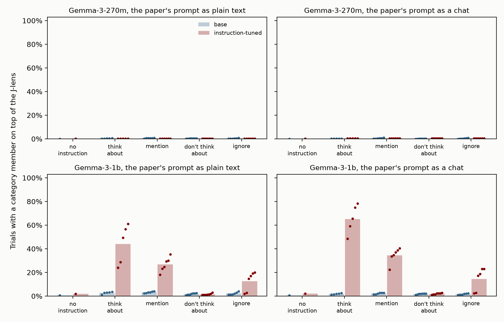
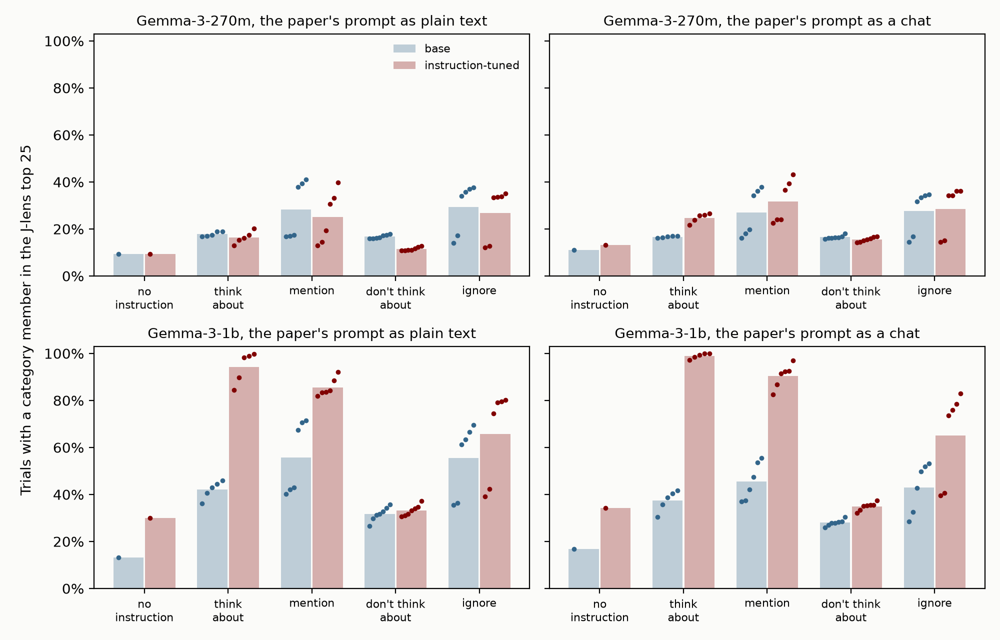

# Directed modulation in Gemma 3: base against instruction-tuned

Written 2026-10-03. This follows `post/DM_SETUP.md`: the same task, materials, prompt and score, run on Gemma-3-270m and Gemma-3-1b, each as the base model and its instruction-tuned version. Every model is read with its own Neuronpedia J-lens. The numbers come from `python post/figures/dm_gemma.py 270m` and `... 1b`, and the figures from `post/figures/dm_gemma_fig.py`.

## In short

- **The question.** GPT-2 (a base model) fails directed modulation, and Qwen3.5-0.8B (instruction-tuned) gets the direction right. But the two differ in everything else too. Gemma 3 has a base and an instruction-tuned checkpoint at each of two sizes, with a lens for all four. So the comparison holds size, architecture, pretraining, tokenizer and prompt fixed, and leaves post-training as the difference.
- **At 1b, post-training turns it on.** On the same tokens, a category member is on top of the J-lens on 2% to 3% of "think about" trials in the base model and 44% to 65% in the instruction-tuned one:

| categories, hit rate | no instruction | think about | mention | don't think about | ignore |
|---|---|---|---|---|---|
| Gemma-3-1b, plain text | 0.7% | 2.8% | 3.2% | 1.8% | 2.2% |
| Gemma-3-1b-it, plain text | 1.8% | 44.0% | 26.8% | 1.6% | 12.6% |
| Gemma-3-1b, chat | 0.7% | 1.9% | 2.2% | 1.8% | 1.7% |
| Gemma-3-1b-it, chat | 2.0% | **65.2%** | 34.5% | 2.0% | 14.5% |
| Gemma-3-270m (all four) | 0.0% to 0.2% | 0.2% to 0.5% | 0.2% to 0.6% | 0.2% to 0.5% | 0.2% to 0.5% |
| Qwen3.5-0.8B, chat (DM_SETUP) | 0.7% | 22.6% | 15.8% | 0.8% | 4.2% |
| Claude (Haiku, Sonnet, Opus 4.5) | 1.6%, 1.4%, 1.6% | 93%, 95%, 97% | 66%, 86%, 87% | 65%, 86%, 83% | 21%, 52%, 47% |

- **Gemma-3-1b-it shows every part of the pattern except the white bear.** "Think about" beats a bare mention on 92% to 97% of (category, sentence) pairs, and in the chat frame each of the five "think about" phrasings beats each of the six mentions. "Ignore" sits in between. "Don't think about" is at the no-instruction rate, as in Qwen; in Claude it is at the mention rate.
- **The base models look like GPT-2, at both sizes.** Mentioning the category raises it further down the lens, but what the instruction asks doesn't matter. The phrasings that open with the category's name rank it highest, whatever they say, and "think about" loses to a bare mention.
- **At 270m, neither model does it.** Post-training tilts the ranks the right way: "think about" moves up toward a mention, and "don't think about" falls close to the no-instruction level. But nothing reaches the top of the lens.
- **So in this family, post-training is necessary but not sufficient.** No base model shows directed modulation. The instruction-tuned one shows it at 1b and not at 270m.
- **Gemma's residual stream is as odd as expected, but that doesn't touch this test.** Five of 640 dimensions hold 75% to 98% of the residual's squared norm. This test only reads the lens, and the lens's ranks are a linear function of the residual: the final RMSNorm only rescales each vector. So the rogue dimensions can add at most a fixed bias over the vocabulary at each layer. The centered-readout control removes that bias (section 4.7).
- **The effect is in the model, not its lens.** Read with the base model's lens, Gemma-3-1b-it still has a member on top on 65.2% of "think about" trials. The base model read with the instruction-tuned lens still shows nothing. At 270m, centering the readout to remove the rogue dimensions' bias changes no conclusion (section 4.7; the 1b run was paused).
- **Part of the effect is the model wanting to say the word.** Left to reply by itself, 1b-it writes something other than the sentence on 51 of 66 "think about" trials, mostly by bringing the category in ("Sunday, Monday, Tuesday…", or the sentence followed by "Mars glows a faint orange."). Counting only tokens where it isn't about to write a member, "think about" is 28.5%, a mention 16.4%, and no instruction 2.0% (section 4.5).
- **A detail for the post.** At this score, the small models' "hits" in the base models and at 270m are almost all a few (category, sentence) pairs where the sentence itself evokes a member, like "The sun is shining brightly today in town." with weather. GPT-2's 0.5% in every condition is this: 48 of its 50 hits under an instruction are two pairs (section 4.6).



*Each panel is one model size and one prompt frame, with the base model (blue) and the instruction-tuned one (red) on the same tokens. Bars are the mean over a condition's phrasings, and dots are single phrasings. Categories, the paper's score over the paper's band.*

## 1. Why these models

The earlier runs compared GPT-2 small (124M, base) with Qwen3.5-0.8B (instruction-tuned). Instruction tuning is one difference between them, but so are size, architecture, training data and tokenizer, and the prompt has to differ too (GPT-2 has no chat format). Fitting a lens to someone's post-trained GPT-2 was the other option. Instead we use pairs that Neuronpedia has already fit lenses for:

| model | checkpoint | layers | width | lens (Neuronpedia, Anthropic's code, WikiText-103) |
|---|---|---|---|---|
| Gemma-3-270m | `google/gemma-3-270m` | 18 | 640 | 302 prompts, layers 0 to 16 |
| Gemma-3-270m-it | `google/gemma-3-270m-it` | 18 | 640 | 278 prompts, layers 0 to 16 |
| Gemma-3-1b | `google/gemma-3-1b-pt` | 26 | 1152 | 467 prompts, layers 0 to 24 |
| Gemma-3-1b-it | `google/gemma-3-1b-it` | 26 | 1152 | 460 prompts, layers 0 to 24 |

- Google's repos are gated and the stored HF token had expired, so the weights come from unsloth's ungated mirrors (`unsloth/gemma-3-270m`, and so on). Their `model.safetensors` has the same sha256 as Google's for all four. Unsloth changes the config's pad and eos ids and the chat template's comments; neither matters here, since we build the chat format ourselves and never pad.
- Every lens was fit the same way (bf16, 128-token WikiText passages, the same stopping rule), each on its own model.
- The paper's own base-against-post-trained comparison (its Fig. 46) uses only "think about" and "don't think about". There the concept reaches the lens top 5 in nearly every trial in both of its models. Its base model is never given the other conditions, so the paper doesn't say whether its base model's lens follows the direction of an instruction.

## 2. Setup

Everything is as in `DM_SETUP.md` section 2 except what this table lists. The code is `jl/control.py` (class `Gemma`, and `--model gemma-270m`, `gemma-270m-it`, `gemma-1b`, `gemma-1b-it`).

| knob | GPT-2 / Qwen (DM_SETUP) | Gemma 3 |
|---|---|---|
| Prompt | GPT-2: the paper's prompt as plain text (`human`). Qwen: the paper's user turn in its chat template (`paper`). | **Both, for every model.** `human`: `\n\nHuman: Write "{sentence}" {instruction} Don't write anything else.\n\nAssistant: {sentence}`. `paper`: `<start_of_turn>user\nWrite "{sentence}" {instruction} Don't write anything else.<end_of_turn>\n<start_of_turn>model\n{sentence}`. So within a frame, base and instruction-tuned models see exactly the same tokens. |
| Chat format | Qwen's template, thinking off | Gemma's turn format, written out by hand (the base checkpoint's tokenizer has no template). It matches what the instruction-tuned tokenizer's template produces. |
| BOS | GPT-2: `<|endoftext|>` prepended. Qwen: none. | `<bos>` prepended to every prompt, in both frames. Gemma needs it, and the lens was fit with it. |
| Band | GPT-2 7 to 9, Qwen 15 to 22 (our choices) | **The paper's band in depth**, 38% to 92%: layers 7 to 15 (270m) and 10 to 23 (1b). We had no structural reason to pick another. Every layer is kept, so other bands can be scored after the fact (section 4.4). |
| Tracked tokens | Single-token forms of each member. GPT-2 drops 5 members, Qwen 6. | The same rule. 550 tokens, no member dropped (Gemma's vocabulary has 262,144 tokens). |
| Families | categories and math | 270m: categories and math. 1b: **categories only**. A 1b trial takes 3 to 4 times as long as a 270m one, and no Gemma model got any math hits at 270m (section 4.8). |
| Sentences, phrasings | 20 and all 26 | the same |
| Trials | | 23,960 per model and frame at 270m (11,000 categories), 11,000 at 1b |

## 3. Gemma's oddities, and what we checked

### The residual stream

You expected rogue dimensions, and they are there, in both models of the pair:

- At tokens other than `<bos>`, the five largest of 640 dimensions hold 75% to 98% of the squared norm at every layer of Gemma-3-270m (64% at the last layer of the instruction-tuned model). Dimension 163 is the largest from layer 5 on, and dimension 400 before that. The same dimensions dominate in the base and the instruction-tuned model.
- `<bos>` has a norm of 3,000 at layer 0, rising to about 100,000 at layers 13 to 15. Other tokens have 120 at layer 0, rising to 20,000 to 37,000 at layers 16 and 17. We never read the lens at `<bos>`.

Why this doesn't touch directed modulation:

- The test only reads the lens: lens_L(h) = W_U · RMSNorm(J_L h). Gemma's RMSNorm divides by one positive number per row and multiplies by a fixed gain g = 1 + w, so the ranks of the lens logits are the ranks of W_U diag(g) J_L h, which is linear in h. Gemma 3 has no final logit softcap. Rogue dimensions can't blow up the normalization and wash out the rest. They only add W_U diag(g) J_L h_rogue, and since they're roughly constant across tokens, that is a roughly fixed bias over the vocabulary at each layer.
- The model itself mostly suppresses them. The final norm's gain on dimension 163 is 0.19 in the base model and 0.09 in the instruction-tuned one, against a median of 9.3. That dimension's unembedding column is large, though (norm 157 against a median of 19), so they aren't fully switched off.
- The control that removes the bias is the **centered readout**: the lens read on h minus the layer's mean residual over WikiText (`LENS_CENTER=1`). This is the activation centering you suggested. Centering the J-lens vectors, as we did for GPT-2, changes no readout, so it is irrelevant to this test. Section 4.7 has the results.

They would matter for interventions. The injected-thought test scales its vector by the layer's mean residual norm, and in Gemma that norm is mostly the rogue dimensions. Nothing here intervenes.

### The lens

- **Its readout makes sense.** On the paper's Fig. 9 example (`modulation_readout`), layers 0 to 10 of Gemma-3-270m show mostly the token just read, with some odd tokens at a few positions ("masts" at " on", "Luxemburg" at " the"). From layer 11 on, they show the next token of the sentence. This is the same shape as GPT-2 (the current token early, the next token from layer 8).
- **Agreement with the model's output** (lens top 1 = output top 1 on WikiText, `stats`) is under 1.3% through layer 10, 7% to 11% at layer 11, and 21% to 66% at layers 12 to 16, with the instruction-tuned lens higher. Qwen3.5-0.8B's is under 5% through layer 14 (61% of depth), so this is not peculiar to Gemma. At 1b it is under 2.5% through layer 10 in both models, and then rises from layer 11 (1b-it: 6% to 15% at layers 11 to 15, 22% to 76% at 16 to 24) or from layer 16 (base: 6.5% at 16, 14% to 61% at 17 to 24).
- **The two lenses of a pair differ by 41% to 46% in Frobenius norm over the band** (cosine 0.89 to 0.92), so whether a difference between the models comes from the model or from its lens is a real question. The swapped-lens control answers it (section 4.7).

### Other checks

- **MPS against CPU:** the logits agree to 1e-4 (base) and 8e-4 (instruction-tuned), with the same top token everywhere.
- **Padding:** on MPS, prompts are right-padded to one length, and readouts to a multiple of 4 rows. A rerun with different padding moves 1.5% of the stored ranks by at most 3 places, a relative change of about 6e-5. No rank changes at 1 or at 25.
- **Tokenizer:** Gemma writes " 8" as " " then "8", so a digit after a space is never a single token. The next-token arithmetic check (`arithmetic`) therefore read 0 of 24 for every Gemma model. The tracked forms in the grid are unaffected (the bare digit "8" and " eight" are single tokens). `arithmetic_gen` reads the number the model actually writes instead (section 4.8).

## 4. Results

All numbers are for the categories over the paper's band, unless the text says otherwise.

### 4.1 Hit rates

| model, prompt | no instruction | think about | mention | don't think about | ignore |
|---|---|---|---|---|---|
| Gemma-3-270m, plain text | 0.0% | 0.4% | 0.6% | 0.4% | 0.4% |
| Gemma-3-270m-it, plain text | 0.2% | 0.2% | 0.2% | 0.2% | 0.2% |
| Gemma-3-270m, chat | 0.0% | 0.2% | 0.6% | 0.2% | 0.4% |
| Gemma-3-270m-it, chat | 0.2% | 0.5% | 0.5% | 0.5% | 0.5% |
| Gemma-3-1b, plain text | 0.7% | 2.8% | 3.2% | 1.8% | 2.2% |
| Gemma-3-1b-it, plain text | 1.8% | 44.0% | 26.8% | 1.6% | 12.6% |
| Gemma-3-1b, chat | 0.7% | 1.9% | 2.2% | 1.8% | 1.7% |
| Gemma-3-1b-it, chat | 2.0% | 65.2% | 34.5% | 2.0% | 14.5% |

Further down the lens, a member in the top 25:

| model, prompt | no instruction | think about | mention | don't think about | ignore |
|---|---|---|---|---|---|
| Gemma-3-270m, plain text | 9% | 18% | 28% | 17% | 29% |
| Gemma-3-270m-it, plain text | 9% | 16% | 25% | 12% | 27% |
| Gemma-3-270m, chat | 11% | 17% | 27% | 17% | 28% |
| Gemma-3-270m-it, chat | 13% | 25% | 32% | 16% | 28% |
| Gemma-3-1b, plain text | 13% | 42% | 56% | 32% | 56% |
| Gemma-3-1b-it, plain text | 30% | 94% | 86% | 33% | 66% |
| Gemma-3-1b, chat | 17% | 37% | 46% | 28% | 43% |
| Gemma-3-1b-it, chat | 34% | 99% | 90% | 35% | 65% |



*The same as the first figure, with a member in the lens top 25 instead of on top.*

- Mentioning the category raises it in both base models (at 1b in plain text, from 13% to 56%), but "think about" raises it less than a bare mention, and "ignore" as much as one.
- The 1b instruction-tuned model's median best rank under "think about" is 1 (chat) or 2 (plain text). In the base model it is 47 and 36.
- The instruction-tuned models' no-instruction rate is higher than the base models' (30% to 34% against 13% to 17% at 1b). With no instruction the category is never named, so this is each model's lens placing these common words higher by default. It is the same across conditions, so it doesn't explain the differences between them.

### 4.2 Paired comparisons

Share of (category, sentence) pairs in which the first condition ranks the category higher, on the median best rank over each condition's phrasings (as in DM_SETUP 4.2):

| model, prompt | mention vs. none | think about vs. mention | ignore vs. mention | don't think vs. mention | don't think vs. think about |
|---|---|---|---|---|---|
| Gemma-3-270m, plain text | 91% | 26% | 57% | 24% | 47% |
| Gemma-3-270m-it, plain text | 90% | 40% | 52% | 14% | 12% |
| Gemma-3-270m, chat | 92% | 20% | 49% | 18% | 35% |
| Gemma-3-270m-it, chat | 92% | 40% | 38% | 7% | 8% |
| Gemma-3-1b, plain text | 92% | 33% | 56% | 16% | 14% |
| Gemma-3-1b-it, plain text | 97% | **92%** | 8% | 3% | 0% |
| Gemma-3-1b, chat | 92% | 37% | 43% | 15% | 17% |
| Gemma-3-1b-it, chat | 97% | **97%** | 5% | 4% | 0% |
| GPT-2 small, plain text (DM_SETUP) | 80% | 30% | 50% | 33% | 65% |
| Qwen3.5-0.8B, chat (DM_SETUP) | 100% | 53% | 1% | 0% | 0% |

There are 440 pairs in each row, less ties. Every share of 40% or less, or 60% or more, has p < 0.001 (sign test; the p-values are in the script's output).

- In every base model, "think about" loses to a bare mention (20% to 37%) and "ignore" ties with one (43% to 57%). That is GPT-2's pattern.
- Post-training moves every comparison the paper's way, at both sizes:
  - "think about" against a mention: 20%–26% → 40% at 270m, 33%–37% → 92%–97% at 1b;
  - "don't think" against "think about": 35%–47% → 8%–12% at 270m;
  - "ignore" against a mention: at 1b, 43%–56% → 5%–8%.
- At 270m the shift doesn't get "think about" past a mention.

### 4.3 The phrasings

A member in the lens top 25, by phrasing, 1b:

| phrasing | condition | base, plain | IT, plain | base, chat | IT, chat |
|---|---|---|---|---|---|
| (none) | no instruction | 13% | 30% | 17% | 34% |
| `Think about {x} while you write.` | think about | 46% | 98% | 40% | 99% |
| `Concentrate on {x} while you write the sentence.` | think about | 43% | 100% | 39% | 100% |
| `Try to focus on {x} while you write the sentence.` | think about | 45% | 99% | 42% | 100% |
| `Hold {x} in mind as you write.` | think about | 41% | 90% | 36% | 98% |
| `Keep {x} in your thoughts.` | think about | 36% | 85% | 30% | 97% |
| `{x}.` | mention | 71% | 88% | 54% | 92% |
| `({x})` | mention | 43% | 82% | 38% | 82% |
| `{x} came up in conversation.` | mention | 68% | 84% | 48% | 91% |
| `{x} appears in this prompt.` | mention | 71% | 84% | 55% | 92% |
| `This prompt contains a reference to {x}.` | mention | 40% | 92% | 42% | 97% |
| `There is a phrase, {x}, included here.` | mention | 42% | 83% | 37% | 87% |
| `{x} is irrelevant.` | ignore | 70% | 80% | 53% | 78% |
| `{x} is unrelated to this task.` | ignore | 67% | 79% | 52% | 76% |
| `{x} is irrelevant — ignore it.` | ignore | 63% | 75% | 50% | 74% |
| `{x} is a distraction — push it out of your mind.` | ignore | 61% | 80% | 43% | 83% |
| `Ignore {x}.` | ignore | 36% | 39% | 32% | 41% |
| `(Ignore: {x}.)` | ignore | 35% | 42% | 28% | 40% |
| the 7 "don't think about" phrasings | don't think about | 27% to 36% | 31% to 37% | 26% to 30% | 32% to 38% |

- **The base model ranks by where the name is.** Its seven highest phrasings are the seven that open with the category's name: `{x}.`, `{x} came up…`, `{x} appears…`, and the four `{x} is…` "ignore" phrasings. Every "think about" phrasing is below them, level with the mentions that put the name later. GPT-2 does exactly this (DM_SETUP 4.5), and so do both 270m models.
- **The instruction-tuned model ranks by what the phrasing asks.** The five "think about" phrasings are at 97% to 100% in the chat frame, with one mention level with them. Every negative phrasing that doesn't open with the name is at the no-instruction level: all seven "don't think about" ones, "Ignore {x}.", and "(Ignore: {x}.)".
- The four "ignore" phrasings that open with the name stay high (74% to 83%). So "ignore" works downward only through the literal word, as in Qwen, and this is why "ignore" sits between a mention and "don't think about". In Claude the order is the other way: "Ignore {x}." suppresses least of the six (DM_SETUP 4.2).
- Hit rates by phrasing tell the same story for 1b-it, chat: "think about" phrasings 48% to 78%, mentions 22% to 41%, the four name-first "ignore" phrasings 17% to 23%, and "Ignore {x}.", "(Ignore: {x}.)" and the "don't think about" phrasings 1% to 3%.

### 4.4 Which layers

- In 1b-it, the hits begin at layer 13 (52% of depth), rise to layer 16, and stay there through layer 23. With "think about", each of layers 16 to 23 alone has a hit on 32% to 44% of chat trials.
- In the 1b base model, no single layer has a hit on more than 1% of trials.
- Reading every lens layer instead of the paper's band changes no rate by more than 2 points, in any model.
- In 270m, no layer has a hit on more than 1% of trials. Restricting to layers 11 to 16, where the lens starts to agree with the output, doesn't change that.

### 4.5 Is the thought separate from what the model is about to write?

As for Qwen (DM_SETUP 4.4), the instruction-tuned model sometimes wants to write the category, and then the lens shows it partly because it's the next word.

| model, prompt | positions counted | no instruction | think about | mention | don't think | ignore |
|---|---|---|---|---|---|---|
| Gemma-3-1b-it, chat | every token of the sentence | 2.0% | 65.2% | 34.5% | 2.0% | 14.5% |
| Gemma-3-1b-it, chat | only where no member is in the model's own top 10 | 2.0% | **28.5%** | 16.4% | 1.9% | 8.6% |
| Gemma-3-1b-it, plain text | every token | 1.8% | 44.0% | 26.8% | 1.6% | 12.6% |
| Gemma-3-1b-it, plain text | only where no member is in its top 10 | 1.6% | 19.7% | 12.0% | 1.5% | 7.0% |
| Gemma-3-1b, chat | only where no member is in its top 10 | 0.5% | 1.3% | 1.6% | 1.1% | 1.0% |
| Qwen3.5-0.8B, chat | only where no member is in its top 10 | 0.2% | 14.4% | 6.2% | 0.2% | 1.7% |

- A member is the 1b-it model's own top next token somewhere in the sentence on 17.5% of "think about" trials in the chat frame (11.0% in plain text). With a mention it is 2.6%, and otherwise 0%.
- Counted only where the model isn't about to write a member, "think about" is still 14 times the no-instruction rate, still beats a mention, and the order of the conditions holds. It is about twice Qwen's rate on the same count.
- Left to write its own reply (greedy, chat, the first phrasing of each condition, 22 categories × 3 sentences), Gemma-3-1b-it writes exactly the sentence on 66 of 66 trials with no instruction or "don't think about", 59 with "ignore", 34 with a mention, and **15 with "think about"**. The rest bring the category in, either instead of the sentence ("Sunday\nMonday\nTuesday…", "March\nApril\nMay…") or after it ("The sun is shining brightly today in town. Mars glows a faint orange.", "…a topaz gleam on the cobblestones."). This is Qwen's caveat, stronger: Qwen copied on 25 of 66. The paper's models copy every time. So the row that counts only tokens where the model isn't about to write a member is the one to compare with Claude.
- Gemma-3-270m-it writes the sentence exactly, unforced, on 66 of 66 trials with no instruction, 55 of 66 with a mention or "don't think about", 39 of 66 with "think about", and 33 of 66 with "ignore" (chat, the first phrasing of each condition, 22 categories × 3 sentences). The base 270m model never starts the sentence by itself; once it has started, the rest is its top prediction 97% to 100% of the time, as with GPT-2.

### 4.6 Where the small models' hits come from

At the paper's score, almost every hit in a base model or at 270m comes from a few (category, sentence) pairs where the sentence itself calls up a member, whatever the instruction:

- Gemma-3-270m-it, chat: all 48 hits under an instruction are "weather conditions" with sentence 2 ("The sun is shining brightly today in town.", where the lens reads " sunny") and "days of the week" with sentence 15 ("…into the evening that day."), each hitting under all 24 phrasings.
- Gemma-3-1b, chat: 116 of its 199 hits under an instruction come from five pairs that hit under 21 to 24 of the 24 phrasings: weather with sentences 2 and 14, days of the week with sentence 16 ("The museum was nearly empty that morning…"), footwear with sentence 8 ("He left the key under the mat near the back door."), and emotions with sentence 7.
- **GPT-2 (the post's numbers):** 48 of its 50 hits under an instruction (our band) are two pairs, each hitting under every one of the 24 phrasings: musical instruments with sentence 10 ("The children played outside all day long…") and footwear with sentence 8. So GPT-2's "0.5% in every condition" isn't a weak effect of the instruction. It is two sentences, and it would be 0.0% to 0.1% without them.

Some of these pairs hit with no instruction too. Others hit only once the category is named at all, so a filter on the no-instruction trials doesn't catch them. In 1b-it, leaving out the pairs that hit with no instruction changes "think about" from 65.2% to 64.6%. Those 9 pairs hold 193 of its 2,787 hits under an instruction. The effect there isn't made of coincidences.

### 4.7 Controls

**Swapped lenses** (`LENS_FROM=...`). Each 1b model read with the other's lens, each in its main frame:

| model, prompt | lens | no instruction | think about | mention | don't think about | ignore | think about vs. mention (pairs) | think about, where the model isn't about to say it |
|---|---|---|---|---|---|---|---|---|
| Gemma-3-1b-it, chat | its own | 2.0% | 65.2% | 34.5% | 2.0% | 14.5% | 97% | 28.5% |
| Gemma-3-1b-it, chat | **the base model's** | 2.5% | **65.2%** | 31.0% | 2.2% | 12.6% | 95% | 27.5% |
| Gemma-3-1b, plain text | its own | 0.7% | 2.8% | 3.2% | 1.8% | 2.2% | 33% | 1.7% |
| Gemma-3-1b, plain text | **the instruction-tuned model's** | 1.8% | 5.4% | 6.2% | 4.0% | 5.4% | 32% | 3.9% |

- The effect is in the model, not in its lens. Read with the base model's lens, the instruction-tuned model gives the same "think about" rate to the decimal, and every comparison keeps its direction and almost its size.
- The base model read with the instruction-tuned lens still shows nothing. "Think about" still loses to a mention (32% of pairs), and "ignore" still ties with one (56%). The instruction-tuned lens lifts every condition a little. This accounts for part of why the instruction-tuned model's no-instruction rate is higher (section 4.1).

**Centered readout** (`LENS_CENTER=1`). The lens read on h minus the layer's mean residual over 16 WikiText passages, which removes the fixed bias the rogue dimensions add (section 3):

| model, prompt | readout | no instruction | think about | mention | don't think about | ignore | think about vs. mention (pairs) | median best rank, think about |
|---|---|---|---|---|---|---|---|---|
| Gemma-3-270m-it, chat | as the paper | 0.2% | 0.5% | 0.5% | 0.5% | 0.5% | 40% | 67 |
| Gemma-3-270m-it, chat | centered | 0.0% | 0.2% | 0.2% | 0.2% | 0.0% | 41% | 152 |
| Gemma-3-270m, plain text | as the paper | 0.0% | 0.4% | 0.6% | 0.4% | 0.4% | 26% | 110 |
| Gemma-3-270m, plain text | centered | 0.0% | 0.0% | 0.0% | 0.0% | 0.0% | 27% | 250 |

The same check at 1b hasn't finished (section 6).

- Centering doesn't uncover anything hidden at 270m. The paired comparisons barely move (think about against a mention: 40% → 41% and 26% → 27%; the others move by at most 8 points in the same direction). The categories just rank lower overall: the fixed bias was lifting these common words, not hiding them.

### 4.8 Math

- No Gemma-3-270m model gets a math hit in any condition or frame. A tracked answer reaches the lens top 25 on at most 6% of trials, flat across conditions.
- The answer can't be blamed on the model not knowing it. Writing the answer itself (`arithmetic_gen`, greedy), Gemma-3-270m-it gets 20 of 24 right after `{expr} =`, 21 of 24 after worked examples, and 15 of 24 as question and answer. The base model gets 5, 13 and 0. Asked in a chat ("What is 4 * 2? Answer with just the number."), 270m-it gets 1 of 24: it repeats one of the operands.
- Gemma-3-1b-it gets 20 of 24 in the chat, and 21, 23 and 21 in the three plain-text frames. The base 1b model gets 9, 15 and 15 in plain text and 0 in the chat. So at 1b the math family can be read, because the instruction-tuned model knows the answers. The math grid at 1b hasn't been run (section 6).

## 5. What this says

- **Directed modulation, as the paper measures it, needs post-training in this family.** At 1b, on the same tokens, the base model's lens ranks by where the category is named and the instruction-tuned model's lens ranks by what the instruction asks. GPT-2's failure is the base-model pattern, not something peculiar to GPT-2.
- **Post-training isn't enough at 270m.** It moves the ranks the right way there, but no category gets to the top of the lens.
- **The prompt frame matters less than the model.** The 1b-it effect is there in plain text as well as in the chat format (44% against 65%). The 1b base model shows nothing in either.
- **The instruction-tuned models also show what Qwen showed.** There is no white-bear effect: "don't think about" is at the no-instruction level, where Claude has it at the mention level. "Ignore" works only through the literal word. And part of the effect is the model wanting to write the word.
- **For the post's "So following instructions gets a small model the direction of the effect, but not its size" (DM_SETUP section 5):** at 1b it gets more than the direction. 65% is closer to Claude's 93% to 97% than to Qwen's 23%, and the order of the four conditions is Claude's except for "don't think about".

## 6. Not done

- **The centered readout at 1b** (both models). It was paused partway to free the laptop. It matters less than at 270m: there the question was whether centering uncovers a hidden effect, and at 1b the effect is already there and doesn't depend on the lens. `FAMILIES=topic NCARRIERS=20 LENS_CENTER=1 python -m jl.control --model gemma-1b-it --frames paper modulation_grid`, and the same for `--model gemma-1b --frames human`. About 75 minutes each.
- **The math family at 1b.** Gemma-3-1b-it does the sums (20 of 24 in a chat), so this is where the paper's "mental calculation" part can be tested. `FAMILIES=math GRID_TAG=_math NCARRIERS=20 python -m jl.control --model gemma-1b-it --frames paper modulation_grid`, and the same for `--model gemma-1b --frames human`. About 90 minutes each. `GRID_TAG` keeps it from overwriting the categories run; score it with `dm_data.Grid(model, "paper_math")`.
- **The swapped-lens control at 270m.** There is no effect at 270m for it to attribute, so it was dropped.
- The paired-question part of the definition at 1b.
- Gemma-3-4b (base and instruction-tuned lenses exist on Neuronpedia), for a third size.
- The paper's Fig. 46 measure on this pair: failure words and "damn" under "don't think about", in the base and the instruction-tuned model.

## Reproducing

```
NCARRIERS=20 python -m jl.control --model gemma-270m modulation_grid modulation_copy arithmetic_gen clauses
NCARRIERS=20 python -m jl.control --model gemma-270m-it modulation_grid modulation_copy arithmetic_gen clauses
FAMILIES=topic NCARRIERS=20 python -m jl.control --model gemma-1b-it modulation_grid      # both frames
FAMILIES=topic NCARRIERS=20 python -m jl.control --model gemma-1b modulation_grid
python -m jl.control --model gemma-270m stats modulation_readout                          # the lens checks
FAMILIES=topic NCARRIERS=20 LENS_FROM=gemma-1b python -m jl.control --model gemma-1b-it --frames paper modulation_grid
FAMILIES=topic NCARRIERS=20 LENS_CENTER=1 python -m jl.control --model gemma-1b-it --frames paper modulation_grid
python post/figures/dm_gemma.py 270m; python post/figures/dm_gemma.py 1b
python post/figures/dm_gemma_fig.py; python post/figures/dm_gemma_fig.py 25
```

On an M3 laptop, a 270m frame takes about 50 minutes alone (24k trials), and a 1b frame of categories about 75 minutes (11k trials).
