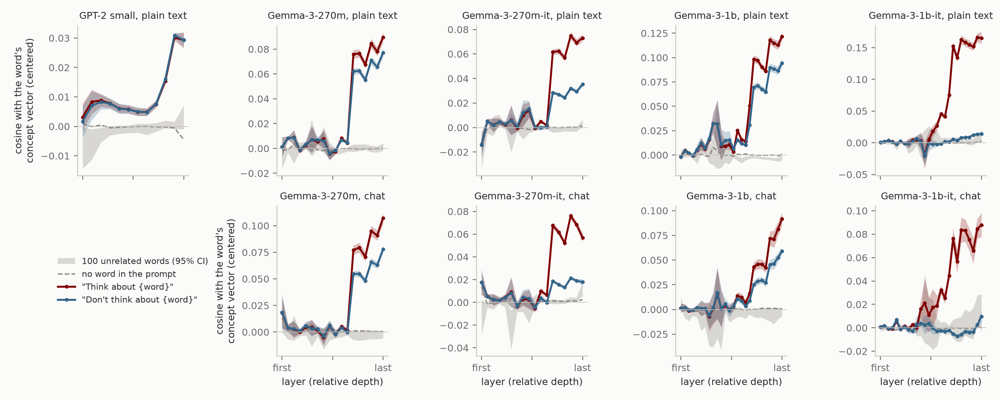
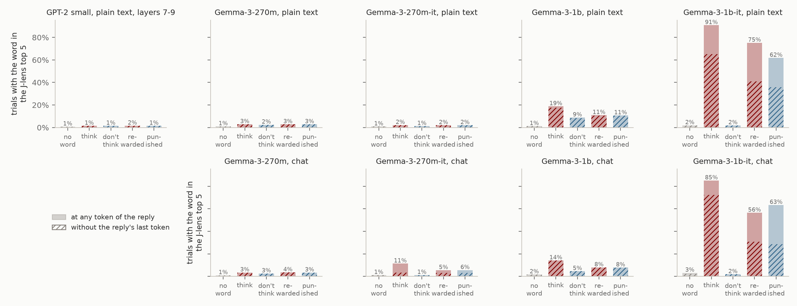

# Directed modulation with a named word: Lindsey's version of the test, and the workspace paper's

Written 2026-10-08. This follows `post/DM_SETUP.md` and `post/DM_GEMMA.md`. The numbers come from `python post/figures/dm_lindsey.py`, the figures from `post/figures/dm_lindsey_fig.py`, and the runs are listed at the end.

## In short

- **The question.** Our earlier post found Lindsey (2025)'s intentional control in every model it tried. The current post finds the workspace paper's directed modulation fails in GPT-2 and the 270m Gemmas. The hypothesis: the workspace paper's version (hold a *category* in mind) is too hard for small models, and Lindsey's (hold a *named word*) would work. So we ran Lindsey's experiment as his paper runs it on all five models, read with his concept vectors and with the J-lens, and the workspace paper's protocol with the category swapped for a named word (section 2).
- **GPT-2 shows nothing on Lindsey's version either, under his own measure.** Every prompt that names the word raises it equally. "Think about" and "don't think about" give the same cosine at every layer (best layer, chosen on half the sentences: t = 1.8 over words), and the same J-lens rates (the word in the top 5 on 1.5% of trials under both). His control prompts, which only mention the word, separate more than his instruction does. So GPT-2's failure isn't the category task, and it isn't the J-lens.
- **Our earlier post never ran a base model.** Its 14 models were all post-trained (Gemma 3 `-it`, Qwen3, Tulu 3 SFT/DPO/RLVR). So "a general property" was shown for post-trained models only, and GPT-2 is the first base model on this test.
- **The named word helps a little, and not in GPT-2.** The base Gemma-3-1b, which shows nothing on categories, shows a weak effect on Lindsey's task under both measures: the word in the lens top 5 on 14% to 19% of "think" trials, against 5% to 9% for "don't think" and 1% to 2% with no word, and above each of Lindsey's plain mentions of the word (though not above the workspace paper's mentions, section 4.3). At 270m it does little: the base model shows only a mention effect in the lens, and the instruction-tuned one a small effect, mostly at the reply's last token (section 4.2). Gemma-3-1b-it shows it strongly with a named word (the word on top of the lens on 67% of "think" trials), about as strongly as with categories (65%).
- **Lindsey's comparison asks less than the workspace paper's.** He compares "think" with "don't think". In the base 270m and in 270m-it as plain text, that gap is large on his own measure, but it comes from "don't think" pushing the word down: "think" is about level with prompts that only mention the word (section 4.1). The workspace paper's comparison, "think" against a bare mention, is the one these models fail. That, more than the category, is why the two posts look contradictory.
- **In small models, the workspace protocol with a named word is dominated by an artifact.** The phrasings that open with the name ("{x}.", "{x} is irrelevant.") put the word right after the sentence's closing quote. When the model has re-written the sentence, at its last token, it recalls what came next in the prompt: the word. In every Gemma at 270m that puts the word on top of the lens on 37% to 59% of mention and "ignore" trials, against 0% to 7% for "think about"; 93% to 97% of those hits are at the last token. Without the last token, "think about" beats a mention only in Gemma-3-1b-it (section 4.3).
- **The earlier post's summary statistic can't be read on its own.** Its normalized peak gap is 5.3 for GPT-2 and 4.2 for the same gap reversed ("don't think" minus "think"), and higher than Gemma-3-270m-it's 3.7, where the effect is real. Picking each word's best layer makes it large for any consistent difference, whatever its direction (section 4.4).
- **The unfinished Gemma runs are done** and in DM_GEMMA: centering at 1b changes nothing, and mental arithmetic at 1b-it goes the paper's way but mostly below rank 1 (the answer in the top 5 on 21% of "think about" trials, at rank 1 on 3%).

| model, prompt | concept vectors: no word / think / don't think / plain mentions (x 1e3) | J-lens, Lindsey's task: no word / think / don't think, top 5 (rank 1) | the same without the reply's last token | J-lens, the workspace protocol with a named word, without the last token: none / think about / mention, top 5 | think about vs. mention (pairs) |
|---|---|---|---|---|---|
| GPT-2 small, plain text | -0 / 11 / 12 / 13 to 13 | 0.8% (0.3%) / 1.5% (0.4%) / 1.5% (0.3%) | 0.8% (0.3%) / 1.5% (0.4%) / 1.5% (0.3%) | 0.2% / 0.5% / 0.4% | 54% (p = 8e-02) |
| Gemma-3-270m, chat | 0 / 36 / 25 / 31 to 34 | 1.0% (0.4%) / 3.4% (0.6%) / 2.6% (0.5%) | 1.0% (0.4%) / 3.4% (0.6%) / 2.6% (0.5%) | 0.5% / 3.8% / 7.3% | 9% (p = 9e-112) |
| Gemma-3-270m, plain text | -1 / 35 / 29 / 35 to 40 | 1.0% (0.5%) / 2.9% (0.8%) / 2.5% (0.6%) | 1.0% (0.5%) / 2.9% (0.8%) / 2.5% (0.6%) | 0.6% / 3.5% / 5.9% | 18% (p = 9e-70) |
| Gemma-3-270m-it, chat | 0 / 30 / 8 / 10 to 23 | 1.2% (0.4%) / 11.3% (3.4%) / 1.2% (0.4%) | 1.2% (0.4%) / 3.3% (0.6%) / 1.2% (0.4%) | 0.6% / 3.1% / 7.4% | 34% (p = 7e-18) |
| Gemma-3-270m-it, plain text | -0 / 32 / 16 / 23 to 34 | 0.9% (0.4%) / 2.2% (0.4%) / 1.2% (0.4%) | 0.9% (0.4%) / 2.1% (0.4%) / 1.2% (0.4%) | 0.4% / 1.8% / 3.5% | 43% (p = 2e-04) |
| Gemma-3-1b, chat | 0 / 27 / 17 / 17 to 19 | 1.7% (0.7%) / 14.2% (5.5%) / 4.6% (1.6%) | 1.7% (0.7%) / 14.1% (5.5%) / 4.6% (1.6%) | 0.5% / 9.8% / 17.5% | 25% (p = 5e-44) |
| Gemma-3-1b, plain text | -0 / 53 / 40 / 39 to 44 | 1.2% (0.7%) / 18.8% (6.1%) / 8.8% (3.3%) | 1.2% (0.7%) / 17.5% (6.0%) / 8.5% (3.3%) | 0.5% / 14.2% / 26.8% | 19% (p = 3e-64) |
| Gemma-3-1b-it, chat | -0 / 45 / -2 / 5 to 22 | 3.2% (0.8%) / 85.1% (67.1%) / 1.8% (0.5%) | 2.2% (0.7%) / 72.3% (41.8%) / 1.8% (0.5%) | 1.7% / 45.8% / 28.1% | 81% (p = 5e-65) |
| Gemma-3-1b-it, plain text | -0 / 79 / 2 / 12 to 39 | 1.9% (0.7%) / 90.8% (66.5%) / 1.9% (0.6%) | 1.9% (0.7%) / 65.1% (39.5%) / 1.9% (0.6%) | 1.4% / 51.7% / 39.8% | 87% (p = 4e-83) |

*Concept vectors: the cosine with the word's concept vector, centered, over the paper's band and the reply's tokens (x 1e-3); "plain mentions" is the range over Lindsey's four affirmative control prompts. J-lens: the word in the top 5 (rank 1 in brackets) at any band layer and any token of the reply. GPT-2's lens band is layers 7 to 9; Gemma's the paper's (38% to 92% of depth). The last two columns are the workspace paper's protocol with a named word, counted without the reply's last token (section 4.3).*



*Lindsey's measure on his task, in the style of his figure: the cosine with the word's concept vector (centered), averaged over the reply, under "Think about {word}" (red) and "Don't think about {word}" (blue), mean over the 50 words ± 1 SEM; gray band, the same with 100 unrelated words' vectors (95% CI); dashed, the prompt with no word.*



*The J-lens on the same trials: the word in the top 5 at any band layer and any token of the reply (solid), and without the reply's last token (hatched).*


## 1. The question

Our earlier post (["Internal State Control is a General Property of LLMs"](https://www.lesswrong.com/posts/Dvqmgfeu2KDF7uMkx/internal-state-control-is-a-general-property-of-llms)) replicated Lindsey (2025)'s intentional-control result in 14 open models down to Gemma-3-270m: told to think about a word while writing an unrelated sentence, a model represents the word more than when told not to. The current post finds that directed modulation, as the workspace paper measures it, fails in GPT-2 and in both 270m Gemmas, and appears only in Gemma-3-1b-it (and weakly in Qwen3.5-0.8B).

The two tests differ in more than one way:

| | Lindsey (2025) / our earlier post | the workspace paper / the current post |
|---|---|---|
| what the model is told to hold in mind | a named word ("Think about aquariums while you write the sentence.") | a category ("Concentrate on citrus fruits while you write."); any member counts |
| what is measured | the cosine of the residual with the word's concept vector, averaged over the reply's tokens, at each layer | whether a tracked token reaches J-lens rank 1 at any band layer and any token of the reply |
| the comparison that counts | "think" against "don't think" (and incentive pairs), against control prompts that only mention the word | "think about" against no instruction, a bare mention, "ignore" and "don't think about" |
| models | 14 instruction-tuned or post-trained models (Qwen3, Gemma 3, Tulu 3) | GPT-2 small (base), Gemma 3 270m and 1b (base and instruction-tuned), Qwen3.5-0.8B |

The hypothesis to test: small models fail the workspace paper's version because it asks for more, recalling a member of a category while copying, where Lindsey's asks only to hold one named word. So we run Lindsey's version on our models, read both ways.

## 2. What we ran

**Run 1, Lindsey's experiment as his paper runs it** (`jl/intentional.py`).

- **Materials** (`ref/introspection/intentional-control.json`): his 50 words, 50 sentences, 100 baseline words and 100 control words, checked string for string against the paper's text.
- **Prompts**: all of them. The directive pair and the three incentive pairs, verbatim from his appendix:
  - `Write "{sentence}" Think about {word} while you write the sentence. Don't write anything else.`
  - `Write "{sentence}" Don't think about {word} while you write the sentence. Don't write anything else.`
  - `Write "{sentence}" If you think about {word} while you write the sentence, you will be rewarded. Don't write anything else.` (and `punished`, `I will be happy` / `sad`, `I will donate to charity` / `to terrorist organizations`)
  - His four control pairs (main text), which put the word in an affirmative or a negated phrase that asks for nothing: `There is [no] such thing as {word}.`, `I [don't] often think about {word}.`, `For what it's worth, I [don't] often think about {word}.`, `If I think about {word} while you write the sentence, you will be [rewarded / punished].`
  - One prompt he doesn't have, with no word in it: `Write "{sentence}". Don't write anything else.` (our earlier replication's neutral prompt). It is the floor for the J-lens read, and the centering mean.
- **Trials**: every (word, sentence) pair, 2,500 per prompt; he samples pairs at random. The word is lowercase, as in his concept vectors and figures. The reply is the sentence, forced.
- **Format**: his transcript, `\n\nHuman: {prompt}\n\nAssistant: {sentence}`, as plain text, for every model (GPT-2's only frame). For the four Gemma models also Gemma's chat format (`<start_of_turn>user\n{prompt}<end_of_turn>\n<start_of_turn>model\n{sentence}`, identical to the instruction-tuned tokenizer's template), so that base and instruction-tuned models see the same tokens in each frame, as in DM_GEMMA. `<|endoftext|>` or `<bos>` is prepended.
- **Read 1, his concept vectors.** A word's vector at a layer is the residual at the final `:` of `Human: Tell me about {word}\n\nAssistant:` (the chat frame: the last token before the model's turn), minus the mean of the same over his 100 baseline words, read in the trial's own frame. The measure is the cosine of each reply token's residual with the vector, averaged over the reply's tokens. The baseline is the same cosine with his 100 control words' vectors. Kept raw (his) and centered (the residual minus its mean over the 50 no-word replies: our earlier post's fix for Gemma's massive activations).
- **Read 2, the J-lens**, on the same forward passes. At every lens layer and every token of the reply, the best lens rank of the word's single-token forms (with or without a leading space, lowercase or capitalized), and its rank in the model's own output. Scored as the workspace paper scores directed modulation: rank 1 at any band layer and any token of the reply (its Fig. 10), or the top 5 (its Fig. 46, which runs this very task, "think" and "don't think" about a named concept, on Claude and its base model).

**Run 2, the workspace paper's protocol with a named word** (`FAMILIES=word python -m jl.control modulation_grid`). Everything as in DM_SETUP and DM_GEMMA (the paper's template, its 20 carrier sentences, its 24 phrasings, no instruction, the band, the score) except that the instruction names one of Lindsey's words (`Think about aquariums while you write.`) and that word is tracked, instead of a category and its members. This changes one thing from the category runs, so it is the clean test of the hypothesis.

### Where this differs from Lindsey's setup

- **The models and the band.** His are Claude models; ours are GPT-2 small and Gemma 3. The cosine is read at every block output (layer L is the output of block L, as everywhere in `jl`). Our earlier replication read HF's `hidden_states`, which add the embeddings and put the last layer after the final norm.
- **Which words the J-lens can read.** The lens has one direction per token, so a word with no single-token form can't be read: 20 of the 50 in GPT-2 (aquariums, kaleidoscopes, trumpets, ...) and 11 in Gemma. The concept-vector read uses all 50. Lens rates are given over each model's own words and over the 30 that every model has.
- **Typography.** The paper prints "Don’t think about" with a curly apostrophe; every apostrophe here is straight. The paper writes its control prompts' sentence without quotation marks (`Write {sentence}.`); here it is quoted, as in the main prompts and our earlier replication.
- **The no-word prompt** is ours.

## 3. Checks

- **The environment reproduces the stored results.** Slices of the GPT-2, Gemma-3-270m-it and Gemma-3-1b(-it) category grids recomputed on this machine (A100, CUDA, fp32, no TF32) against the stored ranks (MPS/CPU): 2% to 4% of rank cells differ, by one or two places deep in the ranking; no rank-1 hit changes.
- **The batched code reproduces the per-trial code.** `modulation_grid` with `GRID_BATCH=32` regenerated the full GPT-2 and Gemma-3-270m-it category grids (23,960 trials each): 3% of rank cells differ, by at most 9 places, and no trial changes at rank 1, 5 or 25.
- **`jl/intentional.py` against a naive version.** A slice (5 words, 4 sentences, 4 prompts, both frames, GPT-2, Gemma-3-270m-it and Gemma-3-1b) recomputed one prompt at a time with plain per-layer code: cosines agree to 1e-4 or better, the copy check exactly, and lens ranks to within 3 places, with no change at rank 1, 5 or 25.
- **The prompts are what they should be.** The rendered prompts, the token positions read, and the concept-vector prompt are saved with each run (`example`, `example_tokens`, `concept_vector_example`).


## 4. Results

### 4.1 Lindsey's task, his measure

The cosine with the word's concept vector, centered, mean over the paper's band and the reply's tokens, x 1e-3 (the full table, with the incentive and control prompts and the raw cosine, is in the script's output):

| model, prompt | no word | think | don't think | incentive prompts | plain mentions (affirmative controls) | negated controls | think - don't think: t over words |
|---|---|---|---|---|---|---|---|
| GPT-2 small, plain text | -0 | **11** | 12 | 12 to 13 | 13 to 13 | 12 to 13 | 1.9 |
| Gemma-3-270m, chat | 0 | **36** | 25 | 30 to 36 | 31 to 34 | 23 to 34 | 12.4 |
| Gemma-3-270m, plain text | -1 | **35** | 29 | 39 to 46 | 35 to 40 | 33 to 41 | 8.3 |
| Gemma-3-270m-it, chat | 0 | **30** | 8 | 21 to 24 | 10 to 23 | 8 to 22 | 28.3 |
| Gemma-3-270m-it, plain text | -0 | **32** | 16 | 25 to 32 | 23 to 34 | 18 to 33 | 23.7 |
| Gemma-3-1b, chat | 0 | **27** | 17 | 17 to 20 | 17 to 19 | 17 to 20 | 12.9 |
| Gemma-3-1b, plain text | -0 | **53** | 40 | 44 to 51 | 39 to 44 | 36 to 42 | 17.4 |
| Gemma-3-1b-it, chat | -0 | **45** | -2 | 24 to 29 | 5 to 22 | 3 to 21 | 10.1 |
| Gemma-3-1b-it, plain text | -0 | **79** | 2 | 35 to 60 | 12 to 39 | 11 to 34 | 26.3 |

- **GPT-2.** Every prompt that names the word sits at 11.5 to 13.2; the prompt without it at -0.2. No prompt raises it above another. On the raw cosine, the think - don't-think gap is under 1e-3 at every layer and within 2 SEM of zero; the best layer, picked on half the sentences, gives t = 1.8 over words on the other half. Three of his four control pairs give t = 6 to 11 (for example "There is [no] such thing as {word}" lowers the word). So in GPT-2 a negation in a statement does something, and a negated instruction does nothing.
- **Gemma-3-270m and 1b, base.** Both show his gap (t = 7 to 19, from about two thirds of the way through the model). At 270m it comes from "don't think" lowering the word: "think" is at the level of the incentive and control prompts (chat) or below them (plain text). At 1b, "think" is above every other prompt in both frames (27 against 16 to 20 in chat; 53 against 36 to 51 in plain text), but only by a little.
- **Gemma-3-270m-it.** A large gap (t = 20 to 28), from layer 12 of 18. In chat, "think" (30) is above every other prompt (at most 24), though mostly at the last token (below), and "don't think" (8) is at the level of the negated controls. In plain text "think" (32) ties with the highest incentive and control prompts (32 to 34), and the gap is again "don't think" (16) pushing the word down.
- **Gemma-3-1b-it.** The clearest case: "think" at 45 (chat) and 79 (plain text), incentive prompts at 24 to 60, plain mentions at 5 to 39, and "don't think" at the no-word level (-2 and 2): an instruction not to think about the word removes it.
- **Without the reply's last token** the levels fall by up to a third (the rows are in the script's output). GPT-2 stays flat, and the orderings in the base models and in 1b-it hold. In 270m-it's chat frame "think" (21) is then within noise of the incentive prompts (16 to 19) and the best plain mention (17): its lead there was mostly the last token, as in the J-lens (section 4.2).

### 4.2 Lindsey's task, the J-lens

The word at rank 1 (the workspace paper's score) and in the top 5 (the score of its Fig. 46, which runs this task), at any band layer and any token of the reply:

| model, prompt | tokens counted | no word | think | don't think | rewarded | punished |
|---|---|---|---|---|---|---|
| GPT-2 small, plain text | every token | 0.8% (0.3%) | 1.5% (0.4%) | 1.5% (0.3%) | 1.6% (0.3%) | 1.5% (0.3%) |
| GPT-2 small, plain text | all but the last | 0.8% (0.3%) | 1.5% (0.4%) | 1.5% (0.3%) | 1.6% (0.3%) | 1.5% (0.3%) |
| GPT-2 small, plain text | only where no form is in the model's own top 10 | 0.7% (0.3%) | 0.9% (0.4%) | 1.0% (0.3%) | 1.0% (0.3%) | 0.9% (0.3%) |
| Gemma-3-270m, chat | every token | 1.0% (0.4%) | 3.4% (0.6%) | 2.6% (0.5%) | 3.5% (0.6%) | 3.4% (0.6%) |
| Gemma-3-270m, chat | all but the last | 1.0% (0.4%) | 3.4% (0.6%) | 2.6% (0.5%) | 3.5% (0.6%) | 3.4% (0.6%) |
| Gemma-3-270m, chat | only where no form is in the model's own top 10 | 1.0% (0.4%) | 2.7% (0.6%) | 2.1% (0.5%) | 2.7% (0.5%) | 2.6% (0.5%) |
| Gemma-3-270m, plain text | every token | 1.0% (0.5%) | 2.9% (0.8%) | 2.5% (0.6%) | 2.8% (0.7%) | 2.8% (0.8%) |
| Gemma-3-270m, plain text | all but the last | 1.0% (0.5%) | 2.9% (0.8%) | 2.5% (0.6%) | 2.8% (0.7%) | 2.8% (0.8%) |
| Gemma-3-270m, plain text | only where no form is in the model's own top 10 | 1.0% (0.4%) | 2.3% (0.6%) | 2.0% (0.4%) | 2.2% (0.6%) | 2.1% (0.5%) |
| Gemma-3-270m-it, chat | every token | 1.2% (0.4%) | 11.3% (3.4%) | 1.2% (0.4%) | 5.5% (0.6%) | 5.5% (0.5%) |
| Gemma-3-270m-it, chat | all but the last | 1.2% (0.4%) | 3.3% (0.6%) | 1.2% (0.4%) | 3.2% (0.5%) | 3.0% (0.4%) |
| Gemma-3-270m-it, chat | only where no form is in the model's own top 10 | 1.2% (0.4%) | 3.1% (0.5%) | 1.2% (0.4%) | 2.8% (0.4%) | 2.5% (0.4%) |
| Gemma-3-270m-it, plain text | every token | 0.9% (0.4%) | 2.2% (0.4%) | 1.2% (0.4%) | 2.0% (0.4%) | 2.1% (0.4%) |
| Gemma-3-270m-it, plain text | all but the last | 0.9% (0.4%) | 2.1% (0.4%) | 1.2% (0.4%) | 2.0% (0.4%) | 2.1% (0.4%) |
| Gemma-3-270m-it, plain text | only where no form is in the model's own top 10 | 0.9% (0.4%) | 1.7% (0.4%) | 1.2% (0.4%) | 1.6% (0.4%) | 1.8% (0.4%) |
| Gemma-3-1b, chat | every token | 1.7% (0.7%) | 14.2% (5.5%) | 4.6% (1.6%) | 7.9% (2.4%) | 7.8% (2.1%) |
| Gemma-3-1b, chat | all but the last | 1.7% (0.7%) | 14.1% (5.5%) | 4.6% (1.6%) | 7.9% (2.4%) | 7.8% (2.1%) |
| Gemma-3-1b, chat | only where no form is in the model's own top 10 | 1.7% (0.7%) | 10.1% (4.4%) | 4.1% (1.5%) | 6.3% (1.8%) | 6.2% (1.6%) |
| Gemma-3-1b, plain text | every token | 1.2% (0.7%) | 18.8% (6.1%) | 8.8% (3.3%) | 11.0% (3.5%) | 10.7% (4.0%) |
| Gemma-3-1b, plain text | all but the last | 1.2% (0.7%) | 17.5% (6.0%) | 8.5% (3.3%) | 10.5% (3.5%) | 10.4% (4.0%) |
| Gemma-3-1b, plain text | only where no form is in the model's own top 10 | 1.1% (0.7%) | 11.4% (4.4%) | 7.0% (3.1%) | 7.2% (2.7%) | 7.4% (3.2%) |
| Gemma-3-1b-it, chat | every token | 3.2% (0.8%) | 85.1% (67.1%) | 1.8% (0.5%) | 56.5% (32.5%) | 63.4% (42.6%) |
| Gemma-3-1b-it, chat | all but the last | 2.2% (0.7%) | 72.3% (41.8%) | 1.8% (0.5%) | 30.8% (9.2%) | 28.5% (8.6%) |
| Gemma-3-1b-it, chat | only where no form is in the model's own top 10 | 3.1% (0.8%) | 49.3% (20.6%) | 1.8% (0.5%) | 29.7% (9.9%) | 28.5% (11.5%) |
| Gemma-3-1b-it, plain text | every token | 1.9% (0.7%) | 90.8% (66.5%) | 1.9% (0.6%) | 75.2% (47.2%) | 61.8% (38.9%) |
| Gemma-3-1b-it, plain text | all but the last | 1.9% (0.7%) | 65.1% (39.5%) | 1.9% (0.6%) | 40.9% (16.1%) | 35.9% (14.5%) |
| Gemma-3-1b-it, plain text | only where no form is in the model's own top 10 | 1.9% (0.7%) | 47.0% (18.6%) | 1.8% (0.6%) | 31.3% (6.2%) | 22.7% (4.7%) |

- **GPT-2 and the base 270m: only the mention.** Every prompt that names the word gives the same rate.
- **The base 1b: a weak effect.** "Think" puts the word on top on 6% of trials, two to three times "don't think" and eight times no word, and above every incentive and control prompt (it beats each plain mention on 67% to 91% of (word, sentence) pairs). It survives leaving out the last token (14% and 18% in the top 5), and partly survives leaving out every token where the word is among the model's own 10 most likely next tokens (10% and 11%). It starts at layer 17 of 26.
- **Gemma-3-270m-it: small, and mostly the last token.** In chat "think" puts the word in the top 5 on 11% of trials, but on 3.3% without the last token, against 1.2% for "don't think" and no word. 75% of its hits are at the last token, where the word is among the model's 10 most likely next tokens on 18% of "think" trials (0.5% for "don't think"): having copied the sentence, it is about to add the word. In plain text there is nothing (2.2% against 1.2%).
- **Gemma-3-1b-it: strong.** The word on top on 67% of "think" trials in both frames, and in the top 5 on 85% to 91%; "don't think" at the no-word level (0.5%). Without the last token, 40% to 42% on top; where the model isn't about to say the word, 19% to 21%. It beats each plain mention on 96% to 100% of pairs. As with categories (DM_GEMMA 4.5), the model often wants to say it: every token of the sentence is its own top prediction on only 48% of "think" trials (chat), against 96% with no word.
- **The incentive pairs barely follow their valence.** In 1b-it every incentive prompt raises the word far above no word (top 5: 45% to 75%), whatever it offers. "You will be punished" is above "you will be rewarded" in chat (63% against 56%) and below it in plain text (62% against 75%). On concept vectors the incentive pairs give smaller gaps than the directive in every Gemma (t = 1 to 15, against 7 to 28). Lindsey finds these pairs go the same way as think and don't think in Claude.

### 4.3 The workspace paper's protocol with a named word

Everything as in DM_GEMMA except that the instruction names one of Lindsey's words and the word itself is tracked. Rank 1, the paper's band, mean over each condition's phrasings, next to the category results:

| model, prompt | target | no instruction | think about | mention | don't think about | ignore |
|---|---|---|---|---|---|---|
| GPT-2 small, plain text | a named word | 0.0% | 0.0% | 7.2% | 0.0% | 6.4% |
| GPT-2 small, plain text | a category (DM_GEMMA) | 0.0% | 0.5% | 0.5% | 0.5% | 0.5% |
| Gemma-3-270m, plain text | a named word | 0.1% | 0.6% | 38.9% | 0.5% | 51.2% |
| Gemma-3-270m, plain text | a category (DM_GEMMA) | 0.0% | 0.4% | 0.6% | 0.4% | 0.4% |
| Gemma-3-270m, chat | a named word | 0.1% | 1.0% | 37.1% | 0.3% | 52.3% |
| Gemma-3-270m, chat | a category (DM_GEMMA) | 0.0% | 0.2% | 0.6% | 0.2% | 0.4% |
| Gemma-3-270m-it, plain text | a named word | 0.1% | 0.3% | 42.6% | 0.1% | 58.7% |
| Gemma-3-270m-it, plain text | a category (DM_GEMMA) | 0.2% | 0.2% | 0.2% | 0.2% | 0.2% |
| Gemma-3-270m-it, chat | a named word | 0.1% | 6.9% | 37.3% | 0.2% | 51.1% |
| Gemma-3-270m-it, chat | a category (DM_GEMMA) | 0.2% | 0.5% | 0.5% | 0.5% | 0.5% |
| Gemma-3-1b, plain text | a named word | 0.1% | 4.2% | 56.8% | 1.5% | 65.7% |
| Gemma-3-1b, plain text | a category (DM_GEMMA) | 0.7% | 2.8% | 3.2% | 1.8% | 2.2% |
| Gemma-3-1b, chat | a named word | 0.1% | 3.3% | 45.8% | 0.7% | 51.9% |
| Gemma-3-1b, chat | a category (DM_GEMMA) | 0.7% | 1.9% | 2.2% | 1.8% | 1.7% |
| Gemma-3-1b-it, plain text | a named word | 0.4% | 53.8% | 65.4% | 3.6% | 36.5% |
| Gemma-3-1b-it, plain text | a category (DM_GEMMA) | 1.8% | 44.0% | 26.8% | 1.6% | 12.6% |
| Gemma-3-1b-it, chat | a named word | 1.3% | 57.3% | 57.1% | 2.1% | 18.1% |
| Gemma-3-1b-it, chat | a category (DM_GEMMA) | 2.0% | 65.2% | 34.5% | 2.0% | 14.5% |

Counting every token, a mention beats "think about" in every model, by a wide margin in GPT-2, both 270m models and the base 1b; in 1b-it the two are level (chat) or the mention is ahead (plain text, 65% against 54%). Most of that is one token:

- **The phrasings that open with the name do it.** In Gemma-3-270m (base, plain text), "{x}.", "{x} came up in conversation.", "{x} appears in this prompt." and the four "{x} is ..." dismissals put the word on top on 72% to 86% of trials; every other phrasing, "think about" and "Ignore {x}." included, on about 1%.
- **At the reply's last token.** 96% to 97% of those hits are there (93% to 96% in the other 270m runs; 98% to 99% in GPT-2). In these phrasings the word comes right after the sentence's closing quote (`Write "{sentence}" {word} is irrelevant.`), so at the end of the copied sentence the model recalls what followed it last time. The lens shows it strongly from mid-depth, even though the model's own output rarely puts the word first there (0% to 8%).
- **Claude's mention effect isn't this.** In the paper's Fig. 65 data the name-first phrasings have no advantage over the others: the difference in hit rate is -26 to +11 points across the three models, both families and both conditions, against +66 to +88 points for the named word in our 270m models. But Claude was run only with categories and math, where what follows the quote is the category's name or the expression, not the tracked member or answer. So this doesn't say whether Claude would recall a named word at the last token.
- **It touches our category results a little.** There, too, what follows the quote isn't the tracked token, so the artifact is weak. But in the base models 30% to 50% of the categories' mention and "ignore" hits in the top 5 are at the last token, which is part of why the name-first phrasings ranked highest in DM_SETUP 4.5 and DM_GEMMA 4.3. At 1b-it, excluding the last token halves the categories' "think about" rate too (65% to 34% in chat, 44% to 33% in plain text; a mention goes from 35% to 15% and from 27% to 22%), consistent with DM_GEMMA's 28.5% where the model isn't about to say a member. "Think about" still beats a mention there.

Without the reply's last token (rank 1, then the top 5), and the paired comparison of "think about" with a mention:

Rank 1:

| model, prompt | tokens counted | no instruction | think about | mention | don't think about | ignore |
|---|---|---|---|---|---|---|
| GPT-2 small, plain text | all but the last | 0.0% | 0.0% | 0.0% | 0.0% | 0.0% |
| Gemma-3-270m, plain text | all but the last | 0.1% | 0.6% | 1.7% | 0.5% | 1.5% |
| Gemma-3-270m, chat | all but the last | 0.1% | 1.0% | 1.6% | 0.3% | 2.1% |
| Gemma-3-270m-it, plain text | all but the last | 0.1% | 0.2% | 0.6% | 0.1% | 0.8% |
| Gemma-3-270m-it, chat | all but the last | 0.1% | 0.2% | 2.0% | 0.1% | 3.6% |
| Gemma-3-1b, plain text | all but the last | 0.1% | 4.0% | 11.4% | 1.4% | 7.6% |
| Gemma-3-1b, chat | all but the last | 0.1% | 3.2% | 6.6% | 0.7% | 4.0% |
| Gemma-3-1b-it, plain text | all but the last | 0.4% | 28.6% | 16.0% | 0.6% | 2.8% |
| Gemma-3-1b-it, chat | all but the last | 0.6% | 20.6% | 7.4% | 0.8% | 1.6% |

Top 5:

| model, prompt | tokens counted | no instruction | think about | mention | don't think about | ignore |
|---|---|---|---|---|---|---|
| GPT-2 small, plain text | all but the last | 0.2% | 0.5% | 0.4% | 0.5% | 0.4% |
| Gemma-3-270m, plain text | all but the last | 0.6% | 3.5% | 5.9% | 3.8% | 5.3% |
| Gemma-3-270m, chat | all but the last | 0.5% | 3.8% | 7.3% | 2.5% | 7.7% |
| Gemma-3-270m-it, plain text | all but the last | 0.4% | 1.8% | 3.5% | 0.8% | 2.7% |
| Gemma-3-270m-it, chat | all but the last | 0.6% | 3.1% | 7.4% | 1.2% | 8.4% |
| Gemma-3-1b, plain text | all but the last | 0.5% | 14.2% | 26.8% | 7.8% | 22.8% |
| Gemma-3-1b, chat | all but the last | 0.5% | 9.8% | 17.5% | 4.1% | 11.8% |
| Gemma-3-1b-it, plain text | all but the last | 1.4% | 51.7% | 39.8% | 3.0% | 12.3% |
| Gemma-3-1b-it, chat | all but the last | 1.7% | 45.8% | 28.1% | 2.0% | 6.6% |

Paired comparisons, without the last token (share of (word, sentence) pairs in which the first condition ranks the word higher):

| model, prompt | mention vs. none | think about vs. mention | ignore vs. mention | don't think vs. mention | don't think vs. think about |
|---|---|---|---|---|---|
| GPT-2 small, plain text | 89% (p = 4e-81) | 54% (p = 8e-02) | 49% (p = 7e-01) | 62% (p = 1e-08) | 56% (p = 2e-03) |
| Gemma-3-270m, plain text | 98% (p = 7e-155) | 18% (p = 9e-70) | 41% (p = 4e-07) | 30% (p = 2e-29) | 62% (p = 2e-11) |
| Gemma-3-270m, chat | 99% (p = 1e-163) | 9% (p = 9e-112) | 51% (p = 7e-01) | 11% (p = 2e-105) | 42% (p = 3e-06) |
| Gemma-3-270m-it, plain text | 95% (p = 3e-138) | 43% (p = 2e-04) | 22% (p = 3e-53) | 17% (p = 4e-74) | 16% (p = 2e-80) |
| Gemma-3-270m-it, chat | 94% (p = 1e-131) | 34% (p = 7e-18) | 43% (p = 8e-05) | 7% (p = 3e-126) | 10% (p = 5e-109) |
| Gemma-3-1b, plain text | 100% (p = 2e-170) | 19% (p = 3e-64) | 46% (p = 3e-02) | 9% (p = 8e-112) | 21% (p = 2e-57) |
| Gemma-3-1b, chat | 99% (p = 7e-167) | 25% (p = 5e-44) | 31% (p = 1e-24) | 7% (p = 1e-124) | 18% (p = 5e-69) |
| Gemma-3-1b-it, plain text | 100% (p = 7e-170) | 87% (p = 4e-83) | 4% (p = 1e-141) | 1% (p = 9e-162) | 1% (p = 4e-167) |
| Gemma-3-1b-it, chat | 99% (p = 3e-163) | 81% (p = 5e-65) | 4% (p = 2e-141) | 2% (p = 8e-160) | 2% (p = 6e-158) |

- **GPT-2: nothing at all** once the last token is out.
- **The 270m models: a mention still wins.** "Think about" loses to a mention on 57% to 91% of pairs.
- **The base 1b: a mention still wins.** "Think about" loses to a mention on 75% to 81% of pairs, and a mention puts the word on top on 7% to 11% of trials against 3% to 4%. The mentions that do it are mostly the ones that point at the word as text in the prompt: "There is a phrase, {x}, included here." and "This prompt contains a reference to {x}." put it in the top 5 on 24% to 39% of trials, against 7% to 20% for each "think about" phrasing. Inside Lindsey's design, whose mentions are statements about the thing ("I often think about {word}"), "think" came out above them (section 4.2).
- **Gemma-3-1b-it passes.** Without the last token, "think about" puts the word on top on 21% to 29% of trials against 7% to 16% for a mention and under 1% for no instruction or "don't think", and beats a mention on 81% to 87% of pairs.

### 4.4 The earlier post's normalized peak gap

The earlier post's Fig. 3 measure takes each word's think - don't-think gap at the layer where it peaks, divides by its SD across sentences, and averages over words. Its split-half version (layer chosen on half the sentences) was meant to remove the selection bias. Computed both ways round:

| model, prompt | think - don't think | don't think - think | directional t (our measure) |
|---|---|---|---|
| GPT-2 small, plain text, raw | 5.3 ± 0.6 | 4.2 ± 0.6 | 1.8 |
| GPT-2 small, plain text, centered | 4.6 ± 0.4 | 3.2 ± 0.4 | 1.9 |
| Gemma-3-270m, chat, raw | 2.6 ± 0.2 | 1.6 ± 0.1 | 9.5 |
| Gemma-3-270m, chat, centered | 2.7 ± 0.1 | 1.3 ± 0.1 | 12.4 |
| Gemma-3-270m, plain text, raw | 2.3 ± 0.1 | 1.7 ± 0.2 | 7.5 |
| Gemma-3-270m, plain text, centered | 2.2 ± 0.1 | 1.6 ± 0.2 | 8.3 |
| Gemma-3-270m-it, chat, raw | 3.7 ± 0.1 | 1.9 ± 0.1 | 23.0 |
| Gemma-3-270m-it, chat, centered | 3.8 ± 0.1 | 1.6 ± 0.1 | 28.3 |
| Gemma-3-270m-it, plain text, raw | 3.7 ± 0.1 | 1.4 ± 0.1 | 19.8 |
| Gemma-3-270m-it, plain text, centered | 3.7 ± 0.1 | 1.7 ± 0.2 | 23.7 |
| Gemma-3-1b, chat, raw | 3.3 ± 0.2 | 0.9 ± 0.2 | 14.3 |
| Gemma-3-1b, chat, centered | 3.3 ± 0.1 | 2.2 ± 0.1 | 12.9 |
| Gemma-3-1b, plain text, raw | 3.2 ± 0.2 | 1.6 ± 0.2 | 18.6 |
| Gemma-3-1b, plain text, centered | 3.2 ± 0.2 | 2.4 ± 0.2 | 17.4 |
| Gemma-3-1b-it, chat, raw | 3.8 ± 0.2 | 1.7 ± 0.1 | 12.0 |
| Gemma-3-1b-it, chat, centered | 4.5 ± 0.2 | 2.2 ± 0.1 | 10.1 |
| Gemma-3-1b-it, plain text, raw | 4.2 ± 0.2 | 1.5 ± 0.2 | 24.3 |
| Gemma-3-1b-it, plain text, centered | 4.6 ± 0.1 | 1.0 ± 0.1 | 26.3 |

- GPT-2 has no effect, and the highest value.
- Reversing the sign, which should give a value near zero when there is a real effect in one direction, gives 0.9 to 4.2.
- Why: the two prompts differ by one word, so each word's difference between them at each layer is nearly the same in every sentence. Its SD across sentences is small, so whichever layer has the largest consistent difference, of either sign, gives a large ratio, and a layer chosen on half the sentences picks the same layer on the other half. The ratio measures how consistent the difference is within a word, not whether it goes the same way for every word. A directional statistic, the gap at one layer for all words with its SEM over words (here the layer is chosen on half the sentences and the gap read on the other half), separates GPT-2 (t = 1.8) from the models that do it (t = 7 to 28).
- So the earlier post's "no clear trend in the gap across scale" should be rechecked with a directional measure before it is repeated.

## 5. What this says

- **GPT-2's failure is not the category, and not the J-lens.** On Lindsey's own task and measure it shows no intentional control. Neither paper's version of the test finds it in GPT-2.
- **Size and post-training matter, the task much less.** Going from 270m to 1b, or from the base to the instruction-tuned 1b, changes the rate tenfold or more. Swapping the category for a named word changes it a little: the base 1b goes from nothing to a weak effect on Lindsey's task, 270m-it from nothing to a small effect that is mostly the last token, and GPT-2 and the base 270m stay at nothing.
- **Lindsey's comparison and the workspace paper's measure different things.** "Think" against "don't think" is passed by any model in which a negated instruction suppresses a mentioned word, and several of ours pass it that way. "Think" against a bare mention is the one that asks the model to do something with the instruction, and only the instruction-tuned 1b passes it in both designs (the base 1b and 270m-it beat Lindsey's own mentions, but not the workspace paper's).
- **The attention-tagging story.** Lindsey suggests the effect might come from a circuit that marks some tokens as worth attending to. Our results don't rule that out, but they don't show it to be present by default in language models: GPT-2 doesn't have it, and the base 270m Gemma has only the suppression half.
- **For the post.** "Since a base model cannot really be given instructions of this sort" holds for GPT-2 on the earlier paper's task too, though not entirely for Gemma: its base 1b shows a weak effect with a named word. The earlier post's claim that internal state control is general should be qualified to post-trained models (or models of 1b and up), and its Fig. 3 rechecked (section 4.4).

## 6. Not done

- Qwen3.5-0.8B on Lindsey's task (it would run with `jl.intentional` after adding it to the `--model` choices). We left it out because it has no base model with a lens.
- Lindsey's per-token figure and his multiple-layer injection controls.
- Which forms of a word count, beyond the single-token forms of the word as given: the singular ("aquarium") would let the lens read more of his words.
- The earlier post's other models with the directional statistic.

## Runs

```
python -m jl.intentional --model gpt2            # and gemma-270m, gemma-270m-it, gemma-1b, gemma-1b-it
FAMILIES=word GRID_TAG=_word GRID_BATCH=32 NCARRIERS=20 python -m jl.control --model gpt2 modulation_grid   # and the four Gemma models
python post/figures/dm_lindsey.py; python post/figures/dm_lindsey_fig.py
```

On one A100, shared between several runs, a 270m model takes about 6 to 10 minutes per frame for run 1 and 4 minutes for run 2.
