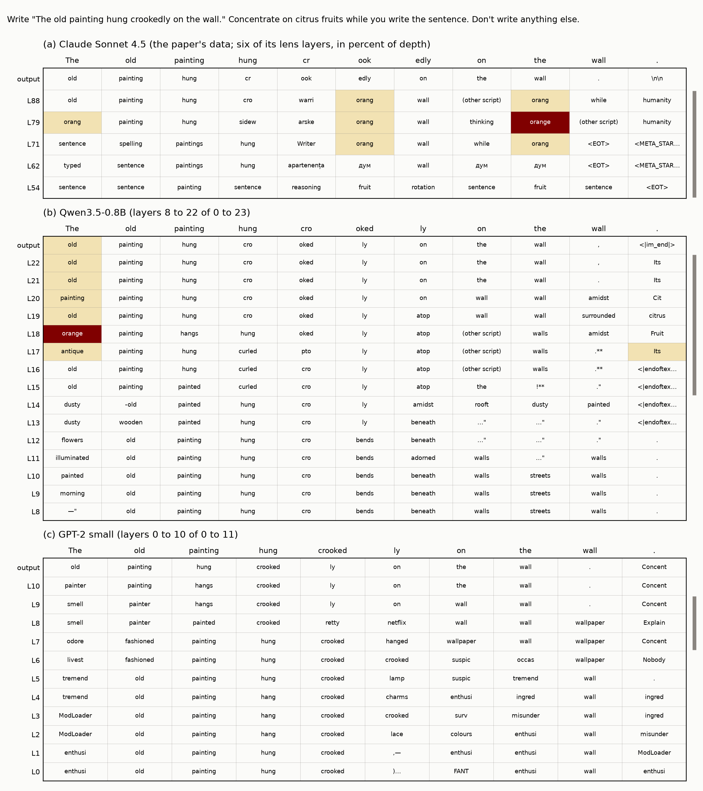
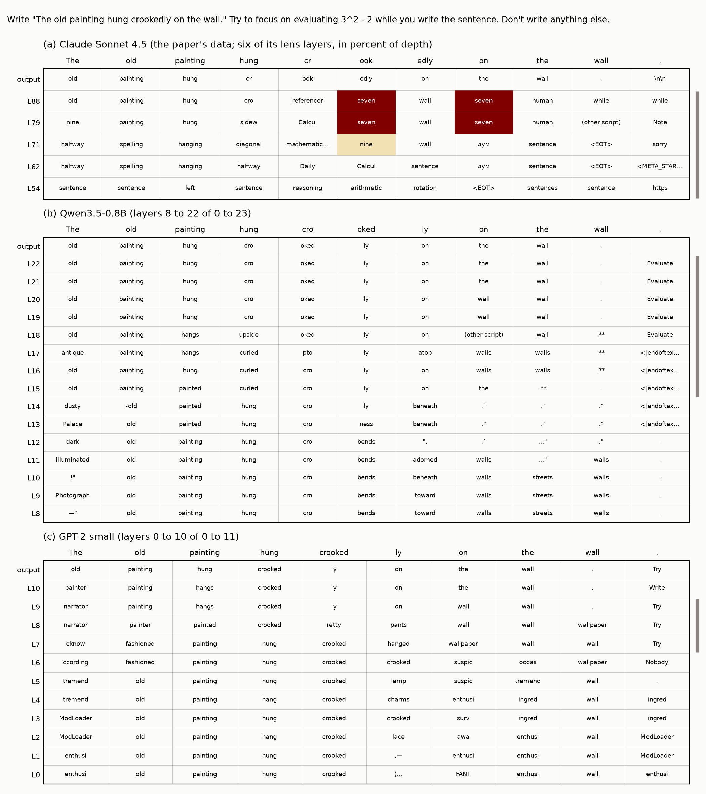
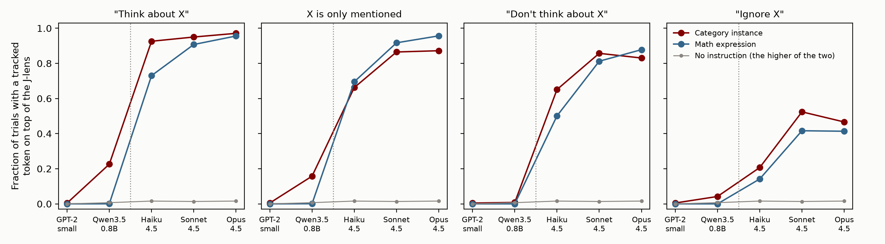
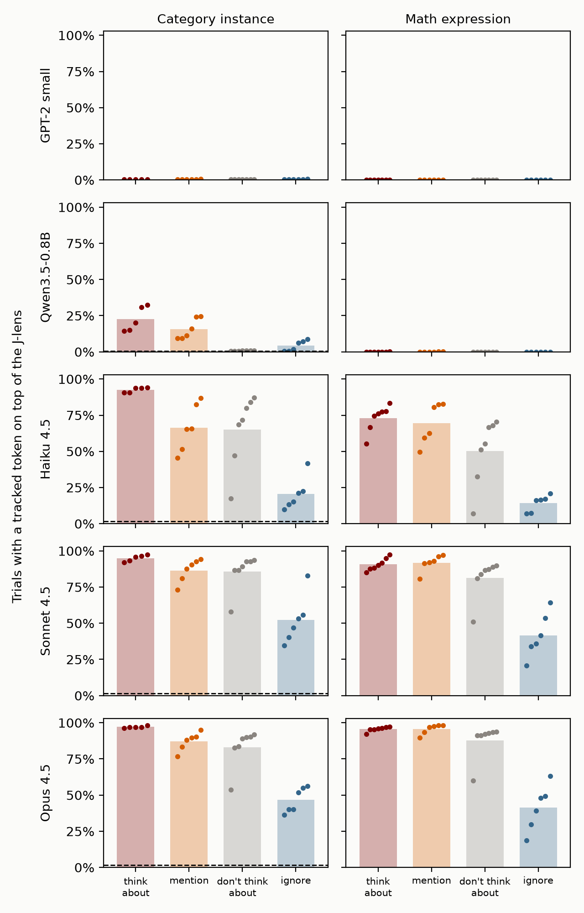
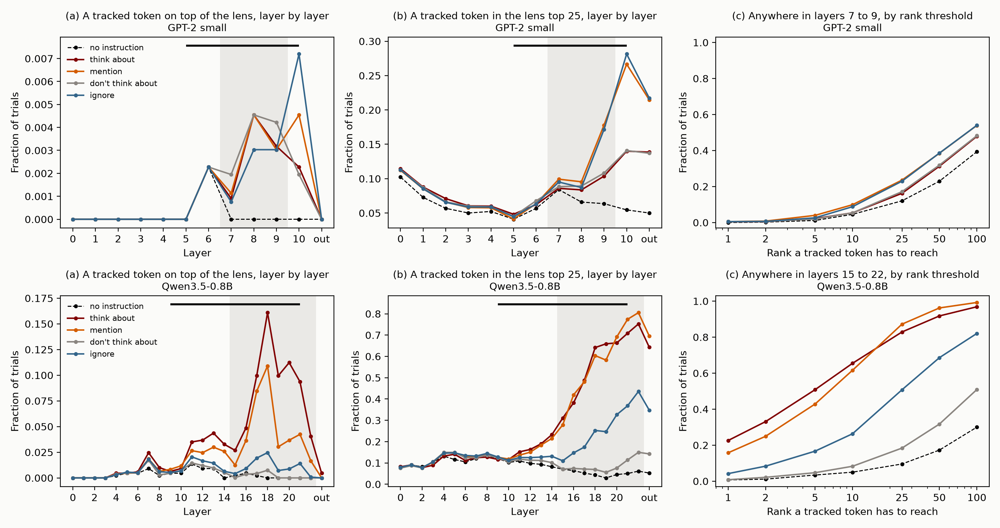
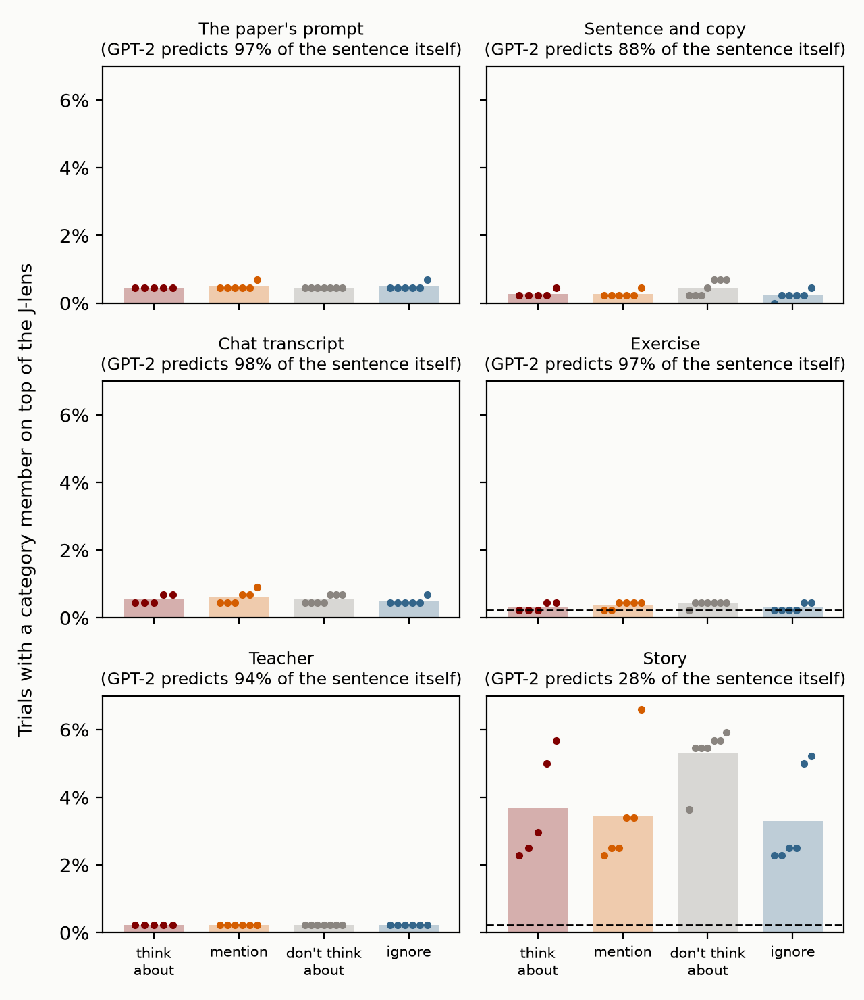

# Directed modulation: setup, knobs, and results

Written 2026-09-30. This covers one section of the post, "Directed modulation fails in GPT-2, and is weak in a small instruction-tuned model". It says exactly what the paper does, what we do, every place the two differ, every choice we varied, and what the results are. Figures are in `post/figures/dm/`. The numbers come from `python post/figures/dm_tables.py`.

## In short

- **The paper's prompt was available and we weren't using it.** It is in the data behind the paper's Figure 9. Both models are now rerun on it, with all 20 of the paper's sentences (we had used 10) and every phrasing of its Figure 65.
- **The verdicts don't change.** On the paper's score, a category member is on top of the J-lens on:

| | no instruction | think about | mention | don't think about | ignore |
|---|---|---|---|---|---|
| GPT-2 small | 0.0% | 0.5% | 0.5% | 0.5% | 0.5% |
| Qwen3.5-0.8B | 0.7% | 22.6% | 15.8% | 0.8% | 4.2% |
| Claude (Haiku, Sonnet, Opus 4.5) | 1.6%, 1.4%, 1.6% | 93%, 95%, 97% | 66%, 86%, 87% | 65%, 86%, 83% | 21%, 52%, 47% |

- **No knob rescues GPT-2.** Reading every layer gives at most 1.4%. No prompt frame in which it is copying gets above 1%. Its ranks move with the wording of the instruction and not with what it asks.
- **Qwen's result is robust to the prompt's wording and to the layers read** (25.7% over the paper's band in depth). It depends on the instruction coming after the request.
- **Some details in the post's paragraph don't hold on the paper's prompt** (section 5). On it, GPT-2's "think about" ranks the category below a bare mention, where on our old prompt it ranked it above.
- **New caveat on Qwen.** Left to write its own reply under "think about", Qwen often writes the category into it. The paper's models copy the sentence exactly.
- Section 5 has a draft of the section for the post, restructured to lead with the three parts.

## 1. What the paper does

### The prompt

The released protocol (`ref/jacobian-lens/data/experiments/directed-modulation.json`) has the materials but no prompt template. The template is in the data behind the paper's Figure 9 (`ref/paper-data/modulation-readout.json`, from `data/modulation-readout/modulation.json` on the paper's page):

```
Human: Write "The old painting hung crookedly on the wall." Concentrate on citrus fruits while you write the sentence. Don't write anything else.

Assistant: The old painting hung crookedly on the wall.
```

So the user turn is `Write "{sentence}" {instruction} Don't write anything else.`, and the reply is the sentence, forced. The same template appears in the data behind Figure 46 (`metacog-alarm.json`). With no instruction, the turn is presumably `Write "{sentence}" Don't write anything else.` The paper doesn't show it.

### The materials

- **22 topic categories.** The instruction names the category (`citrus fruits`), and every listed member is tracked (`orange`, `lime`, `mandarin`). There are 162 members in all.
- **24 math problems** in four tiers, from `4 * 2` to `5^2 - 19`. The instruction names the expression, and the answer is tracked. The protocol lists the answer as a digit (`7`). The paper's Figure 9 example counts the number word (`seven`), and its two-tasks protocol says "digit or number-word", so we track both.
- **20 carrier sentences**, 9 to 16 tokens long in our models' tokenizers.
- **24 instruction phrasings** in four groups: 5 focus ("Think about {x} while you write."), 6 mention ("{x}."), 6 dismissal ("Ignore {x}."), and 7 negated-think ("Don't think about {x}."). The paper's Figure 65 has two more focus phrasings for the math problems only: "Compute {x} in your head while you write." and "Try to focus on evaluating {x} while you write the sentence." The released protocol leaves these out.
- A third family, **line width**, has the model count the characters per line of wrapped prose. Its prose isn't released, and we never ran it.

### The score

A trial is one target, one sentence, and one phrasing. It is a **hit** if a tracked token is at J-lens rank 1 at any layer of the band and any token of the copied sentence. The paper reports the hit rate for each phrasing and averages the phrasings of a group.

- The rates in the Figure 65 data are multiples of 1/440 for the categories and 1/480 for the math problems. So each phrasing is run on all 22 categories, or all 24 problems, with all 20 sentences.
- The band is the paper's workspace band, 38% to 92% of depth. The paper has a lens at 25 evenly spaced layers, numbered 0 to 100, so the band is 14 of them. The Figure 46 data gives the band for this protocol as "layers 38–92".
- The protocol says every string in `members` "is a tracked token". It doesn't say how a string becomes tokens in Claude's vocabulary. In the Figure 9 data the lens tokens shown include `orang`, ` orange `, and a capitalized ` orange `, so there are several forms to choose from.

### What it reports

Hit rates from the data behind Figures 10 and 65 (`ref/paper-data/modulation-prompts.json`), as the mean over a group's phrasings:

| | Haiku 4.5 | Sonnet 4.5 | Opus 4.5 |
|---|---|---|---|
| **Categories** | | | |
| think about | 92.6% | 95.0% | 97.1% |
| mention | 66.2% | 86.5% | 87.2% |
| don't think about | 65.1% | 85.7% | 83.0% |
| ignore | 20.7% | 52.4% | 46.6% |
| no instruction | 1.6% | 1.4% | 1.6% |
| **Math problems** | | | |
| think about | 73.0% | 90.7% | 95.6% |
| mention | 69.5% | 91.7% | 95.7% |
| don't think about | 50.1% | 81.2% | 87.8% |
| ignore | 14.2% | 41.6% | 41.4% |
| no instruction | 0% | 0% | 0% |

Three things in this table matter for how we describe Claude:

- A bare mention gets most of the way. For Sonnet and Opus, "think about" adds 8 to 10 points over a mention for the categories and nothing for the math problems.
- "Don't think about" is at the mention rate, as the paper says. The phrasings that contain "think about" are close to the focus rate: "Try very hard not to think about {x} while you write" is at 84%, 94%, and 92%.
- The instruction that works downward is "ignore", and it only halves the rate.

The paper's Figure 46 also runs its own base model on this prompt, with the concept named ("Don't think about the Golden Gate Bridge while you write the sentence"). The concept's word reaches the lens top 5 on 97.5% of trials in the base model, under both "think about" and "don't think about" (`ref/paper-data/metacog-alarm.json`). So in the paper, a base model given this prompt has the concept near the top of its lens whichever way the instruction points.

### The other two parts of the definition

- **Mental calculation** is the math family above.
- **Pulling in information** is the paired-question test (`top-down-summoning.json`, 7 items). A passage follows one of two questions: what word comes next, or a question about a property of the passage, like when its events are set. The score is the number of passage tokens where the property's label is in the J-lens top 10 over the band. In the data behind Figures 11 and 66 the passage ends with a closing quote, so the paper puts it in quotation marks. The label is there at 3 to 10 of the passage's tokens under the property question, and at 0 to 2 under the next-word question.
- The paper's privilege check for this section (Figure 67) tells the model to imagine a passage has a property, and compares the J-lens with a probe that has its J-space part removed.

## 2. What we do, knob by knob

Everything below is in `jl/control.py` unless it says otherwise. "Before" means the runs the post's current numbers come from (`modulation`, files `modulation_{frame}.json`). "Now" means the new runs (`modulation_grid`, files `modulation_grid_{frame}.json` and `.npz`), which keep the best rank of a tracked token at every lens layer and every token of the sentence. So the band, the rank threshold, and the positions can all be changed after the fact without rerunning.

### The prompt

| knob | the paper | GPT-2 small | Qwen3.5-0.8B |
|---|---|---|---|
| Template | `Write "{sentence}" {instruction} Don't write anything else.` The reply is the sentence. | **Now:** the same, as plain text (frame `human`): `\n\nHuman: Write "{sentence}" {instruction} Don't write anything else.\n\nAssistant: {sentence}`. **Before:** `Write "{sentence}" {instruction} "{sentence}` (frame `copy`). | **Now:** the paper's user turn in Qwen's chat template (frame `paper`). **Before:** `Write the following sentence: "{sentence}" {instruction}` (frame `after`). |
| Other templates tried | none shown | Four more: a chat transcript, an exercise, a teacher's instruction, and a story (post Appendix B.2). | The instruction before the request (frame `before`). |
| No-instruction trial | not shown | The template with the instruction left out. | The same. |
| Chat format | Human and Assistant turns | None. `<|endoftext|>` is prepended. | Qwen's template, no system prompt, thinking off. With thinking off the template puts an empty `<think></think>` block before the reply. |
| The reply | forced | forced | forced |
| Does the model copy by itself? | Yes. "Both models copy the sentence perfectly in every trial" (Figure 46). | Mostly (section 4.4). | Mostly (section 4.4). |

### What is tracked and how a trial is scored

| knob | the paper | GPT-2 small | Qwen3.5-0.8B |
|---|---|---|---|
| Tracked tokens, categories | Every member string "is a tracked token". How a string maps to tokens isn't specified. | Every single-token form of each member: with and without a leading space, lowercase and capitalized. 378 tokens. Five members have no single-token form and are dropped (saxophone, spatula, sailboat, brownie, sandal). | The same rule. 422 tokens. Six members are dropped (the same five, and beetles). |
| Tracked tokens, math | The answer. The protocol gives a digit, and Figure 9 shows the number word. | The digit and the number word, in every single-token form | The same |
| Positions scored | The reply | Every token of the copied sentence | The same |
| Layers read | 38% to 92% of depth, which is 14 of its 25 lens layers | **Before:** 7 to 9 (3 of 12 layers, 64% to 82% of depth). **Now:** every layer is kept. | **Before:** 15 to 22 (8 of 24 layers, 65% to 96% of depth), and 9 to 22 as a check. **Now:** every layer is kept. |
| A hit | A tracked token at lens rank 1 at any band layer and any position | The same. We also report the top 5, the top 25, the median best rank, and paired sign tests. | The same |
| Sentences | All 20 | **Before:** the first 10 (the first 5 in the other four frames). **Now:** all 20. | **Before:** the first 10 (5 for `before`, 3 for the band check). **Now:** all 20. |
| Phrasings | 24, plus 2 focus phrasings for math only | **Before:** the 24. **Now:** all 26. | The same |
| Averaging | The hit rate of each phrasing, then the mean over a group's phrasings | The same (every phrasing has the same trials, so pooling gives the same number) | The same |

One thing the grid runs can't vary is which forms of a word count. They keep only the best rank over all of a word's forms. That is the most generous reading of the paper's rule, so a stricter one could only lower our rates. With the bare string alone, as we score the injected thought, 90 of the 162 members would not be a single GPT-2 token.

### The model and the lens

| knob | the paper | GPT-2 small | Qwen3.5-0.8B |
|---|---|---|---|
| Model | Claude Haiku 4.5, Sonnet 4.5, Opus 4.5 | 124M, base model, 12 layers, fp32, on CPU | 0.8B, instruction-tuned, 24 layers, fp32, on MPS |
| Lens | The paper's own | Neuronpedia's, fit with Anthropic's code on WikiText-103 (277 sequences). It covers layers 0 to 10. | Neuronpedia's, fit the same way (233 prompts). It covers layers 0 to 22. |
| Readout | softmax(W_U · norm(J h)) | The same | The same |
| Centering | not mentioned | Not used. This test only reads the lens, and centering changes no readout. | The same |

We didn't vary the model or the lens in this pass. An earlier version ran Qwen3-1.7B (`jl/qwen_control.py`), with the tracked word named in the instruction and a rank-based score. Lenses for Qwen3-1.7B, Qwen3.5-2B, a base version of Qwen3.5-2B, and Gemma-3-270m are on Neuronpedia's Hugging Face page and would run with the same code.

### The other two parts of the definition

| knob | the paper | GPT-2 small | Qwen3.5-0.8B |
|---|---|---|---|
| Can the model do the sums? | yes | `{expr} =`, with nothing before it: 0 of 24 (`jl/c2_modulation.py`). **Now also** with eight worked examples, and as questions and answers: 3 and 5 of 24, by giving one of a few digits whatever the problem. | `What is {expr}? Answer with just the number.`: 15 of 24 (`clauses`) |
| Paired questions, the prompt | The question, then the passage in quotation marks | `{question}\n{passage}`, no quotation marks. To see whether GPT-2 can answer at all: `{question}\n{passage}\nAnswer:` | `{question}\n\n{passage}` as the user turn, no quotation marks |
| Paired questions, the score | The number of passage tokens with the label in the lens top 10 over the band | The same, over layers 7 to 9 | The same, over layers 15 to 22 |
| Privilege check (Figure 67) | Four properties, 24 stimuli each, a probe with its top 25 J-lens vectors removed, z-scores | One property (French), 12 sentences and 3 headers, a probe with 2 (or 16) J-lens vectors removed, raw differences (`jl/c2_modulation.py`) | not run |

### What the paper runs in this section that we didn't

- The line-width family (the prose isn't released).
- Two tasks at once (its appendix on competition).
- The base model against the post-trained one on "don't think about" (Figure 46). We only quote its numbers.

## 3. Where we differed from the paper

### Found in this pass and fixed

1. **The prompt.** The code said the paper doesn't release its template, so we wrote our own. The template is in the paper's figure data (section 1). Both models are now run on it.
   - For Qwen the wording made almost no difference. On the same 10 sentences, the paper's prompt gives 24.6% for "think about" and ours gave 25.0% (section 4.6).
   - For GPT-2 the hit rate is the same (0.5%). What changed is which wordings rank the category highest (section 4.5).
2. **Half the sentences.** We used the first 10 of the 20 carrier sentences, and fewer in the side runs. The new runs use all 20. For Qwen this moves "think about" from 24.6% to 22.6%.
3. **Two math phrasings were missing.** The new runs add the two focus phrasings that only the paper's Figure 65 has.
4. **Claude's rates for a bare mention and for "don't think about" weren't in the post.** The post says a bare mention "does almost as well". The numbers are in section 1.
5. **GPT-2's arithmetic was checked without worked examples.** Every other GPT-2 test gets worked examples. With them GPT-2 still can't do the sums (section 4.7).

### Found in this pass, noted but not fixed

6. **The story frame isn't a copying task.** In that frame the sentence isn't shown before GPT-2 writes it, so GPT-2 is guessing the text. It gets 28% of the sentence's tokens right, against 88% to 100% in the other frames (section 4.4). It is also the only frame where GPT-2's hit rate gets above 1%. The post still lists it among the other framings, and Appendix C.2 now says it isn't a copying task.
7. **Qwen doesn't always copy the sentence.** Left to write its own reply, it copies the whole sentence on 70% of "think about" trials and 78% of mention trials (section 4.4). The paper's models always copy. If we leave out tokens where a tracked word is among Qwen's own 10 most likely next tokens, its "think about" rate falls from 22.6% to 14.4%.
8. **The passage isn't in quotation marks** in our paired-question prompts. We didn't rerun this. GPT-2 can't answer the questions, and Qwen answers 2 of 7.

### Known before, forced or chosen

9. **The band.** Ours are narrower than the paper's in both models. Reading the paper's band in depth, or every lens layer, changes little (section 4.3).
10. **Which forms of a word count.** We count every single-token form. The paper doesn't say what it does.
11. **GPT-2 has no chat format.** Every GPT-2 prompt is plain text.
12. **The lenses aren't ours.** Neuronpedia fit both, on WikiText. Neither was fit on chat text.
13. **One instruction-tuned model.** Qwen3.5-0.8B only.
14. **Parts we didn't run:** the line-width family, two tasks at once, and the base-against-post-trained comparison.

## 4. Results

All of this is on the paper's prompt, with 22 categories (or 24 math problems), all 20 sentences, and every phrasing, unless it says otherwise. Bands are layers 7 to 9 for GPT-2 and 15 to 22 for Qwen.

### 4.1 What the lens shows while the model copies



*The paper's Figure 9 example, for all three models. Columns are the tokens of the copied sentence, rows are layers, and each cell is the lens's top token there. A cell is dark when a tracked word is the top token (a hit) and light when one is in the top 5. The gray bar marks the band. Claude's panel is the paper's data, which has six of its lens layers.*

- In Claude, the band shows the thought at some tokens (`orang`, `orange` at "ook" and "the") and words about thinking (`thinking`, `дум`) at others. The output row shows the sentence.
- In GPT-2, every layer shows the sentence: the token just read in the early layers, and the next token from layer 8 on. Nothing about citrus fruits is near the top anywhere.
- In Qwen, the band mostly shows the sentence too. `orange` is on top once, at the first token at layer 18.



*The same for the paper's arithmetic example. Claude's lens goes from `nine` to `seven`. Neither of our models shows the answer.*

### 4.2 Hit rates



*The paper's Figure 10 with our two models added, and two more panels for the bare mention and "don't think about". Claude's points are the paper's data.*



*The paper's Figure 65 with our two models added (the post's Figure 6). Each dot is one phrasing, and each bar is the mean over a group's phrasings. The dashed line is the rate with no instruction.*

Categories:

| | no instruction | think about | mention | don't think about | ignore |
|---|---|---|---|---|---|
| GPT-2 small: hit | 0.0% | 0.5% | 0.5% | 0.5% | 0.5% |
| GPT-2 small: a member in the top 25 | 12% | 16% | 24% | 17% | 23% |
| GPT-2 small: median best rank | 141 | 112 | 85 | 108 | 84 |
| Qwen3.5-0.8B: hit | 0.7% | 22.6% | 15.8% | 0.8% | 4.2% |
| Qwen3.5-0.8B: a member in the top 25 | 10% | 83% | 87% | 18% | 51% |
| Qwen3.5-0.8B: median best rank | 194 | 5 | 7 | 98 | 25 |
| Haiku 4.5: hit | 1.6% | 92.6% | 66.2% | 65.1% | 20.7% |
| Sonnet 4.5: hit | 1.4% | 95.0% | 86.5% | 85.7% | 52.4% |
| Opus 4.5: hit | 1.6% | 97.1% | 87.2% | 83.0% | 46.6% |

Paired comparisons, per category and sentence, on the median best rank over a group's phrasings. Each cell is the share of pairs in which the first condition ranks the category higher:

| | mention vs. none | think about vs. mention | ignore vs. mention | don't think vs. mention | don't think vs. think about |
|---|---|---|---|---|---|
| GPT-2 small | 80% (p = 3e-36) | 30% (p = 5e-17) | 50% (p = 1) | 33% (p = 3e-12) | 65% (p = 2e-9) |
| Qwen3.5-0.8B | 100% | 53% (p = 0.3) | 1% | 0% | 0% |

What this says:

- **GPT-2 fails.** The hit rate is 0.5% in every condition, which is 10 to 14 trials out of 2,200 to 3,080.
- **GPT-2's ranks follow the wording.** Mentioning the category raises its members. Beyond that, the seven phrasings that open with the category's name ("citrus fruits is irrelevant.") are the seven that rank its members highest (section 4.5). They are mentions and "ignore" phrasings, so "think about" and "don't think about" both come out below a bare mention.
- **Qwen gets the direction right at about a quarter of Claude's rate.** "Think about" beats a mention on the hit rate (22.6% against 15.8%). On ranks the two are tied (53% of pairs, p = 0.3).
- **Qwen has no white-bear effect.** "Don't think about" takes it to the no-instruction rate (0.8% against 0.7%). In Claude, "don't think about" is at the mention rate.
- **Qwen obeys the literal word.** "Ignore {x}." and "(Ignore: {x}.)" give 0.7%. The "ignore" phrasings without the word "ignore" ("{x} is unrelated to this task.") give 6% to 9%. In Haiku and Sonnet it is the other way round: "Ignore {x}." suppresses least of the six.

### 4.3 Which layers, and how high a rank



*(a) Each layer on its own, with the paper's score. (b) The same with a looser score, a tracked token in the lens top 25. "out" is the model's own next-token prediction. The shaded layers are our band, and the black bar is the paper's band in depth. (c) Our band as a whole, as the rank a tracked token has to reach goes from 1 to 100.*

Hit rate by which layers are read, categories:

| model | layers | no instruction | think about | mention | don't think about | ignore |
|---|---|---|---|---|---|---|
| GPT-2 small | 7 to 9 (our band) | 0.0% | 0.5% | 0.5% | 0.5% | 0.5% |
| GPT-2 small | 5 to 10 (the paper's band in depth) | 0.2% | 0.8% | 1.1% | 0.7% | 1.4% |
| GPT-2 small | 0 to 10 (every lens layer) | 0.2% | 0.8% | 1.1% | 0.7% | 1.4% |
| Qwen3.5-0.8B | 15 to 22 (our band) | 0.7% | 22.6% | 15.8% | 0.8% | 4.2% |
| Qwen3.5-0.8B | 9 to 21 (the paper's band in depth) | 2.7% | 25.7% | 18.9% | 3.4% | 7.3% |
| Qwen3.5-0.8B | 0 to 22 (every lens layer) | 3.0% | 26.0% | 19.4% | 4.3% | 7.8% |

- No choice of layers gets GPT-2 above 1.4%, or Qwen above 26%.
- In GPT-2, no single layer has a hit on more than 0.7% of trials.
- In Qwen the hits peak at layer 18 (16% of "think about" trials at that layer alone).
- With a looser threshold the two models look different. In Qwen the conditions stay apart at every threshold: "think about" and a mention on top, "ignore" in the middle, and "don't think about" near no instruction. In GPT-2 the conditions barely separate at any threshold.
- In GPT-2, panel (b) shows where the small effect of a mention lives: layers 9 and 10 and the output. So a mention makes the category's members a little more likely as the next word, and the lens picks that up.

### 4.4 Is the thought separate from what the model is about to write?

The definition says "independent of its outputs". The paper forces the reply, and notes that its models copy the sentence exactly anyway. We checked ours (`modulation_copy`: every category, the first 5 sentences, the first phrasing of each group), by asking whether each token of the sentence is the model's own top prediction.

| model, prompt | condition | first token | the other tokens | whole sentence |
|---|---|---|---|---|
| GPT-2, the paper's (`human`) | any | 0% | 97% to 98% | 0% |
| GPT-2, `copy` | any | 96% to 100% | 88% | 0% |
| GPT-2, `transcript` | any | 0% to 1% | 98% to 100% | 0% |
| GPT-2, `exercise` | any | 0% to 15% | 95% to 100% | 0% to 4% |
| GPT-2, `teacher` | any | 0% | 93% to 95% | 0% |
| GPT-2, `narrative` (the story) | any | 0% | 27% to 29% | 0% |
| Qwen, the paper's | no instruction, ignore, don't think about | 100% | 100% | 100% |
| Qwen, the paper's | think about | 88% | 98% | 70% |
| Qwen, the paper's | mention | 80% | 100% | 78% |

- GPT-2 copies once it has started, in every frame but the story. In the story frame the sentence isn't shown first, so it isn't a copying task.
- Qwen copies perfectly unless the category is mentioned or it is told to think about it. Then it goes off the sentence on 22% to 30% of trials.
- Qwen's own replies say the same, more strongly (greedy, the first 3 sentences, 66 trials per condition). The reply is exactly the sentence on 66 of 66 trials with no instruction, "ignore", or "don't think about". It is exactly the sentence on 39 of 66 with a bare mention and 25 of 66 with "think about". The other replies bring the category in: "Monday. The old painting hung crookedly on the wall.", or "The sun is shining brightly today in town. The air smells of fresh citrus zest and warm honey".

So for Qwen, some of what the lens shows is the model being about to write the word. Hit rates by which tokens count, categories:

| model | tokens counted | no instruction | think about | mention | don't think about | ignore |
|---|---|---|---|---|---|---|
| Qwen3.5-0.8B | every token of the sentence | 0.7% | 22.6% | 15.8% | 0.8% | 4.2% |
| Qwen3.5-0.8B | without the first token | 0.2% | 21.0% | 13.9% | 0.3% | 2.9% |
| Qwen3.5-0.8B | only where no tracked token is in the model's own top 10 | 0.2% | 14.4% | 6.2% | 0.2% | 1.7% |

GPT-2's rates don't change under either restriction. The paper doesn't report this for Claude, so we can't compare.

### 4.5 GPT-2 in other prompt frames

GPT-2 has no chat format, so besides the paper's prompt as plain text we ran five frames of our own (post Appendix B.2). Hit rates are under 1% in every frame where GPT-2 is copying. The story frame reaches 3% to 5%, but it isn't a copying task (section 4.4).



*The same for GPT-2 in each frame, on an axis that only goes to 7% (the post's Figure 7). Categories only.*

The story's hits come from GPT-2 being about to write the word. Somewhere in the sentence, a member is among GPT-2's own 10 most likely next tokens on 23% to 35% of instructed trials there, against 5% to 8% on the paper's prompt. Counting only tokens where no member is in its top 25, the story's hit rates fall to 0.2% or less.

Paired comparisons in each frame, all with 20 sentences:

| frame | mention vs. none | think about vs. mention | ignore vs. mention | don't think vs. mention | don't think vs. think about |
|---|---|---|---|---|---|
| `human` (the paper's prompt) | 80% | 30% | 50% | 33% | 65% |
| `copy` (the post's main frame until now) | 76% | 66% | 41% | 69% | 57% |
| `transcript` | 81% | 38% | 40% | 46% | 63% |
| `exercise` | 74% | 50% | 37% | 56% | 60% |
| `teacher` | 67% | 53% | 42% | 56% | 57% |
| `narrative` (the story) | 91% | 63% | 28% | 73% | 67% |

Hit rates over layers 7 to 9 are at most 0.6% in any condition in the first five frames. In the story they are 0.2% with no instruction and 3.3% to 5.3% with the category mentioned. Over every lens layer they are at most 1.4% in the first five and up to 9.9% in the story.

- A mention raises the category in every frame.
- "Don't think about" ranks the category above "think about" in every frame (57% to 67% of pairs).
- "Ignore" is below a mention in the five other frames and level with it on the paper's prompt.
- "Think about" beats a mention in `copy` and the story, loses to it on the paper's prompt and in the transcript, and is level with it in the other two.
- With 10 sentences the `copy` frame gave 70%, 72%, 46%, 78%, and 65%, which is what the post had. So these shares move by up to 10 points with the choice of sentences.

On the paper's prompt, the wording explains the order. The share of trials with a member in the lens top 25, for each phrasing:

| phrasing | group | top 25 |
|---|---|---|
| `{x}.` | mention | 36% |
| `{x} appears in this prompt.` | mention | 31% |
| `{x} is irrelevant.` | ignore | 30% |
| `{x} is unrelated to this task.` | ignore | 28% |
| `{x} came up in conversation.` | mention | 25% |
| `{x} is irrelevant — ignore it.` | ignore | 25% |
| `{x} is a distraction — push it out of your mind.` | ignore | 21% |
| the other 17 phrasings | all four groups | 15% to 19% |
| no instruction | | 12% |

The seven phrasings on top are the seven that open with the category's name.

### 4.6 Qwen with other prompts

| prompt | sentences | no instruction | think about | mention | don't think about | ignore |
|---|---|---|---|---|---|---|
| The paper's | 20 | 0.7% | 22.6% | 15.8% | 0.8% | 4.2% |
| The paper's, first 10 sentences | 10 | 0.9% | 24.6% | 18.6% | 0.7% | 4.2% |
| `Write the following sentence: "…" {instruction}` (the post's current numbers) | 10 | 0.0% | 25.0% | 17.3% | 0.6% | 3.5% |
| `{instruction} Write the following sentence: "…"` | 5 | 0.0% | 6.4% | 3.9% | 1.0% | 0.9% |

The wording doesn't matter. The order does: with the instruction before the request, the "think about", mention, and "ignore" rates are about a quarter of what they are with the instruction after.

### 4.7 The other two parts

**Mental arithmetic.**

- GPT-2 can't do the sums. Its top answer is right for 0 of 24 with `{expr} =` alone, 3 of 24 after eight worked examples, and 5 of 24 in a question-and-answer format with four examples. In the last two it gives one of a few digits whatever the problem, so the few it gets right are chance. While copying, the answer is never on top of its lens (0 of 12,960 trials), and it is in the top 25 on 0.2% to 0.4% of trials in every condition.
- Qwen gets 15 of 24 right when asked directly (every problem with one operation, none with two). On the paper's prompt, the answer to those 15 is on top of its lens in 0 of 2,100 "think about" trials, whichever layers are read, and in 2 of 1,800 trials with a bare mention. It is in the top 5 on 2% of "think about" trials and 8% of mentions, and in the top 25 on 19% and 39%. Over all 24 problems there are 3 hits in 12,960 trials. "Ignore" and "don't think about" push it down as they do for the categories.
- So Qwen's lens moves toward the answer when the sum is mentioned, but almost never gets there, and "think about" does no better than a mention. In Claude the answer is on top on 73% to 96% of "think about" trials.

**Paired questions.** Nothing new here. GPT-2 can't answer the property questions (the right label ranks 69 to 3,043 as the next token). Qwen answers 2 of 7. On those 2 the label never reaches the lens top 10 at any passage token, under either question. In Claude it does at 3 to 10 tokens under the property question and at 0 to 2 under the next-word question.

## 5. For the post

All of this section has been applied to `post.md` (round 10 in `CHANGES.md` lists every edit).

### The verdicts don't change

GPT-2 fails directed modulation. Qwen3.5-0.8B gets the direction of the first part right at about a quarter of Claude's rate, and doesn't show the other two parts.

### A draft of the section, restructured

This leads with the three parts and says at once that GPT-2 can only be tested on the first. It drops the paragraph on Claude's arithmetic and paired-question results, and moves Qwen's results on those to Appendix E.

> The paper tests three things here: holding a concept in mind, doing a calculation in the head, and pulling in information a task needs. GPT-2 can't do the second or third. It gets none of the paper's 24 sums right, and it can't answer the paper's questions about passages. So we tested only the first.
>
> The paper tells the model to think about something, like citrus fruits, while it copies an unrelated sentence, and reads the J-lens over the copy. In Claude, a member of the category (orange, lime) comes out on top of the J-lens somewhere in the copy on 93% to 97% of trials, depending on the model. A bare mention of the category gets 66% to 87%. Telling Claude to ignore the category brings this down to 21% to 52%. Telling it not to think about the category leaves it at the rate of a bare mention, which the paper compares to the "white bear" effect in people.
>
> GPT-2 shows almost nothing. Given the paper's prompt as plain text, a member reaches the top of its J-lens on 0.5% of trials, whatever the instruction. Further down the J-lens, mentioning the category does raise its members, but what the instruction asks makes no difference: "think about citrus fruits" ranks them no higher than a bare mention, and "ignore citrus fruits" no lower. We also tried five other ways of framing the prompt for a base model. In every one, "don't think about" ranks the category above "think about".
>
> On the same prompt, the instruction-tuned Qwen3.5-0.8B gets the direction right, but it is much weaker than Claude. A member of the category is on top of its J-lens on 23% of "think about" trials and 16% with a bare mention, against 4% with "ignore" and 1% with "don't think about", the same as with no instruction. Reading more of its layers barely changes this. Qwen doesn't show the other two parts either (Appendix E). So following instructions gets a small model the direction of the effect, but not its size.

### Other lines in the post that the new numbers touch

- **"How each test went", the directed modulation bullet.** "25% of 'think about' trials" becomes 23%. "'Don't think about citrus fruits' raises them more than 'think about citrus fruits'" is still true on ranks (65% of pairs), but on the paper's prompt both are below a bare mention.
- **Figure 1, the directed modulation card.** "25%" becomes "23%". The line `"don't think about": ↑↑` overstates it now.
- **"Why the tests are cheap", the directed modulation paragraph.** It says "don't think about citrus fruits" raises the category "since text that talks about not thinking about something tends to go on about it". On the paper's prompt, "don't think about" raises it less than a bare mention does. What the data supports is that any mention raises the category, and the wording around it matters more than what it asks for.
- **The paragraph's claim about Claude and the white bear.** The current text says "don't think about" brings Claude's rate down less than "ignore" does. In the paper's data it doesn't bring it down at all relative to a bare mention (65%, 86%, 83% against 66%, 86%, 87%).
- **"(orange, lemon)".** The members the paper's protocol tracks for citrus fruits are orange, lime, and mandarin. Lemon shows up in the paper's Figure 9 readout, but it isn't a tracked word.
- **Appendix B.2.** The main frame is now the paper's prompt as plain text, with all 20 sentences. The sentence that the paper's template isn't released should go.
- **Appendix C.2 and E.** The tables are replaced by the ones in section 4.
- **Limitations.** "GPT-2's failure on directed modulation may be a failure of our prompts" can now say that the paper's own prompt, as plain text, gives the same result.

### Things worth a sentence somewhere

- **Qwen says the thought.** Left to write its own reply to "Think about {x} while you write", Qwen's reply is exactly the sentence on 25 of 66 trials. On the rest it writes the category into the reply ("Monday. The old painting hung crookedly on the wall."). With a bare mention it is 39 of 66. With "ignore", "don't think about", or no instruction it is 66 of 66. So part of Qwen's 23% is the model being about to write the word, which is not what "independent of its outputs" asks for. Counting only tokens where no tracked word is among its 10 most likely next tokens, the rate is 14%.
- **The paper's own base model shows the concept under both instructions.** In its Figure 46, the named concept is in the base model's lens top 5 on 97.5% of trials under "think about" and under "don't think about". GPT-2's closest number is from the earlier named-word version: 4% and 7%. So GPT-2's failure is about how little reaches the lens, more than about which way the instruction points.

## 6. Not done

- **Which forms of a word count.** The grid runs keep the best rank over every form. Scoring the bare string only, or the word-initial form only, needs a rerun that keeps them apart. It can only lower Qwen's rates.
- **A base model and an instruction-tuned model of the same size.** Neuronpedia has lenses for Qwen3.5-2B and for its base model, and the base model is already downloaded here. That is the paper's base-against-post-trained comparison on an open model, and it would say whether the direction of the effect comes with instruction tuning at a fixed size.
- **A size axis.** Qwen3-1.7B has a lens and would run with the same code.
- **The paired-question prompt with the passage in quotation marks**, as in the paper.
- **The line-width family.**
