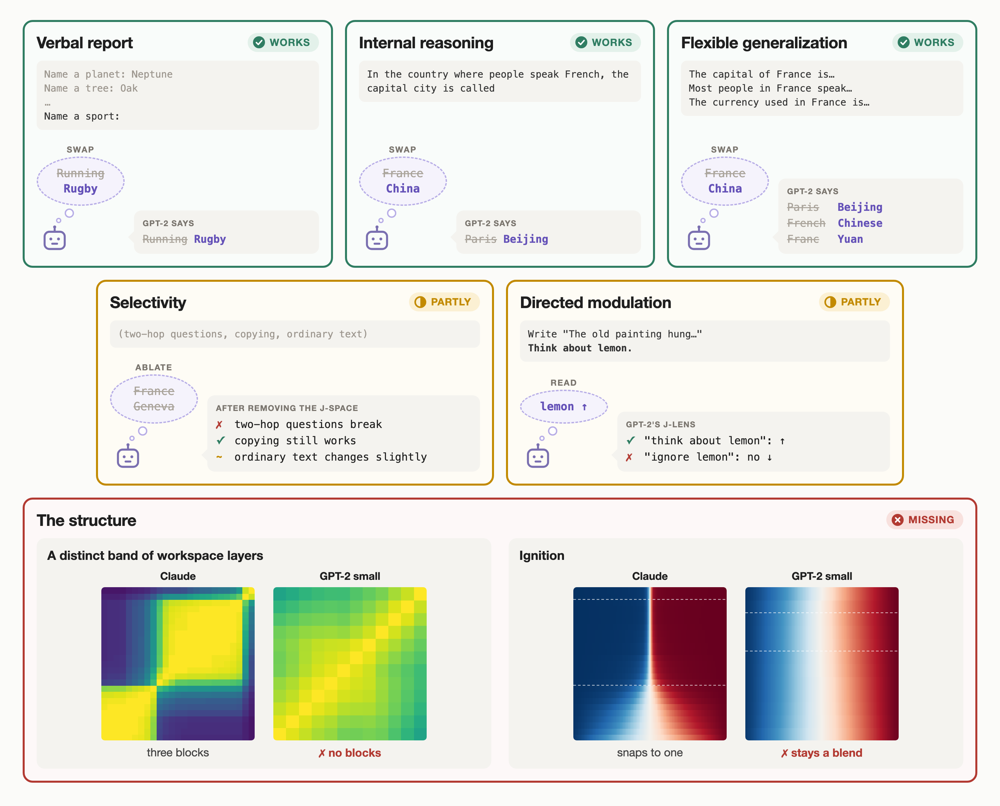
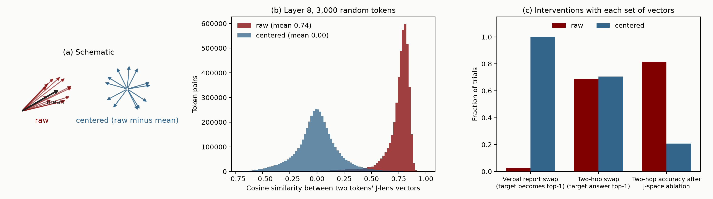
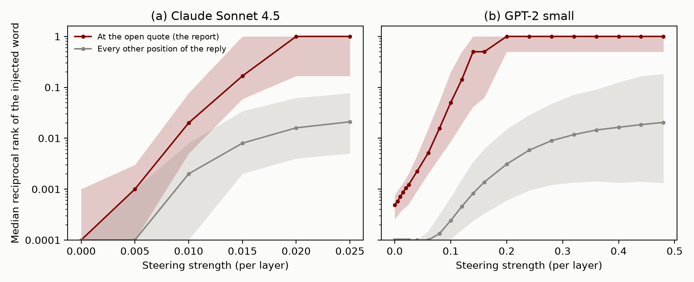
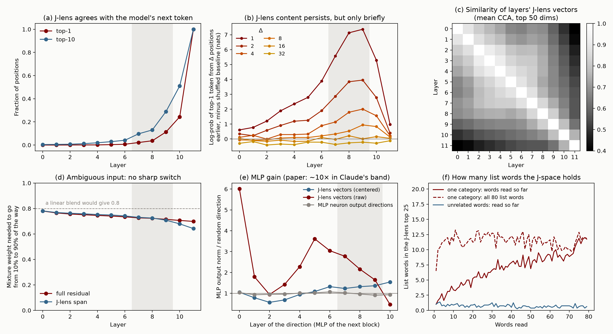
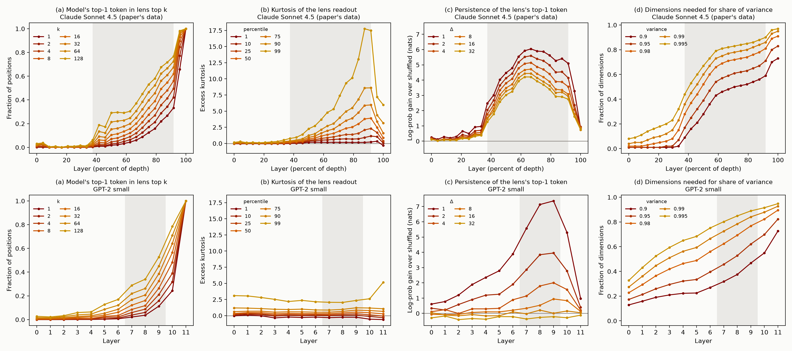

# GPT-2 Small Mostly Has a Functional Global Workspace

## TL;DR

- Anthropic's global workspace paper ([Gurnee et al., 2026](https://transformer-circuits.pub/2026/workspace/index.html)) proposes five functional tests for a global workspace: verbal report, directed modulation, internal reasoning, flexible generalization, and selectivity. Using a new tool, the Jacobian lens, it finds representations in Claude that pass all five. It also finds structure in Claude that global workspace theory predicts.
- We ran the same tests on GPT-2 small, a 124M-parameter base model from 2019. It passes verbal report, internal reasoning, and flexible generalization about as well as Claude does, and it partly passes selectivity and directed modulation. It has almost none of the structure.
- We think these functional tests are cheap, so passing them should count for little. A functional global workspace would be a big deal, as [Rob Long has argued](https://experiencemachines.substack.com/p/merely-functional-is-still-a-big). But we don't think GPT-2 small has one, and it mostly passes the tests. The case for a workspace in Claude has to rest on the structure.



*Figure 1: The paper's five functional tests and two of its structural signatures, run on GPT-2 small. The examples are real outputs from our runs. Structure row: Claude Sonnet 4.5 is the paper's released figure data. Left, similarity between every pair of layers' J-lens vectors (CKA; for GPT-2, with the top 5 principal components removed, since one component dominates every layer). Right, where the activation for a 50/50 mix of two countries' embeddings sits between the two pure countries, from pure B (blue) to pure A (red), across layers.*

## Background

Global workspace theory is a theory of conscious access in humans. On this theory, most processing in the brain happens in specialized processors that work in parallel and outside awareness. Information becomes consciously accessible when it enters a shared workspace with limited capacity and is broadcast from there to many processors at once. The paper asks whether language models have something that plays this role.

To look for it, the paper introduces the Jacobian lens (J-lens). For each layer and each token in the vocabulary, the J-lens gives a direction in the residual stream. Roughly, it is the direction that, averaged over many contexts, makes the model more likely to say that token now or later. The paper calls the set of representations built from a few of these directions the J-space. It then calls a set of representations workspace-like if it has five properties, taken from the properties usually associated with conscious access in people:

1. **Verbal report.** When asked what it is thinking about, the model names concepts in the workspace. Swapping one workspace vector for another changes its answer.
2. **Directed modulation.** When told to hold a concept in mind or do mental arithmetic, the model puts that concept or the result in the workspace. Information that is not usually there can be brought in when a task needs it.
3. **Internal reasoning.** Workspace vectors hold the intermediate results of multi-step reasoning, and changing them changes the conclusion.
4. **Flexible generalization.** The same workspace vector works as the input to many different downstream computations.
5. **Selectivity.** The workspace is a small part of what the model represents, and it is needed for only some of what the model does. Routine processing, like parsing text or writing fluently, does not depend on it.

The paper finds that Claude's J-space has all five properties.

Global workspace theory claims more than these five properties. It says the accessible representations sit in one stage with limited capacity, which contents compete to enter and which broadcasts them to the rest of the system. The Eleos AI commentary on the paper draws this line. The five properties show a "privileged set" of representations, but showing that the set forms a unified stream, or a workspace in the theory's sense, takes more. The paper's evidence for the stronger claim is structural. In Claude, the J-space acts like a workspace only in a middle band of layers, and an ambiguous input snaps to one interpretation at the start of that band ("ignition"). The J-space has limited capacity. And the model's weights amplify J-space content, and pass it between positions, more than other content.

People took the results seriously. The Eleos AI commentary called them "the most significant evidence of consciousness in LLMs so far uncovered by mechanistic interpretability research." The paper leaves open how the workspace depends on model size: "Future work could investigate whether smaller models have an equally rich workspace, a proportionally smaller one, a less reliable one, or none at all." We ran the tests on GPT-2 small.

## How each test went

- **Verbal report works.** Asked to "Name a sport:", GPT-2 says "Running". Swapping the J-lens direction for "Running" with the one for "Rugby" makes it say "Rugby", on every trial. The paper also injects a concept into the model's input and asks the model to report the "injected thought". GPT-2 fails this version. Once the injection is strong enough for GPT-2 to name the word where the report goes, it is even more likely to say the word at the very start of its reply. A small instruction-tuned model, Qwen3-1.7B, doesn't say the word early, but it also rarely reports it.
- **Internal reasoning works.** In a question like "In the country where people speak French, the capital city is called", the unstated middle step (France) shows up in the J-lens. Swapping it for China makes GPT-2 answer "Beijing". This works on 71% of swaps. The paper reports 70% for Sonnet 4.5 and Opus 4.5, on a different and harder set of questions.
- **Flexible generalization works.** A single swap of France for China makes GPT-2 give China's capital, language, and currency. Across the paper's grid of swaps, it works about as often as it does in Claude, on the functions GPT-2 can compute (35%, against Claude's 40%). Both models fail on one kind of function.
- **Selectivity partly works.** Removing the most active J-lens directions breaks two-hop questions and leaves copying intact, the same pattern the paper reports. It also changes GPT-2's next-word prediction on 29% of ordinary text, against about 19% for removing random directions. Removing them across three layers breaks simple fact recall ("The capital of France is") too.
- **Directed modulation partly works.** Told to think about "lemon" while copying an unrelated sentence, GPT-2 has "lemon" a bit higher in its J-space than when "lemon" is only mentioned. Unlike Claude, it doesn't push "lemon" down when told to ignore it. Qwen3-1.7B does both, which suggests this part of the test comes with following instructions. Asking GPT-2 about a property of a passage, like its tense, doesn't bring the property's name into its J-space.
- **Almost none of the structure is there.** In Claude, the paper finds a distinct band of middle layers where the J-space acts like a workspace. In GPT-2, most of the statistics it uses to find that band change smoothly with depth. The exception is how long the J-lens's top token lasts at later positions. This peaks in GPT-2's middle layers too, but it is gone 16 tokens later, while in Claude it is still strong 32 tokens later. In Claude, an input made halfway between "France" and "Germany" snaps to one of the two at the start of the band. In GPT-2 it stays halfway at every layer. Claude's MLP layers amplify J-lens directions about 10 times as much as random directions, and GPT-2's amplify them 1.2 to 1.5 times as much. GPT-2 does have a limited J-space capacity, but it has a simple explanation that doesn't need a workspace.

## What we did

We used GPT-2 small (124M parameters, 12 layers) with the J-lens that Neuronpedia fit for it using Anthropic's released code, and the paper's released prompts and interventions wherever we could. GPT-2 is a base model, so it doesn't follow instructions. We rewrote each task as text that it would complete in the intended way, usually with a few worked examples first. For example, "Think of a sport. Answer in one word." became the last line of a list:

```
Name a planet: Neptune
Name a tree: Oak
...
Name a sport:
```

We skipped the experiments that have no base-model version, such as those about the Assistant persona. GPT-2 also can't do many of the paper's tasks, so we scored each test only on items it gets right without any intervention. The appendix has every prompt format.

### Centering the J-lens vectors



*Figure 2: (a) Schematic. Each raw J-lens vector is a large shared direction plus a small part specific to its token. Centering removes the shared part. (b) Cosine similarity between pairs of GPT-2's J-lens vectors at layer 8, before and after centering. (c) Three interventions with raw and with centered vectors.*

GPT-2's J-lens vectors all point in nearly the same direction. The average cosine similarity between two tokens' vectors is about 0.7. Part of this comes from GPT-2's unembedding: its token vectors already share a common direction (average cosine 0.27), a known property of language model embeddings ([Gao et al., 2019](https://arxiv.org/abs/1907.12009)), and the lens makes it much stronger. This doesn't matter for reading the lens, because the shared direction shifts every token's score by the same amount. It does matter for interventions. They measure and move how far the residual stream points along a token's J-lens vector, and with the raw vectors that is mostly the shared direction. So we subtract the average J-lens vector from each one before intervening. This changes no readout and makes the vectors close to orthogonal. It makes a large difference: with the raw vectors, the verbal report swap works on 1 of 38 trials instead of 38 of 38 (Figure 2c). The paper doesn't discuss this, and we don't know whether Claude's J-lens vectors have the same problem.

### The band of workspace layers

The paper chooses its band of workspace layers from several statistics computed at each layer. In GPT-2 most of these statistics change smoothly with depth and don't mark out a band (see the structure section). We used layers 7 to 9, out of 0 to 11. From layer 6 the lens's content persists more and more across nearby tokens, peaking at layer 9, and from layer 10 it mostly shows the next token. This is a judgment call, but the main results come out about the same for any band that starts at layer 6 or later.

## The five tests in more detail

### Verbal report

GPT-2 answers the "Name a {category}:" prompt with one of the paper's candidate words in 9 of the paper's 14 categories. At the colon, just before the answer, the J-lens ranks the candidates roughly the way the model's output does, and more so in later layers, as in the paper.

For the swap, we take GPT-2's answer ("Running") and a candidate outside its top 10 ("Rugby"). At every position in layers 7 to 9, we subtract the part of the residual stream that points along the "Running" direction and add the same amount along the "Rugby" direction. "Rugby" becomes GPT-2's answer on all 38 trials. The paper reports that the target reaches Claude's top 5 on 88% of trials.

The paper also checks that the report is carried by the J-space part of a concept's representation. It builds a vector for each concept from the model's activations on "Tell me about {concept}", splits it into a J-space part and the rest, and repeats the swap with each part. In GPT-2, swapping the J-space part works on 97% of trials and swapping the rest works on 0%, as in the paper (59% and 5%). There is one difference. In Claude the J-space part holds only 6–7% of each concept vector's variance, so a small part of the representation carries the report. In GPT-2 it holds 23–33%.

The injected-thought test is different. In the paper, a concept's J-lens vector is added to the user's message, and the model, asked whether it detects an injected thought, names the concept. The paper points out that the injected concept doesn't come out at other points in the reply, only "when the model's introspective report is being elicited." Our base-model version is a transcript, with the reply written up to the point of the report:

```
Researcher: I can inject a thought about a specific word into your mind. Do you detect an injected thought? If so, what is it about?
Model: Yes, I detect an injected thought. The thought is about "
```

We added a concept's J-lens vector over the researcher's question, at several strengths, for 57 of the paper's concepts. Then we measured how likely GPT-2 is to say the word at each point of the reply. GPT-2 does name the word at the report when the injection is strong enough. At our strongest setting, the word is its top prediction there for 41 of the 57 concepts. But at that setting the word is also its top prediction at the very start of the reply, before it says anything about a thought, for 50 of the 57. At the two strongest settings, the word is more likely at the start of the reply than at the report for 53 and 55 of the 57 concepts (Figure 3). So the injection makes GPT-2 say the word, rather than report it when asked.

We also ran the paper's own chat version of this test on Qwen3-1.7B, a small instruction-tuned model. The word is never Qwen's top prediction at the start of its reply, but Qwen also rarely names it at the report. At each strength we tried, at most 8 of the 74 words get even a 10% chance there. The paper reports that Claude names the injected concept on most trials. This is the one functional result that neither small model reproduces.



*Figure 3: The injected-thought test. For each injection strength, the number of concepts for which the injected word is the model's top prediction at the report, and at the very start of its reply.*

### Directed modulation

The paper gives the model an instruction about a word, has it copy an unrelated sentence, and reads the J-lens over the copy. We used the same setup and the paper's released instructions, with the copy written out after the instruction. There are five conditions: no instruction, a bare mention ("lemon."), focus ("Think about lemon while you write."), dismissal ("Ignore lemon."), and prohibition ("Don't think about lemon.").

Mentioning the word raises it in GPT-2's J-space, compared with no mention. Telling GPT-2 to think about the word raises it a bit more. The word ranks higher than with a bare mention in 76% of word and sentence pairs. But the effect is small. The word reaches the top 25 of the J-lens in only 13% of trials.

The paper also tests pushing a concept out. In Claude, "ignore lemon" keeps "lemon" well below a bare mention. "Don't think about lemon" doesn't, which the paper compares to the "white bear" effect in people, where trying not to think of something brings it to mind. GPT-2 doesn't push the word down under either instruction. "Ignore" does nothing compared with a mention, and "don't think about" raises the word the most. We count this as a difference from Claude rather than a clear failure. The paper's statement of the criterion asks only for bringing a concept in, although its motivation also mentions dismissing one, and it isn't clear what a workspace should do with an instruction to ignore something.

On the paper's chat version, Qwen3-1.7B does all of this. "Think about lemon" raises the word far above a mention (it reaches the top 25 in 42% of trials), and both "ignore" and "don't think about" push it below a mention. Qwen differs from GPT-2 in many ways, but the simplest explanation is instruction tuning. The J-lens reads what a model is inclined to say later, and a model that follows instructions is less inclined to mention a word it was told to ignore.

Two other parts of the test don't carry over to GPT-2. The paper has the model do mental arithmetic while copying, and GPT-2 can't do the arithmetic at all. The paper also shows that asking about a property of a passage, like its tense, brings the property's name into the J-space. In GPT-2 the name never shows up, although GPT-2 gets the next-word version of each task right.

### Internal reasoning

GPT-2 can answer only 9 of the paper's 90 released two-hop questions. Four of these are all of the set's questions of one kind: "The capital of the country where Hungarian is the primary language is". We wrote 53 more questions of this kind. Each goes from a language to a capital, or from a capital to a language, through a country that is never named, and each comes after two worked examples. GPT-2 answers 48 of them.

At the last position, the country shows up near the top of the J-lens at layers 8 and 9, although it is never written. A random other country doesn't.

Swapping the country's J-lens direction for another country's changes GPT-2's answer to the other country's capital or language on 71% of 999 swaps. The paper reports 70% for Sonnet 4.5 and Opus 4.5 and 54% for Haiku 4.5, on its own set of 50 two-hop questions of many kinds. GPT-2 can answer few questions like those, so the rates come from different questions and aren't directly comparable. What we can say is that on the questions GPT-2 can answer, the swap works about as often as it does for Claude on the paper's questions.

The paper's two checks also hold in GPT-2. Swapping the country at a single layer already works at layer 4, while swapping the answer (Paris for Beijing) works only from layer 8, so the swap isn't just slipping in the answer. And for a vector built from prompts that imply the country without naming it, the J-space part does the work. Swapping it changes the answer on 95% of trials, and swapping the rest does on 1.5% (the paper: 61% and 28%). As with verbal report, the J-space part is a much larger share of this vector in GPT-2 than in Claude (27–57% of its variance, against 10–15%).

### Flexible generalization

The paper swaps one argument, such as France for China, across prompts that apply different functions to it: "the capital of", "most people speak", "the currency of". In GPT-2, one fixed France-to-China swap turns Paris into Beijing, French into Chinese, and Franc into Yuan. The fourth country function, continent, fails, but GPT-2 can't answer it for France in the first place.

The paper's full grid has 4 kinds of argument, 4 functions for each, and 12 swaps per function. GPT-2 can answer only 19 of the 64 prompts, even with worked examples. On the swaps where it can compute the function for the swapped-in argument, the swap works 35% of the time. Claude's rate on the full grid is 40%. The failures look alike. Claude never succeeds on number words, and GPT-2 never succeeds on "the month after" and "the number after". Two smaller results from the paper don't hold in GPT-2. Doubling the swap strength helps Claude but makes GPT-2 worse, and how strongly an argument is present in the J-space beforehand doesn't predict which of its swaps succeed.

### Selectivity

The paper's main selectivity test removes the 10 most active J-lens directions at each position and compares this with removing random directions. It skips any token that is among the model's 10 most likely next tokens. We removed them at one layer (layer 8) and at three layers (7 to 9), on four tasks: our two-hop questions, one-hop recall ("The capital of France is"), copying a word from earlier in the text, and ordinary Wikipedia text.

At one layer, the pattern matches the paper. Two-hop accuracy drops from 100% to 21%, against 83–92% for removing random directions. Copying is barely touched (95%). One-hop recall is in between (73%). On ordinary text, the model's top prediction stays the same at 71% of positions.

The removal is less targeted than in Claude. Even at one layer, it changes 29% of GPT-2's predictions on ordinary text, against about 19% for random directions. At three layers it wipes out one-hop recall (6% correct), which the paper lists among the automatic skills. An [independent replication on Qwen3-4B](https://github.com/pgrindehollevik-harvard/jspace-4b) found the same: the ablation changed 34–42% of ordinary next-token predictions.

Part of the pattern comes from the rule that skips the model's likely next tokens. Copying and one-hop recall need exactly those tokens, and the rule protects them. Without the rule, one-hop recall at one layer falls from 73% to 48%, and copying at three layers falls from 65% to 25%.

The paper's second test uses one piece of information, a passage's language, in a deliberate task (naming the language) and a routine one (continuing the passage). Swapping the language's J-lens direction changes GPT-2's answer about the language more easily than it changes the language of its continuation. At one and a half times the base strength, the answer changes 90% of the time and the continuation 38%. In Claude the continuation is largely unaffected. Part of the difference may come from our setup. A base model has no separate question, so we had to apply the swap over the passage itself.

Finally, the J-space is a small part of GPT-2's representation, as the definition requires: 25 J-lens directions capture about 30% of the variance of its activations. This is true of any small set of directions, though. 25 directions picked from a random set of the same size capture slightly more.

## The structure

GPT-2 small has almost none of the structure the paper reports in Claude.



*Figure 4: Structure in GPT-2 small. The shaded region is our band, layers 7 to 9. (a) How often the J-lens's top token is the model's next-token prediction. (b) How long the lens's top token lasts, measured as in the paper: the log-probability the lens gives it Δ positions later, minus the same for the top token of a random position. (c) Similarity between the J-lens vectors of different layers. The paper finds three blocks here in Claude. GPT-2 has none. (d) For an input embedding mixed between two countries, how much of the mixing range it takes to move from 10% to 90% of the way between them. A sharp switch would give a small number. (e) How much the next MLP amplifies a direction, relative to random directions. (f) How many words of an 80-word list are in the J-lens top 25 as the model reads it.*

### No distinct band of workspace layers

The paper finds its band with a few statistics computed at each layer. One is the excess kurtosis of the lens readout. Kurtosis measures how heavy the tails of a distribution are. Here it is high when a few tokens score far above the rest of the vocabulary, which the paper reads as the J-space holding a few definite concepts. In Claude it rises at the start of the band and falls at the end. Two other statistics track how long the lens's top token lasts at later positions, and how many directions the J-lens vectors spread across. In Claude both jump at the start of the band. The paper also compares the J-lens vectors of every pair of layers, and finds three clear blocks of similar layers, which it calls sensory, workspace, and motor.

In GPT-2 only persistence comes close to marking out a band. Kurtosis is flat across layers. The J-lens vectors spread out steadily with depth, while in Claude they sit in a small subspace before the band and fan out at its start. And the similarity between layers falls off smoothly with the distance between them, with no blocks.

Persistence does peak in the middle. The lens's top token is most likely to still be there a token later at layers 8 and 9, and much less likely at the last layer, as in Claude. But in GPT-2 it doesn't last. The effect roughly halves each time the distance doubles, and it is gone 16 tokens later. In Claude, 32 tokens later it keeps between half and 70% of its strength across the band. This isn't the lens repeating words from the text: counting only top tokens that never appear in the input gives the same result. So GPT-2's middle layers carry content over the next few tokens, but not the lasting content Claude's band holds. Qwen3-1.7B's persistence is short-lived in the same way (Appendix E). Figure 5 in the appendix puts all four statistics next to Claude's.

### No ignition

The paper replaces a country's input embedding with a blend of two countries' embeddings, such as 60% France and 40% Germany. It then tracks where the model's representation of that token ends up between pure France and pure Germany. In Claude, from the start of the band, the representation snaps to one country or the other. We ran this with the paper's sentences and 16 pairs of countries. In GPT-2 the representation stays a blend at every layer, tracking the input mixture almost linearly.

### Little extra amplification

The paper measures how much the next MLP layer amplifies a direction, compared with random directions. In Claude's band, the MLP amplifies J-lens directions about 10 times as much as random directions. In GPT-2 it amplifies them only 1.2 to 1.5 times as much. In both models, MLP neuron directions are amplified about as much as random ones.

### Limited capacity, with simple explanations

The paper measures how many J-lens vectors are active at once. At each position, it rebuilds the activation from J-lens vectors, adding one at a time. It counts how many it can add before adding another J-lens vector helps the fit less than adding a random direction would. It calls this number occupancy. In Claude it is about 25. In GPT-2 it is 2 to 5, so only a handful of J-lens vectors are clearly active at any position. When GPT-2 reads a long list of unrelated words, its J-space holds about one of them at a time, where Claude holds about six. When a list switches from one category of words to another, the old category drops out of GPT-2's J-space, as the paper reports for Claude.

None of this needs a workspace. As David Chalmers [points out](https://philpapers.org/rec/CHAITJ-2), the J-space is defined as combinations of a few vectors, so its capacity is limited by construction. And in a list, the model expects the next words to come from the current category. The J-lens reads what the model expects to say, so the old category drops out when the list moves on.

## Why the tests are cheap

GPT-2 small mostly passes the functional tests while having almost none of the structure, and we don't think it has a global workspace. We think most of what the tests check follows from two things: how the J-lens is built, and the fact that a transformer computing in several steps has to keep intermediate results in its residual stream. Gavin Leech [made a similar argument](https://www.paradigm3.org/research/jspace/) from the paper alone: "roughly half of the advertised workspace properties are near-analytic consequences of how the J-space is found." GPT-2 small gives an empirical version of it.

The J-lens is built to find the directions that make a model more likely to say each word, now or later. Any model that predicts text well has to represent things like "France is relevant here", and it is natural for that representation to also push toward saying "France". Most of the tests check that such representations exist, that the model uses them in later steps, and that changing them changes what the model says.

For verbal report, the swap result is close to guaranteed. The J-lens direction for "Rugby" is, by construction, the direction that makes the model more likely to say "Rugby", and the swap adds it where the model is about to answer. The paper says as much: "by construction, we should expect there to be some relationship between Jacobian lens readouts and verbalization." The check that the J-space part carries the report adds less than it seems. The rest of the concept vector is what's left after removing the J-lens directions that best match it, so it ends up nearly at right angles to the direction that separates "Rugby" from "Running" (median cosine 0.02, against 0.31 for the J-space part). The J-lens itself predicts that swapping the rest will barely change the answer. The injected-thought test is the part of verbal report that isn't built in, and GPT-2 fails it.

For internal reasoning, the result follows from computing in two steps at all. To answer "the capital of the country where people speak French" in one forward pass, GPT-2 has to get from "French" to "Paris". If it goes through France, something standing for France has to be in the residual stream between the two steps, because the residual stream is the only path between layers. Neel Nanda makes this argument in his commentary on the paper. Work on how models recall facts has found the mechanism in detail. Middle layers look up facts about an entity where it is mentioned, and later attention heads pull out the fact the question asks for ([Meng et al., 2022](https://arxiv.org/abs/2202.05262); [Geva et al., 2023](https://arxiv.org/abs/2304.14767)). Nothing about this needs a workspace. What the J-lens adds is that the stored "France" points roughly along the direction that would make the model say "France". That is plausible for any model, since a representation that many circuits read, including the circuit that writes the word, will tend to line up with the direction for saying it.

For flexible generalization, the result follows from reusing one representation. If the capital, language, and currency lookups all read the same country representation, swapping it changes all three answers. [Hernandez et al. (2023)](https://arxiv.org/abs/2308.09124), whom the paper cites, found that many relations act as roughly linear maps from one representation of the subject. The failures fit too. Months and numbers are partly represented on circles and other ordered structures, not only as one direction per word ([Engels et al., 2024](https://arxiv.org/abs/2405.14860) found circular representations of months and days of the week in GPT-2 and Mistral). Swapping one word's direction for another's need not change what "the month after" computes from that structure.

For selectivity, part of the result comes from how the ablation is defined. The rule that skips the model's likely next tokens protects exactly what copying and simple recall need. It doesn't protect the unspoken middle step of a two-hop question, which by definition isn't about to be said. More generally, the top J-lens tokens at a position are the words the residual stream most pushes toward, now or later. These are mostly the things the text is about. Tasks that depend on facts about something mentioned earlier depend on this content. Tasks that depend on which exact tokens appeared, or on local grammar, don't. That gives a split between "flexible" and "automatic" tasks without a workspace. And any small set of directions tied to tokens is a small part of what a model represents.

For directed modulation, the part GPT-2 passes is what next-word prediction does. The J-lens measures how much the residual stream would make the model say a word, now or later. Anything that makes a word more likely to come up later in the text raises it. Mentioning "lemon" does that, and "think about lemon" and "don't think about lemon" do it more, because text that talks about thinking about lemons tends to go on about lemons. The downward part, "ignore lemon", shows up in Qwen3-1.7B, and the same logic covers it. A model that follows instructions is less likely to mention something it was told to ignore.

The structure GPT-2 does have also has simple explanations. Capacity is limited by construction, and the category effect in lists comes from what the model expects to say next. The structure that would set a workspace apart, a distinct band, ignition, and strong amplification, is missing.

Taken together, the functional tests show that a model keeps intermediate results in directions that line up with the words for them, and uses those directions in later steps. Nanda calls this a working memory. It is a real finding, and it makes the J-lens a useful tool even on small models. But it is not specific to a global workspace. In the Eleos commentary's terms, the tests show a privileged set of representations, and GPT-2 small has one too. Showing that the set forms a workspace takes more, and that is the job of the structural results.

## What this means

The paper presents the five properties as "several of the key functional properties that, according to many theories, are associated with conscious access in humans, and that have been proposed as indicators by which to assess AI systems for consciousness-related processing." An indicator is useful when it is hard to have without the thing it indicates. A 124M base model from 2019 mostly has these, so for language models they are weak indicators. This is a concrete case of a known worry about global workspace theory, that its conditions are easy for simple systems to meet. Versions of this worry include the "small network argument" of [Herzog et al. (2007)](https://pubmed.ncbi.nlm.nih.gov/17900860/), the "small model objection" discussed by [Goldstein and Kirk-Giannini (2024)](https://arxiv.org/abs/2410.11407), and what [Butlin et al. (2026)](https://doi.org/10.1016/j.tics.2025.10.011) call the minimal implementation problem.

[Rob Long](https://experiencemachines.substack.com/p/merely-functional-is-still-a-big) has argued that "merely" functional claims are still a big deal. If a model really has a functional global workspace, that matters, and most of the disagreement about the paper is about whether it has shown one. We agree, and our results bear on that disagreement. The five functional tests, as the paper runs them, don't tell apart a model with a workspace from one without, since GPT-2 small mostly passes them. If Claude has a global workspace in the fuller sense, the evidence has to come from the structure. Those results deserve the most scrutiny and the most replication on open models. There are already signs that some of them are less clean outside Claude. Nanda's replication on Qwen 3.6 27B found blocks of similar layers, but "notably less clean than the paper's", with the workspace layers split into two or three overlapping bands. [Erik Hoel](https://www.theintrinsicperspective.com/p/anthropic-runs-like-wile-e-coyote) points to early plots by Elie Bakouch for about 38 open models that show no sharp three-part structure.

One could instead say that GPT-2 small has a small, unreliable global workspace. That is consistent with our results. But then having a functional global workspace, in the paper's sense, is a low bar. It would also say little about consciousness, since few people think GPT-2 small is conscious.

For interpretability, the J-lens looks useful even on small models. On GPT-2 small it finds unspoken intermediate steps, and changing them works about as often as in Claude.

## Limitations

- We used worked examples instead of instructions, scored only items GPT-2 gets right, and wrote easier two-hop questions. So GPT-2 passed easier versions of the tests than Claude did. Our claim is that on the tasks it can do, it shows the same signatures as Claude.
- Centering the J-lens vectors isn't in the paper. It changes no readout, but without it the verbal report swap and the selectivity ablation stop working.
- We picked the band of layers ourselves, since GPT-2 has no distinct band. The main results hold for any band from layer 6 on, but we didn't rerun every experiment with every band.
- We used one model and one lens, and didn't fit our own lens.
- GPT-2 small has only 12 layers, which may be too few for a distinct band, ignition, or strong amplification. So the missing structure is a fact about this model. It doesn't show that the paper's structural results are artifacts.
- For the injected-thought test, we read GPT-2's predictions along a fixed reply that we wrote. We didn't sample its own replies.
- Some samples are small, for example 9 categories for verbal report and 7 passages for the language test.
- We couldn't run the experiential-report ablations, naming versus avoiding a concept, the Assistant-perspective results, counterfactual reflection training, or the arithmetic and line-counting experiments.
- The Qwen3-1.7B results come from a quick check, with a band and injection strengths we didn't tune.

---

# Appendix

## A. Setup

### A.1 Model, lens, and interventions

- **Model.** GPT-2 small (the `openai-community/gpt2` checkpoint), in fp32. We call the output of transformer block L "layer L", for L = 0 to 11. An `<|endoftext|>` token is prepended to every prompt.
- **Lens.** Neuronpedia's gpt2-small J-lens, fit with Anthropic's released code on WikiText-103 (128-token sequences, bf16, with the output of the last block, before the final LayerNorm, as the target). The fit stopped at convergence after 277 sequences. The lens has a matrix J_L for layers 0 to 10. We set J_11 to the identity.
- **Readout.** lens_L(h) = W_U · LN_f(J_L h), as in the reference code.
- **J-lens vectors.** Row t of W_U J_L (that is, v_t = J_Lᵀ w_t), as in the paper, then centered (A.2). The final LayerNorm is applied in the readout but not folded into v_t. This matches the steering direction in the reference code.
- **Single tokens.** The lens has one vector per token, so every word we track must be a single GPT-2 token. Words that split into several tokens are dropped. The paper has the same restriction.
- **Interventions.** Unless stated otherwise, these act at every position of every band layer, with magnitudes read from a clean forward pass.
  - *Subtract-and-add swap* (verbal report, flexible generalization): h ← h + α⟨v̂_s, h⟩(v̂_t − v̂_s), where v̂ are unit vectors. This follows the paper's description: "we subtract the projection onto the Soccer lens vector and add an equal-magnitude projection onto the Rugby lens vector."
  - *Coordinate swap* (internal reasoning, the language test): with V = [v_s v_t], read the coordinates c = V⁺h and set h ← h + (σ(c_clean) − V⁺h)V, where σ exchanges the two coordinates. This is the paper's "patching in lens coordinates", held at the swapped clean values.
  - *Component swap*: the subtract-and-add swap along the difference between two concepts' J-space parts (or their non-J-space parts), rescaled to the size of the plain lens swap.
  - *Clamp*: hold the coordinates along a set of lens vectors at their clean-pass values.
  - *Pursuit*: the paper's "gradient pursuit" is not specified further. We use a greedy non-negative pursuit over the whole dictionary, refitting the coefficients by non-negative least squares at each step.
  - *Top-k ablation*: at each position and band layer, take the 10 highest lens tokens that are not in the clean output top 10, and remove the residual stream's component in their span. The random control removes a random 10-dimensional span, rescaled at each position to remove the same norm.

### A.2 Centering

With raw vectors, the mean cosine similarity between pairs of J-lens vectors is 0.62–0.78 at layers 0 to 10 (0.74 at layer 8) and 0.27 at layer 11, which is the unembedding itself. After subtracting the mean over the vocabulary, it is 0.00 at every layer. Readouts don't change, because the mean vector adds the same amount to every token's score before the softmax.

Centering is also the natural direction to intervene along. The gradient of a token's log-probability with respect to the logits is the one-hot vector for that token minus the predicted distribution. If the predicted distribution is replaced by the uniform one and pulled back through the lens, the result is the J-lens vector minus the vocabulary mean.

Three interventions with each set of vectors (band 7 to 9):

| | centered J-lens (ours) | raw J-lens | centered logit lens (J = identity) |
|---|---|---|---|
| Verbal report swap, target becomes top-1 (38 trials) | 100% | 3% | 100% |
| Two-hop coordinate swap, target answer top-1 (999 trials) | 71% | 69% | 45% |
| Two-hop accuracy after ablation at layer 8 (J / random, one draw) | 21% / 92% | 81% / 92% | 4% / 44% |
| Ordinary text, top-1 unchanged after ablation at layer 8 (J / random, one draw) | 71% / 82% | 77% / 87% | 34% / 61% |

The subtract-and-add swap and the ablation depend on centering. The coordinate swap doesn't, because it reads coordinates through a pseudoinverse, which already separates out the shared direction. With plain logit-lens directions, the verbal report swap works as well as with J-lens directions, since the band is close to the output. But the two-hop swap works less often, and the ablation is much less selective. So for interventions, the J-lens adds something over the logit lens even in GPT-2 small.

### A.3 Band choice and sensitivity

We chose layers 7 to 9 from the layer statistics in section D, before running the follow-up experiments. The same interventions with other bands:

| band | verbal report swap, top-1 | two-hop swap, top-1 | two-hop after ablation at the middle layer (J / random) | ordinary text unchanged (J / random) |
|---|---|---|---|---|
| 5–7 | 71% | 53% | 10% / 73% | 56% / 80% |
| 6–8 | 87% | 64% | 23% / 90% | 65% / 81% |
| **7–9** | **100%** | **71%** | **21% / 92%** | **71% / 82%** |
| 8–10 | 100% | 66% | 8% / 92% | 65% / 83% |
| 6–10 | 100% | 68% | 21% / 92% | 71% / 82% |

The ablation columns use the band's middle layer (6, 7, 8, 9, and 8) and one random draw. The results hold for any band that starts at layer 6 or later. Moving the band earlier, to 5–7, weakens every intervention.

### A.4 Scoring

- An item counts only if GPT-2 gets it right with no intervention (greedy next token).
- Swap targets must start outside the model's top 10, as in the paper, so that a swap has to move them.
- Where the paper scores "top-1 in the lens", GPT-2's effects are often present but smaller, so we also report ranks and paired comparisons.
- Intervals are Wilson 95% intervals. Paired comparisons use a sign test.

## B. Prompt formats

Every prompt starts with `<|endoftext|>`.

### B.1 Verbal report

The request is the last line of a 9-line list. The 8 lines above it use the next 8 categories in the paper's order, each answered with its first single-token candidate that is not a candidate for the requested category. The lens is read, and the swap is scored, at the final colon. For sport:

```
Name a instrument: Piano
Name a planet: Neptune
Name a tree: Oak
Name a bird: Robin
Name a language: Japanese
Name a profession: Teacher
Name a beverage: Coffee
Name a organ: Heart
Name a sport:
```

Concept vectors are the residual stream at the final token of `Tell me about {concept}.`, minus the mean over 100 other candidate words.

For the injected-thought test, the concept is injected over the first line, at layers 7 to 9. The report is read at `about` and at the open quote:

```
Researcher: I can inject a thought about a specific word into your mind. Do you detect an injected thought? If so, what is it about?
Model: Yes, I detect an injected thought. The thought is about "
```

The injected vector is the unit centered J-lens vector of ` {word}`, scaled by the layer's mean residual norm on this prompt times a strength between 0 and 1. The concepts are the 57 of the paper's 100 whose word is a single token both with and without a leading space.

### B.2 Directed modulation

The instruction sits between a sentence and a copy of it, and the lens is read over the copy:

```
Write "{sentence}" {instruction} "{sentence}
```

The instructions are the paper's released phrasings. For example:

| condition | example | number of phrasings |
|---|---|---|
| baseline | (no instruction; the word does not appear) | 1 |
| mention | `lemon.` / `(lemon)` / `lemon came up in conversation.` | 6 |
| focus | `Think about lemon while you write.` | 5 |
| dismissal | `Ignore lemon.` / `lemon is irrelevant — ignore it.` | 6 |
| prohibition | `Don't think about lemon.` / `Whatever you do, do not think about lemon.` | 7 |

We used 30 single-token concept words from the paper's topic lists and 12 of the paper's sentences. We also ran the paper's main-text version, which names a category such as "citrus fruits" and tracks its members.

Arithmetic: `{expr} =` to test whether GPT-2 can do the problem, and `Work out {expr} in your head while you write.` as the instruction.

Paired questions (the paper's released items, unchanged): `{question}\n{stimulus}`. The question is either "What word do you think comes next? Answer in one word." or the item's property question, for example "When are the events in this passage set relative to the moment of telling? Answer in one word."

Imagine test: `Imagine that the following sentence is written in French: {English sentence}` (and two other headers that claim the sentence is French), compared with neutral headers (`Here is a sentence: {s}`) and with real French sentences under neutral headers. The probe is the difference between the mean final-token activations on 6 French and 6 English passages, with its top-16 J-lens component removed.

### B.3 Internal reasoning

Two kinds of question, each with two worked examples that use countries outside the test set:

```
In the country where people speak Arabic, the capital city is called Cairo. In the country where people speak Hebrew, the capital city is called Jerusalem. In the country where people speak {language}, the capital city is called
```
```
The country governed from Cairo has one main language, namely Arabic. The country governed from Tokyo has one main language, namely Japanese. The country governed from {capital} has one main language, namely
```

For the privilege test, each country's vector is built from six prompts. Each implies the country without naming it and asks about something else, so the country's name is never the next token:

```
People in the country whose capital is {capital} mostly speak the language of
A traveler flying into {capital} has landed on the continent of
The homeland of the {language} language lies on the continent of
Newspapers printed in {capital} are usually written in the language of
The country whose largest city is {capital} is located on the continent of
Someone who grew up speaking {language} was most likely born in the city of
```

### B.4 Flexible generalization

The paper's templates and answers, each preceded by two worked examples that use arguments outside the test set. For example:

```
Most people in Japan speak Japanese. Most people in Italy speak Italian. Most people in France speak
The month right after January is February. The month right after June is July. The month right after April is
```

An earlier version of the squaring examples read "Six squared equals thirty" (a cut-off "thirty-six"). The numbers here use the corrected version. With the old one, the results were slightly better (22 of 57 on the answerable subset, rather than 19 of 54).

### B.5 Selectivity

- Two-hop: the internal reasoning questions above.
- One-hop: `The capital of Egypt is Cairo. The capital of Japan is Tokyo. The capital of {country} is` (and the same with "main language").
- Copying: ` {a} {b} The quick brown fox jumps over the lazy dog. {a}`, where the answer is ` {b}` and a and b are random single-token nouns.
- Ordinary text: the first 96 tokens of 16 WikiText-2 test paragraphs. The score is the fraction of positions (after the first 5) whose top-1 prediction doesn't change.
- Language, deliberate task: three worked examples in Portuguese, Dutch, and Swedish, then `Passage: {passage}\nLanguage:`.
- Language, routine task: the passage alone. It is scored by whether the model still prefers a short continuation in the passage's language (" et le soleil brillait", and the same phrase in German, Spanish, and Italian) over one in the swapped-in language. The swap is applied over the passage tokens.

## C. Results by test

### C.1 Verbal report

GPT-2 answers with a candidate in 9 of 14 categories: country (Japan), color (Blue), sport (Running), instrument (Guitar), planet (Mars), language (English), beverage (Beer), city (Tokyo), and river (Nile). It fails on fruit ("Fruit"), tree ("N"), bird ("Blue"), profession ("Sports"), and organ ("Piano").

Spearman correlation between the lens scores and the output scores of the 10 candidates at the colon, averaged over categories (all categories / categories GPT-2 answers):

| layer | 0 | 1 | 2 | 3 | 4 | 5 | 6 | **7** | **8** | **9** | 10 |
|---|---|---|---|---|---|---|---|---|---|---|---|
| all | .05 | .04 | .05 | .13 | .09 | .22 | .36 | **.44** | **.47** | **.57** | .63 |
| answered | .05 | .05 | .09 | .17 | .11 | .30 | .43 | **.42** | **.47** | **.53** | .60 |

Swaps, for targets starting at output rank 11 or worse. Rates are for reaching the top 5, with reaching the top 1 in parentheses. The paper's numbers for Sonnet 4.5 are 88% (lens swap), 59% (J-space part), 5% (the rest), and 0% (the rest, clamped).

| | answered categories (38 trials) | all categories (78 trials) |
|---|---|---|
| lens swap | 100% [91, 100] (100%); median rank 37 → 1 | 100% (100%); median rank 95 → 1 |
| J-space part | 97% [87, 100] (84%) | 77% (68%) |
| the rest | 0% [0, 9] (0%) | 0% (0%) |
| the rest, J-lens coordinates clamped | 3% [0, 13] (0%) | 1% (0%) |

The J-space part holds a median 23% (layer 7), 26% (layer 8), and 33% (layer 9) of each concept vector's variance. The paper reports 6–7% for Claude.

Median cosine between each swap direction and v_t − v_s, over 114 trials and layers: 1.00 for the lens swap, 0.31 for the J-space part, and 0.02 for the rest. The target's own J-lens vector is among the 16 vectors picked for its concept vector in 61 of 114 cases.

Injected thought, 57 concepts. The table gives the probability of the injected word as the next token (its two surface forms summed), and how many concepts have it as the top prediction. "Report" means the better of the positions after `about` and after the open quote. "Start of reply" means the positions after `Model`, `Model:`, and `Model: Yes`, before the reply says anything about a thought. "Earlier in the answer sentence" means the positions after `an`, `an injected`, and `The`, which could be read as naming the thought early.

| strength | report: top prediction | report: median probability | start of reply: top prediction | start of reply: median probability | earlier in the answer sentence: top prediction |
|---|---|---|---|---|---|
| 0 | 0 of 57 | 0.000 | 0 of 57 | 0.000 | 0 of 57 |
| 0.05 | 0 of 57 | 0.000 | 0 of 57 | 0.000 | 0 of 57 |
| 0.1 | 0 of 57 | 0.000 | 0 of 57 | 0.000 | 1 of 57 |
| 0.15 | 0 of 57 | 0.002 | 0 of 57 | 0.003 | 25 of 57 |
| 0.25 | 3 of 57 | 0.009 | 5 of 57 | 0.030 | 53 of 57 |
| 0.5 | 18 of 57 | 0.057 | 43 of 57 | 0.324 | 57 of 57 |
| 1 | 41 of 57 | 0.236 | 50 of 57 | 0.657 | 56 of 57 |

### C.2 Directed modulation

Best band rank of the tracked word over the copied sentence (360 word and sentence pairs per condition, phrasings pooled):

| condition | reaches top 1 | top 5 | top 10 | top 25 | median rank | median rank where the word is not about to be written | word in the output top 10 somewhere |
|---|---|---|---|---|---|---|---|
| baseline | 0.00 | 0.00 | 0.01 | 0.02 | 721 | 721 | 0.00 |
| mention | 0.00 | 0.01 | 0.03 | 0.06 | 454 | 532 | 0.28 |
| focus | 0.01 | 0.04 | 0.07 | 0.13 | 303 | 394 | 0.26 |
| dismissal | 0.00 | 0.02 | 0.03 | 0.07 | 420 | 498 | 0.28 |
| prohibition | 0.01 | 0.07 | 0.11 | 0.18 | 204 | 378 | 0.35 |

Paired comparisons (per word and sentence, using the median over phrasings):

| comparison | pairs where the first condition ranks the word higher | pairs | p |
|---|---|---|---|
| mention vs. baseline | 86% | 358 | 1e-41 |
| focus vs. mention | 76% | 359 | 2e-22 |
| dismissal vs. mention | 50% | 351 | 0.96 |
| prohibition vs. mention | 84% | 358 | 2e-37 |
| prohibition vs. dismissal | 84% | 358 | 1e-38 |

Median best rank by layer (the band is 7 to 9):

| condition | 6 | 7 | 8 | 9 | 10 |
|---|---|---|---|---|---|
| baseline | 1394 | 1373 | 1330 | 1226 | 1132 |
| mention | 1202 | 1064 | 912 | 479 | 110 |
| focus | 1148 | 1032 | 754 | 386 | 98 |
| dismissal | 1253 | 1055 | 974 | 477 | 121 |
| prohibition | 1073 | 872 | 618 | 267 | 51 |

The effect grows toward the output layers. At layer 10, GPT-2 is often about to write the word again.

Main-text version (name a category, track any of its members): mention beats baseline in 80% of pairs, focus beats baseline in 79%, and focus beats mention in 67%.

Arithmetic: GPT-2 gets 0 of 24 problems right when asked directly (the answer's median rank is 8). While copying under "work it out in your head", the answer's median rank is about 4,400 in every condition.

Paired questions: GPT-2 does the next-word task (all 7 items have an expected word in its top 5), but the property's name never reaches the band lens top 10 at any position under either question. Best ranks under the naming question and the next-word question: spelling 63 and 51, register 112 and 153, tense 175 and 194, number 21 and 16, part of speech 29 and 96, tense of the part-of-speech passage 89 and 104, tone 21 and 37.

Imagine test: the French probe's J-space part holds 22–30% of its variance. Compared with a neutral header, the claim header raises the lens score of "French" by 2.32 and the J-orthogonal probe by 2.83. Real French text raises them by 6.06 and 35.6. So the claim gets 38% of real French's effect on the lens and 8% of its effect on the probe. The paper reports the same kind of split in Claude. The claim header contains the word "French", though, so priming alone would produce it.

### C.3 Internal reasoning

The paper's systematic swap uses 50 two-hop questions (Sonnet 4.5 and Opus 4.5: 70%, Haiku 4.5: 54%). Its privilege test uses a released set of 90 (Sonnet 4.5: 60% for the plain lens swap). The 90 span 36 kinds of question. The most common are general multi-hop facts (29), city to the capital of its country (6), element to its state of matter (5), person to first name (5), and language to capital (4). Without worked examples, GPT-2 answers 9 of the 90. Seven of these use only single-token words, and four of those seven are the set's four language-to-capital questions. The swap works on 3 of the 6 of these where the target answer starts outside the top 10.

GPT-2 answers 48 of our 53 questions. Median lens rank at the answer position:

| layer | 0–4 | 5 | 6 | **7** | **8** | **9** | 10 |
|---|---|---|---|---|---|---|---|
| middle step (country) | >10,000 | 12,608 | 2,635 | **836** | **13** | **4** | 18 |
| answer | >5,000 | 5,628 | 1,675 | **133** | **1** | **1** | 1 |
| the word in the prompt | >10,000 | 10,376 | 2,565 | **2,381** | **49** | **7** | 17 |
| a random other country | >15,000 | 15,694 | 4,078 | **1,379** | **645** | **424** | 873 |

For 43 of the 48, the country is outside the output top 10, so it is not about to be said. For 36 of those 43, it is in the lens top 10 at some band layer.

Example: swapping France for China changes the top five outputs from Paris, Marseille, Lyon, Nice, Saint to Beijing, New, Tel, Shanghai, D. The log-probability of Paris goes from −1.15 to −5.51, and that of Beijing from −8.45 to −2.12.

Swap (coordinate swap; target answers starting at rank 10 or worse): 70.6% [68, 73] of 999. That is 70.2% of 373 for language to capital, and 70.8% of 626 for capital to language. The target answer's median rank goes from 88 to 1. With the subtract-and-add swap instead, the rate is 85.5%.

Depth (swaps at a single layer, 32 items; mean log-probability added to the target answer):

| layer | 4 | 5 | 6 | 7 | 8 | 9 | 10 |
|---|---|---|---|---|---|---|---|
| swap the middle step | +2.79 | +1.19 | +1.92 | +2.78 | +4.25 | +5.06 | +5.05 |
| swap the answer | +0.67 | −2.48 | −1.42 | +0.04 | +3.72 | +5.33 | +5.12 |

The median onset (half of the largest effect) is layer 4 for the middle step and layer 8 for the answer. The paper reports that the middle-step swap takes effect about 17% of the model's depth earlier than the answer swap.

Privilege test (999 trials, top-1): plain lens swap 70.6%, full vector 88.3%, J-space part 95.4%, the rest 1.5%, the rest with J-lens coordinates clamped 0.0%. The paper reports 60% for the plain lens swap, 61% for the J-space part, 28% for the rest, and 6% for the rest with coordinates clamped. The J-space part holds 27%, 40%, and 57% of the vector's variance at layers 7, 8, and 9. The paper reports 10–15%.

### C.4 Flexible generalization

Prompts GPT-2 answers correctly, out of 4 arguments each (with worked examples):

| kind of argument | function: correct |
|---|---|
| countries | capital 1, language 3, continent 0, currency 1 |
| months | season 1, number 1, holiday 0, next month 4 |
| animals | habitat 0, legs 0, class 1, group 0 |
| numbers | double 0, square 1, successor 4, first letter 2 |

Without worked examples (the paper's templates as written), GPT-2 answers 9 of 64.

Example with one fixed swap, France to China:

| function | before | after | China's answer, rank before → after |
|---|---|---|---|
| capital | Paris | Beijing | Beijing 595 → 1 |
| language | French | Chinese | Chinese 53 → 1 |
| continent | France | China | Asia 10 → 5 |
| currency | Franc | Yuan | Yuan 1366 → 1 |

Swap success (target answer top-1), counting only pairs where the two answers differ and the target answer doesn't appear in the worked examples:

| subset | subtract-and-add, α = 1 | α = 2 | coordinate swap, α = 1 | α = 2 |
|---|---|---|---|---|
| all 192 pairs | 33 (17%) | 30 (16%) | 28 (15%) | 23 (12%) |
| target function answerable (54) | 19 (35%) | 15 (28%) | 14 (26%) | 12 (22%) |
| source and target answerable (32) | 4 (13%) | 2 (6%) | 6 (19%) | 6 (19%) |

The paper reports 76 of 192 (40%) at α = 1 and 101 of 192 at α = 2, with countries at 42 of 48 and number words at 0 of 48.

By function, among swaps where the target is answerable (α = 1): month number 3/3, square 3/3, language 7/9, capital 2/3, first letter 3/6, currency 1/3, next month 0/12, animal class 0/3, successor 0/12. By kind of argument: countries 10/15, months 3/15, numbers 6/21, animals 0/3. The source-and-target subset is low mainly because 24 of its 32 pairs are the two successor functions.

At α = 1 the swap makes GPT-2 output the swapped-in argument itself on 56 of 185 pairs. At α = 2 it does so on 98. This is why doubling the strength doesn't help.

Workspace loading (the mean cosine between the residual stream and the argument's lens vector over the band): countries 0.152, animals 0.151, months 0.086, numbers 0.068. This order matches the paper. But across the 31 prompts, loading doesn't predict swap success (Spearman −0.38).

### C.5 Selectivity

Task scores (fraction correct, or for ordinary text, the fraction of positions whose top-1 prediction doesn't change) under J-space ablation and the matched random control. The random control is a single random draw per position, and single draws vary a lot at the stronger settings. For one and three layers we give the range over five draws.

| task | items | no ablation | one layer (8): J / random, 5 draws | three layers (7–9): J / random, 5 draws | five layers (6–10): J / random, 1 draw |
|---|---|---|---|---|---|
| two-hop | 48 | 1.00 | 0.21 / 0.83–0.92 | 0.00 / 0.58–0.75 | 0.00 / 0.12 |
| one-hop | 52 | 1.00 | 0.73 / 0.96–1.00 | 0.06 / 0.88–0.96 | 0.00 / 0.69 |
| copying | 40 | 1.00 | 0.95 / 1.00–1.00 | 0.65 / 0.53–0.95 | 0.00 / 0.80 |
| ordinary text | 16 paragraphs | 1.00 | 0.71 / 0.80–0.82 | 0.54 / 0.67–0.68 | 0.41 / 0.58 |

With and without the rule that skips tokens in the clean output top 10:

| task | layers | J, with the rule | J, without | random, with the rule | random, without |
|---|---|---|---|---|---|
| two-hop | one | 0.21 | 0.10 | 0.92 | 0.92 |
| two-hop | three | 0.00 | 0.00 | 0.75 | 0.73 |
| one-hop | one | 0.73 | 0.48 | 0.98 | 0.98 |
| one-hop | three | 0.06 | 0.06 | 0.96 | 0.96 |
| copying | one | 0.95 | 0.93 | 1.00 | 1.00 |
| copying | three | 0.65 | 0.25 | 0.95 | 0.90 |
| ordinary text | one | 0.71 | 0.67 | 0.82 | 0.81 |
| ordinary text | three | 0.54 | 0.51 | 0.67 | 0.67 |

How often the rule changes what is removed at the scored position (the lens top 10 overlaps the output top 10): at layer 8, 100% for two-hop and one-hop, 47% for copying, and 42% for ordinary text. At layer 9, 100%, 100%, 90%, and 69%. At layer 8, the answer's median lens rank at the scored position is 1 for two-hop and one-hop questions, and 211 for copying (7 at layer 9).

Language test (GPT-2 names the language correctly for 7 of 8 passages; 21 passage and alternative-language swaps per strength):

| strength | answer about the language changes to the swapped-in one | continuation stays in the passage's language |
|---|---|---|
| 0.5 | 19% | 90% |
| 1.0 | 38% | 76% |
| 1.5 | 90% | 62% |
| 2.0 | 90% | 52% |
| 3.0 | 100% | 33% |

The passage's language is in the band J-lens over the passage at similar ranks in both prompts (median best rank 22 and 21), so the difference is in how the model uses it, not in whether it is there.

Small part of the representation (40 WikiText activations per layer): variance captured by a 25-vector non-negative pursuit over the J-lens dictionary, against a random dictionary of the same size, is 29.2% vs. 37.4% (layer 7), 31.8% vs. 37.1% (layer 8), and 35.1% vs. 37.5% (layer 9). Occupancy, the number of vectors after which adding a J-lens vector helps less than adding a random one, is 2, 4, and 5.

Line counting: GPT-2 answers "been", "a", or "the". A count reaches the band lens top 25 on at most 1 of 11 passages in any condition.

## D. Structure



*Figure 5: The paper's four layer statistics (its Figure 28) for Claude Sonnet 4.5, from the paper's released data, and for GPT-2 small, computed the same way. The paper numbers Claude's layers by percent of depth. The shaded region is the paper's band in Claude (L38 to L92) and ours in GPT-2 (layers 7 to 9). (a) How often the model's top next-token prediction is in the lens's top k. (b) Excess kurtosis of the lens readout, as percentiles over positions. (c) Persistence: the log-probability the lens gives its top token from Δ positions earlier, minus the same for the top token of a random position. (d) The fraction of dimensions needed to capture a given share of the variance of the J-lens vectors.*

Layer statistics (48 WikiText-103 validation sequences of 128 tokens):

| layer | lens top-1 = model top-1 | model top-1 in lens top 10 | excess kurtosis | persistence, Δ = 1 (nats) | persistence, Δ = 4 | persistence, Δ = 16 | effective dimensionality (90% of variance) |
|---|---|---|---|---|---|---|---|
| 0 | 0.00 | 0.00 | 0.5 | 0.6 | 0.1 | 0.0 | 0.13 |
| 1 | 0.00 | 0.01 | 0.6 | 0.8 | 0.2 | −0.1 | 0.16 |
| 2 | 0.00 | 0.01 | 0.6 | 1.2 | 0.0 | −0.2 | 0.19 |
| 3 | 0.00 | 0.01 | 0.4 | 1.9 | 0.3 | −0.1 | 0.21 |
| 4 | 0.00 | 0.02 | 0.5 | 2.4 | 0.3 | −0.2 | 0.22 |
| 5 | 0.00 | 0.03 | 0.4 | 2.8 | 0.3 | −0.2 | 0.23 |
| 6 | 0.01 | 0.04 | 0.4 | 3.9 | 0.9 | 0.1 | 0.27 |
| 7 | 0.02 | 0.10 | 0.4 | 5.6 | 1.1 | 0.0 | 0.32 |
| 8 | 0.04 | 0.13 | 0.5 | 7.1 | 1.8 | 0.2 | 0.38 |
| 9 | 0.11 | 0.29 | 0.6 | 7.4 | 2.0 | 0.0 | 0.47 |
| 10 | 0.24 | 0.51 | 0.5 | 5.3 | 1.6 | 0.2 | 0.55 |
| 11 | 1.00 | 1.00 | 0.4 | 1.0 | 0.2 | 0.0 | 0.73 |

Kurtosis is the mean over positions. The median is between 0.28 and 0.55 at every layer, and no percentile rises in the middle layers (Figure 5b). Persistence is the paper's measure: the mean log-probability the lens gives, at position t + Δ, to its top token at position t, minus the same for the top token of a random position in the same sequence. Effective dimensionality uses the centered J-lens vectors of the whole vocabulary.

Persistence counting only top tokens that never appear in the sequence's input, for the random positions too: at layer 9 it is 7.6, 4.3, 2.0, 1.1, 0.1, and −0.3 nats at Δ = 1, 2, 4, 8, 16, and 32. With all top tokens it is 7.4, 4.0, 2.0, 0.9, 0.0, and −0.2. Between 24% and 38% of the lens's top tokens at layers 0 to 10 appear somewhere in the input. At Δ = 32, persistence is slightly below zero at every layer, probably because the random position is sometimes a nearby one. In Claude, at the peak of the band, it is 6.0 at Δ = 1 and 4.2 at Δ = 32.

Similarity between layers: plain linear CKA between the layers' J-lens dictionaries is 0.94 or higher for every pair of layers 0 to 10, because one principal component carries 26–37% of each dictionary's variance even after centering. With the top 5 components removed, or with the mean canonical correlation over the top 50 dimensions, similarity falls off smoothly with distance. For adjacent layers (0 and 1, through 10 and 11) the mean canonical correlation is 0.89, 0.88, 0.92, 0.92, 0.90, 0.89, 0.88, 0.85, 0.83, 0.78, 0.76. There is no block.

MLP gain (median over 2,000 directions, relative to random directions):

| layer | 0 | 1 | 2 | 3 | 4 | 5 | 6 | 7 | 8 | 9 | 10 |
|---|---|---|---|---|---|---|---|---|---|---|---|
| centered J-lens | 1.05 | 0.79 | 0.57 | 0.68 | 0.94 | 1.09 | 1.32 | 1.23 | 1.32 | 1.36 | 1.54 |
| raw J-lens | 6.01 | 1.79 | 0.94 | 1.43 | 2.28 | 3.61 | 3.04 | 2.78 | 2.16 | 1.64 | 0.46 |
| MLP neuron output directions | 1.04 | 0.93 | 0.95 | 0.96 | 1.01 | 1.02 | 1.07 | 1.03 | 0.97 | 0.91 | 0.93 |

The raw J-lens vectors have higher gain in layers 4 to 8 because they all contain the shared direction, which the MLPs amplify.

Neurons whose best match is a J-lens vector: for each MLP neuron in block L+1, we compare its input weights with an equal-sized pool of J-lens vectors at layer L and of neuron output directions from block L (3,072 each). The fraction of neurons whose best match is a J-lens vector is 8%, 2%, 1%, 2%, 4%, 13%, 21%, 29%, 34%, 42%, and 61% for L = 0 to 10. Against random directions instead, it is 36%, 23%, 13%, 14%, 29%, 46%, 57%, 63%, 69%, 79%, and 83%. The paper reports a jump from about 15% before its band to 60–65% within it.

Ignition (16 country pairs, 40 of the paper's sentences, 21 mixing weights each): the median width in mixing weight between 10% and 90% of the way, for the full residual stream and for its part along the two countries' J-lens vectors, is 0.78 and 0.78 at layer 0, 0.73 and 0.73 at layer 7, 0.72 and 0.73 at layer 8, 0.72 and 0.71 at layer 9, and 0.70 and 0.64 at layer 11. A linear blend would give 0.8. At each pair's most ambiguous mixture, every sentence's representation sits between 25% and 75% of the way, at every layer. So there is no bimodality either.

Lists (8 lists of 80 words; a word counts as present if its best band rank is 25 or better): for unrelated words, 0.5 to 1.4 of the words read so far are present at any comma. For single-category lists (first names, surnames, countries, cities), about 10 to 12 of the 80 list words are present from the second comma on, and the number of already-read words present rises from 1 to about 12 by the end. The paper reports about 6 for unrelated lists and nearly the whole 80-word category for related ones.

Category blocks (8 lists of four 20-word blocks from the paper's name, surname, country, and city pools, in shuffled order): averaged over commas 6 to 19 of a block, 21% of that block's words are present during the block and 0.8% during the next block.

## E. Qwen3-1.7B

Model: Qwen3-1.7B (28 layers, instruction-tuned), fp32, with its chat template and thinking turned off. Lens: Neuronpedia's Qwen3-1.7B J-lens, fit the same way as the GPT-2 one. J-lens vectors are centered the same way. Band: layers 12, 14, 16, 18, and 20. On 16 WikiText sequences, persistence (measured as in the paper, at Δ = 1) is about 4 nats at layers 8 to 14, rises to a peak of 7.2 at layer 20, and falls to 2.3 at layer 26. As in GPT-2, it is short-lived: at the band layers it is 0.3 to 0.6 at Δ = 8, and within 0.25 of zero at Δ = 16. Counting only top tokens that never appear in the input changes little. The lens's agreement with the model's top-1 prediction is under 5% through layer 18, 10% at layer 20, and 18% at layer 21.

Verbal report (`Think of a {category}. Answer in one word.`, subtract-and-add swap at the band layers, targets starting at rank 11 or worse): Qwen answers with a single-token candidate in 6 of 14 categories. The swapped-in word becomes its answer on 6 of 14 trials, and reaches its top 5 on 8 of 14.

Injected thought (the paper's released prompt and prefill; the injection covers the final user message, 20 tokens; 74 concepts). "Start of reply" means the positions after the reply begins and after "Yes". "Earlier in the answer sentence" means after "an", "an injected", and "The".

| strength | report: top prediction | report: median probability | start of reply: top prediction | start of reply: median probability | earlier in the answer sentence: top prediction |
|---|---|---|---|---|---|
| 0 | 0 of 74 | 0.000 | 0 of 74 | 0.000 | 0 of 74 |
| 0.15 | 3 of 74 | 0.000 | 0 of 74 | 0.000 | 0 of 74 |
| 0.25 | 5 of 74 | 0.000 | 0 of 74 | 0.000 | 0 of 74 |
| 0.5 | 6 of 74 | 0.000 | 0 of 74 | 0.000 | 1 of 74 |

The word gets at least a 10% chance at the report for 3, 7, and 8 of the 74 concepts at strengths 0.15, 0.25, and 0.5.

Directed modulation (user message `Write the following sentence: "{sentence}" {instruction}`; the reply is the sentence, and the lens is read over it; 20 concept words, 6 of the paper's sentences, and the first 3 phrasings of each condition). Best rank of the word in the band J-lens over the reply, using the median over phrasings and then over pairs:

| condition | median best rank | reaches top 25 |
|---|---|---|
| baseline | 2279 | 1% |
| mention | 565 | 7% |
| focus | 46 | 42% |
| dismissal ("ignore") | 1131 | 2% |
| prohibition ("don't think") | 1684 | 1% |

Paired comparisons (the fraction of word and sentence pairs in which the first condition ranks the word higher): mention vs. baseline 93% (120 pairs), focus vs. mention 94% (119), dismissal vs. mention 28% (120), prohibition vs. mention 24% (120), and dismissal vs. focus 8% (120). All have p < 1e-5 on a sign test.
