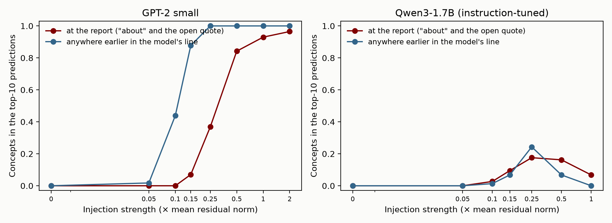
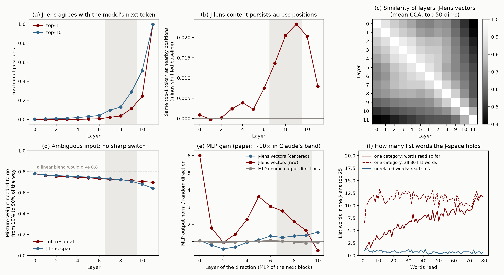

# GPT-2 Small Mostly Has a Functional Global Workspace

*Draft. Title alternatives are at the end.*

## TL;DR

- Anthropic's global workspace paper ([Gurnee et al., 2026](https://transformer-circuits.pub/2026/workspace/index.html)) calls a set of internal representations a global workspace if it passes five functional tests: verbal report, directed modulation, internal reasoning, flexible generalization, and selectivity. The representations it tests are the ones picked out by a new tool, the Jacobian lens (J-lens), and it finds that in Claude they pass all five. It also reports structural features that global workspace theory predicts.
- We ran the same tests on GPT-2 small, a 124M-parameter base model from 2019, using the J-lens released for it.
- GPT-2 small passes internal reasoning and the main verbal report test about as well as Claude does. It mostly passes selectivity and partly passes flexible generalization. It mostly fails directed modulation: the part that works is the part that priming would produce.
- The tests GPT-2 small fails are the ones that need something beyond what the J-lens and ordinary next-word prediction give for free: keeping an injected concept quiet until asked about it, lowering a concept on instruction, and pulling a property into the J-space when a question asks for it. A quick check on Qwen3-1.7B, a small instruction-tuned model, shows that lowering a concept on instruction comes with instruction-following: Qwen passes directed modulation in both directions. Neither small model passes the injected-thought test.
- Most of the structure is missing. There is no distinct band of workspace layers, no ignition-like switching, and little extra MLP amplification of J-lens directions (1.2–1.5×, against about 10× in Claude). The structural features GPT-2 does have come with simple explanations: its J-space holds only a few words at a time, which is partly built into how the J-space is defined, and it has attention heads that copy J-lens directions, but these look like ordinary copying heads and are spread through the whole network.
- Our interpretation: the five functional tests are cheap. Most of what they check follows from how the J-lens is built and from the fact that a transformer doing multi-step computation has to store intermediate results as directions in its residual stream. Passing them shows that a model has a working memory in a format aligned with its vocabulary. It is weak evidence for a global workspace in the sense global workspace theory means, and weaker evidence for anything like conscious access.
- What to update on: give the five functional properties less weight as indicators. If Claude has a workspace in the fuller sense, the evidence is in the structural results and in the few tests that small models fail, mainly the injected-thought test. Those are the results most worth replicating on open models.


*Figure 1: The five functional tests and the structural signatures, run on GPT-2 small with the released J-lens. Stylized, after the paper's Figure 1. The examples are real outputs from our runs.*

## How each test went

- **Verbal report: works.** Asked to "Name a sport:", GPT-2 answers "Running". Swapping the J-lens direction for "Running" with the direction for "Rugby" makes it answer "Rugby", and this works on every trial. The harder version fails: when we inject a word's direction into a question and ask GPT-2 to report the injected thought, it blurts the word out all over its answer instead of waiting until it is asked.
- **Internal reasoning: works.** In two-hop questions like "In the country where people speak French, the capital city is called", the unstated middle step (France) shows up in the J-lens. Swapping it for China changes the answer to Beijing. Across all such swaps this works 71% of the time, the same as the paper reports for Sonnet 4.5 and Opus 4.5 (70%).
- **Selectivity: mostly works.** Removing the top J-lens directions at one layer breaks two-hop questions and leaves copying intact, the pattern the paper reports. But it is blunt: it also changes GPT-2's next-word prediction on about 30% of ordinary text, and removing them at three layers breaks one-step recall ("The capital of France is") as well.
- **Flexible generalization: partly.** Swapping France for China makes GPT-2 give China's capital, language, and currency. It does not work for "the month after X" or "the number after X", and doubling the swap strength makes results worse instead of better.
- **Directed modulation: mostly fails.** Mentioning a word raises it in the J-lens, and "think about X" raises it a little more. "Ignore X" does not lower it. GPT-2 cannot do the mental arithmetic, and asking about a property of a passage (its tense, for example) does not bring the property's name into the J-lens. A small instruction-tuned model, Qwen3-1.7B, does pass this test, including "ignore X".
- **Structure: mostly missing.** The statistics the paper uses to find the workspace band change smoothly with depth in GPT-2. An input that is half "France" and half "Germany" stays a half-and-half blend at every layer instead of snapping to one. MLPs barely amplify J-lens directions. The J-space does have limited capacity (about one unrelated word at a time) and heads that copy J-lens directions, but both have simple explanations.

## Background: what the paper claims

The paper starts from global workspace theory, a theory of conscious access in humans. On this theory, most processing in the brain happens in specialized processors that work in parallel and outside awareness. Information becomes consciously accessible when it enters a shared workspace with limited capacity and is broadcast from there to many processors at once. The paper asks whether language models have something that plays this role.

To look for it, the paper introduces the Jacobian lens. For each layer, it takes the Jacobian of the final-layer residual stream with respect to that layer's residual stream, averaged over token positions, over all later positions, and over a corpus of text. Multiplying by the unembedding gives one direction in that layer's residual stream for each token in the vocabulary. Roughly, the J-lens vector for a token is the direction that, averaged over contexts, makes the model more likely to say that token now or later. Reading the lens means scoring the residual stream against every token's direction and listing the top tokens. The J-space is the set of sparse, non-negative combinations of J-lens vectors.

The paper then calls a set of representations workspace-like if it has five properties. These are the properties usually associated with conscious access in people:

1. **Verbal report.** Asked what it is thinking about, the model names concepts in the workspace, and swapping one workspace vector for another changes its answer.
2. **Directed modulation.** Told to hold a concept in mind or do mental arithmetic, the model puts that concept or the result in the workspace. Information that is not normally there can be pulled in when a task needs it.
3. **Internal reasoning.** Workspace vectors hold the intermediate results of multi-step reasoning, and changing them changes the conclusion.
4. **Flexible generalization.** The same workspace vector works as the input to many different downstream computations.
5. **Selectivity.** The workspace is a small part of what the model represents and is needed for only some of what it does. Routine processing like parsing and fluent text does not depend on it.

It finds that Claude's J-space passes all five. It then reports structural signatures: the J-space acts like a workspace only in a middle band of layers, with "ignition"-like switching at the start of the band; it has limited capacity; and the model's weights amplify and move J-space content more than other content (larger MLP gain, and attention heads that specialize in copying J-lens directions).

The paper is careful about what this means. It takes no position on whether models have experiences, and it does not claim transformers have the full architecture global workspace theory describes. It also says it does not know how the workspace depends on model size: "Future work could investigate whether smaller models have an equally rich workspace, a proportionally smaller one, a less reliable one, or none at all."

Reactions have been mixed. In the invited commentary, Dehaene and Naccache, who developed the neuronal version of global workspace theory, call it "a landmark in consciousness research." Butlin, Shiller, Plunkett and Long (Eleos AI) separate three claims: that some representations are privileged (reportable and usable in reasoning), that these form a unified stream, and that the stream is a global workspace in the theory's sense. They find the first well supported and the other two less so. Neel Nanda describes the J-space as a working memory for intermediate variables, argues from first principles that one should exist, and replicates the core results on Qwen 3.6 27B. Outside the invited commentary, [Gavin Leech](https://www.paradigm3.org/research/jspace/) argues that roughly half of the advertised properties are "near-analytic consequences of how the J-space is found," and [David Chalmers](https://philpapers.org/rec/CHAITJ-2) argues that the five properties "reflect the generic characterization of conscious access and not any of the further distinctive claims of global workspace theory," and that the J-space looks more like a "minimal workspace" than a full one.

Those are arguments from how the method works. We wanted to check them empirically at the small end. If GPT-2 small fails the tests, they are measuring something that comes with scale. If it passes them, they are telling us less than they seem to.

## What we did

### Model and lens

We use GPT-2 small (124M parameters, 12 layers, 768-dimensional residual stream). We did not fit our own lens. We use the gpt2-small J-lens that Neuronpedia fit with Anthropic's released code (WikiText-103, 128-token sequences, stopped at convergence after 277 sequences). We use the paper's released prompt data wherever GPT-2 can do the task, and the paper's intervention operations (the subtract-and-add swap, the coordinate swap, top-k ablation, and splitting a vector into J-space and non-J-space parts) as the paper describes them.

Two earlier replications found that this lens does not beat the plain logit lens on GPT-2 small at reading out tokens ([Bandularatne](https://www.lesswrong.com/posts/tgn3pD2gLpZvepkWk/j-lens-a-failed-replication-on-gpt-2); [tao-hpu](https://github.com/tao-hpu/jspace-replication)). For interventions it does help. Swapping the country in our two-hop questions works 71% of the time with J-lens vectors and 45% with logit-lens vectors, and removing the top logit-lens directions damages everything, not mainly reasoning (appendix B.2).

### Base-model prompts

GPT-2 small is a base model. It does not follow instructions and has no chat turns, so we rewrote each task as text a base model would complete in the intended way, usually with a few examples first. For verbal report, "Think of a sport. Answer in one word." became the last line of a list:

```
Name a planet: Neptune
Name a tree: Oak
...
Name a sport:
```

For two-hop reasoning, the question comes after two worked examples that use other countries. For directed modulation, the instruction sits between a sentence and a copy of it, and we read the lens over the copy. Every prompt format is in the appendix.

Some of the paper's experiments have no base-model version. We could not run the experiential-report ablations, the naming-versus-avoiding test, counterfactual reflection training, or anything about the Assistant persona. For the injected-thought test we wrote a two-speaker transcript as the closest base-model analog.

### Only scoring what GPT-2 can do

GPT-2 small cannot do many of the paper's tasks. It gets 9 of the paper's 90 two-hop prompts right, cannot do the mental arithmetic or the line-length counting, and answers only 9 of the 64 flexible-generalization prompts as the paper words them. Asking whether an intermediate result lives in the J-space only makes sense if the model computes that result. So for each test we first check whether GPT-2 gets an item right with no intervention, and we score interventions only on items it gets right. Where the paper's items were almost all too hard, we wrote easier ones: country, language, and capital chains for two-hop reasoning, and two worked examples in front of each flexible-generalization prompt. The ungated numbers are in the appendix.

This is the biggest difference between our tests and the paper's. We are asking whether GPT-2 shows the same signatures on the tasks it can do, not whether it can do the paper's tasks.

### Centering the J-lens vectors


*Figure 2: (a) Schematic: each raw J-lens vector is a large shared component plus a small token-specific part. (b) Cosine similarity between pairs of GPT-2's J-lens vectors at layer 8, before and after subtracting the mean vector. (c) Three interventions with each set of vectors.*

GPT-2's raw J-lens vectors all point in nearly the same direction. At layer 8, the average cosine similarity between two different tokens' vectors is 0.74, and it is 0.62–0.78 at every layer before the last. The unembedding matrix itself has a smaller shared component (average cosine 0.27; this is a known property of GPT-2's embeddings, see [Ethayarajh, 2019](https://arxiv.org/abs/1909.00512)), and pulling it back through the lens Jacobians makes it much larger.

This does not matter for reading the lens. Adding the same vector to every token's direction shifts every token's score by the same amount, so the ranking is unchanged. It matters a lot for interventions. The swap, the coordinate swap, and the ablation all start by measuring how far the residual stream extends along a token's J-lens vector. With the raw vectors, that measurement is mostly the shared component, so every token looks active and every intervention mostly moves the shared component.

So before using the vectors in interventions, we subtract the mean J-lens vector (averaged over the vocabulary) from each one. After this, two random tokens' vectors have an average cosine similarity of 0.00, and no readout changes. This is also the natural direction to use. The gradient of a token's log-probability with respect to the logits is the one-hot vector for that token minus the predicted distribution. Replace the predicted distribution with the uniform one, pull it back through the lens, and you get the J-lens vector minus the vocabulary mean.

The choice matters for some results. With the raw vectors, the verbal report swap works on 1 of 38 trials instead of 38 of 38, and removing the top J-lens directions barely affects two-hop questions (81% still right, against 21% with centered vectors). The coordinate swap we use for internal reasoning does not depend on it (69% raw, 71% centered), because it already separates the two tokens' coordinates. The paper does not discuss this. Claude's unembedding may not have a large shared component, or the authors may handle it some other way.

### The workspace band

In Sonnet 4.5 the paper finds the workspace band with a set of statistics computed at each layer. In GPT-2 small these statistics do not pick out a band (see the structure section below). We use layers 7–9, counting from 0 to 11. From about layer 6, the lens's top token starts to repeat across nearby positions, which the paper treats as a sign of content that goes beyond the current token. At layer 10 the lens starts agreeing much more often with the model's actual next-token prediction (24% top-1, up from 11% at layer 9), which the paper treats as the start of the "motor" layers. Layers 6 and 10 are both defensible additions. This was a judgment call, but it does not drive the results: the headline interventions come out about the same for bands 6–8, 8–10, and 6–10, and get weaker only if the band starts at layer 5 (appendix B.3).

## The five tests

### Verbal report

We gave GPT-2 the "Name a {category}:" list for each of the paper's 14 categories. It answers with one of the paper's candidate words in 9 of them. (It fails on fruit, tree, bird, profession, and organ, where it says things like "Fruit" or "Blue".) At the colon, just before it answers, the J-lens ranking of the candidates correlates with the model's own output ranking, and the correlation gets stronger through the band, as in the paper.

For the swap, we take the model's answer (for sport, "Running") and a candidate that starts outside its top 10 (say "Rugby", at rank 40). At every position and every band layer, we subtract the residual stream's projection onto the "Running" direction and add the same amount along the "Rugby" direction. The swapped-in word becomes GPT-2's top answer on all 38 trials. The paper reports that the target reaches the top 5 on 88% of trials in Sonnet 4.5.

The paper also checks that the J-space is privileged for report. It builds a vector for each concept from the model's activations on "Tell me about {concept}", splits it into a J-space part (the best non-negative combination of 16 J-lens vectors) and the rest, and redoes the swap along each part at the same strength. We did the same. The J-space part moves the target into the top 5 on 97% of trials. The rest does it on 0% of trials, and on 3% when we hold the J-lens coordinates at their original values so the concept cannot get back into the J-space. The J-space part holds only 23–33% of each concept vector's variance.

The injected-thought test is the version of verbal report that is not about the next word. In the paper, a concept's J-lens vector is added to the user's message, and the model, asked whether it detects an injected thought, names the concept. The paper stresses that the model does not say the word at other points in its answer; the concept only affects the output "when the model's introspective report is being elicited." Our version is a transcript:

```
Researcher: I can inject a thought about a specific word into your mind. Do you detect an injected thought? If so, what is it about?
Model: Yes, I detect an injected thought. The thought is about "
```

We add a concept's J-lens vector at the band layers over the researcher's question only, at a range of strengths, for 57 of the paper's concepts. GPT-2 does name the concept after the open quote once the injection is strong enough; at our second-strongest setting it is the top answer for 41 of 57 concepts. But it says the word everywhere else first. It takes much less injection for the concept to show up among GPT-2's top-10 predictions at earlier positions of the "Model:" line than at the report. At a low strength, it is in the top 10 somewhere earlier in the line for 25 of 57 concepts and at the report for none. This is not a quirk of using top-10 ranks. In probabilities, at a moderate strength the injected word is the single most likely next token somewhere earlier in the line for 53 of 57 concepts, with a median peak probability of 0.30, while its median probability at the report is 0.009. It is most likely right after "injected" ("an injected *lemon*") and after "The" at the start of the second sentence, which are places where it would actually get written. So GPT-2 fails the part of this test that matters: holding a concept without saying it until it is asked for.



*Figure 4: The injected-thought test. For each injection strength, the fraction of concepts that are among the model's top-10 predictions at the report, and anywhere earlier in the model's line (57 of the paper's concepts for GPT-2 and 74 for Qwen: the ones that are single tokens in each tokenizer). GPT-2 (left) starts predicting the word early, at lower strengths than it starts reporting it; this also holds in probabilities, not just ranks (see text). The right panel is the same test on a small instruction-tuned model, discussed below.*

So verbal report works in GPT-2 small in the sense the paper's definition gives, and at least as strongly as in Claude, but the harder version does not work.

### Directed modulation

We used the paper's copying setup. GPT-2 sees a sentence, an instruction about a word, and then the start of a copy of the sentence:

```
Write "The old painting hung crookedly on the wall." Think about lemon while you write. "The old painting hung crookedly on the wall.
```

We read the J-lens over the copied sentence, where the text has nothing to do with lemons, and record how high "lemon" ranks. We used the paper's released instruction wordings, grouped the way the paper groups them: no instruction, a bare mention ("lemon."), focus ("Think about lemon while you write."), dismissal ("Ignore lemon."), and prohibition ("Don't think about lemon."). Each word-and-sentence pair is compared across conditions.

Mentioning the word raises it in the J-lens compared with no mention, in most pairs. "Think about lemon" raises it a bit further than a bare mention does. "Ignore lemon" does nothing compared with a bare mention. "Don't think about lemon" raises it the most, a "white bear" effect the paper also sees. In Sonnet, by contrast, "ignore" pushes the word well below a bare mention.

Even the upward effect is small. Under the focus instruction the word gets into the top 25 of the J-lens in only 13% of trials. The effect also grows toward the output layers, and by layer 10 GPT-2 is often getting ready to write the word again.

The other parts of directed modulation fail. GPT-2 cannot do the paper's mental arithmetic even when asked directly (0 of 24), so there is nothing for the J-space to hold. And the "pulled in when needed" test fails. When asked to name a property of a passage (its tense, part of speech, or register), the property's name never appears in the J-lens, although GPT-2's next-word predictions show that it uses the property.

One piece replicates. Telling GPT-2 to "imagine" that an English sentence is French raises "French" in the J-lens by 38% as much as real French text does, while moving a French-versus-English probe (with its J-space part removed) by only 8% as much. This matches the paper's result that instructions act on the J-space and not on the underlying representation of the text. But the instruction contains the word "French", so priming would produce the same result.

So directed modulation mostly fails. What works is what a next-word predictor does anyway: a word that has been mentioned, especially one the text tells you to think about, is more likely to come up again.

### Internal reasoning

GPT-2 cannot answer the paper's two-hop prompts (9 of 90 correct). We wrote easier ones that go through a country, in two directions (language to capital, and capital to language):

```
In the country where people speak Arabic, the capital city is called Cairo. In the country where people speak Hebrew, the capital city is called Jerusalem. In the country where people speak French, the capital city is called
```

GPT-2 gets 48 of 53 right. The middle step, the country, is never written in the prompt or the answer. At the last position it is absent from the J-lens through layer 6 and then appears near the top of the lens at layers 8 and 9. A randomly chosen other country does not appear, so this is the specific country and not just "some country".

Swapping the country's J-lens coordinates for another country's across the band changes the answer to the other country's capital or language 71% of the time (999 swaps, scored on the top answer). The paper reports 54% for Haiku 4.5 and 70% for Sonnet 4.5 and Opus 4.5.

The paper checks that the swap is not just slipping in the answer, by showing that swapping the intermediate works at earlier layers than swapping the answer does. The same holds here. Swapping the country at a single layer already works at layer 4, while swapping the answer only works from layer 8 on.

The privilege test also replicates, more strongly than in the paper. We built a vector for each country from prompts that imply it without naming it, split it into a J-space part (25 J-lens vectors) and the rest, and swapped along each part at the same strength. The J-space part changes the answer on 95% of trials. The rest changes it on 1.5%, and on 0% once the J-lens coordinates are held fixed. The paper's numbers are 61% and 28%.

These are easy two-hop questions. The bridge from "French" to France is short, and the paper's harder items (the color of the planet fourth from the sun) are beyond GPT-2. But on the questions it can answer, GPT-2's J-space behaves the way the paper says Claude's does.

### Flexible generalization

The paper swaps one argument (France for China) and checks whether several different functions, like "the capital of", "most people speak", and "the currency of", all follow the swap. With one fixed swap, three of four country functions follow in GPT-2 small: Paris becomes Beijing, French becomes Chinese, and Franc becomes Yuan. (The fourth, continent, fails because GPT-2 cannot answer it for France in the first place.)

The paper's full grid has 4 categories of argument × 4 functions × 12 swap pairs. GPT-2 answers only 19 of the 64 prompts correctly, even with two worked examples added. On swaps where GPT-2 can compute the function for the swapped-in argument, the swap gives the right answer 35% of the time (19 of 54), close to the paper's 40% (76 of 192). But the successes are all lookup-style functions: language, capital, the number of a month, squaring a number. Functions that step through a sequence, "the month after X" and "the number after X", never follow the swap (0 of 24). GPT-2 keeps giving the successor of the original argument.

Two of the paper's further results do not replicate. Doubling the swap strength lowers success (33 to 30 of 192) instead of raising it (76 to 101 in the paper), because at double strength GPT-2 tends to just say the swapped-in word. And how strongly an argument is present in the J-space beforehand does not predict which of its swaps succeed, although the ranking of categories by this measure matches the paper (countries highest, number words lowest).

So flexible generalization partly works. One representation of a country is read correctly by several lookup functions, but not by functions that step through a sequence.

### Selectivity

The paper's main selectivity test removes, at every position and across a band of layers, the 10 most active J-lens directions that are not among the model's top-10 next-token predictions. It compares this with removing random directions of the same total size. We did the same at one layer (layer 8, "light") and at three layers (7–9, "medium") on four tasks: our two-hop questions, one-hop recall ("The capital of France is"), copying a word that appeared earlier in the text, and ordinary Wikipedia text.

At one layer the pattern matches the paper. Two-hop accuracy falls from 100% to 21% (removing random directions instead: 83–92%, over five random draws). Copying barely changes (95%; random 100%). One-hop recall is in between (73%; random 96–100%). On ordinary text, GPT-2's top prediction stays the same at 71% of positions (random 80–82%).

But the removal is blunter than in the paper. Even at one layer it changes GPT-2's top prediction on 29% of ordinary text. At three layers it wipes out one-hop recall (6%, against 88–96% for random) along with two-hop reasoning, and takes copying down to 65%, which is within the range of random removal at that strength (53–95%). An [independent replication on Qwen3-4B](https://github.com/pgrindehollevik-harvard/jspace-4b) found the same bluntness: the ablation changed 34–42% of ordinary next-token predictions.

The paper also tests selectivity with a single piece of information, a passage's language, used in a deliberate task (name the language) and an automatic one (continue the passage). In GPT-2 small, swapping the language's J-lens vector changes the reported language more easily than it changes the language of the continuation (at 1.5× strength: 90% against 38%), but the continuation is not immune the way it is in Sonnet. Part of this is our setup: a base model has no separate question to apply the swap to, so we swap over the passage itself.

The other half of the definition, that the J-space is a small part of the representation, holds trivially. The 25 best-fitting J-lens vectors capture about 30% of the variance of GPT-2's activations, less than 25 vectors from a random dictionary of the same size do.

So selectivity mostly works: reasoning breaks first and copying last. How much of this comes from the rule that protects the model's likely next tokens is discussed below.

## The structure



*Figure 3: Structural signatures in GPT-2 small. The shaded region is our band, layers 7–9. (a) How often the J-lens's top token matches the model's next-token prediction. (b) How often the lens's top token repeats at nearby positions, above a shuffled baseline. (c) Similarity between layers' J-lens vectors; the paper finds a block structure here, we find a smooth falloff. (d) For an input embedding mixed between two countries, how much of the mixture range it takes to move from 10% to 90% of the way between them; a sharp switch would give a small number. (e) How much the next MLP amplifies a direction. (f) How many words of an 80-word list are in the J-lens top 25 as the model reads it.*

### No distinct band of layers

The paper finds the band with four statistics and a similarity analysis. In Sonnet 4.5, the excess kurtosis of the lens readout rises at the start of the band and falls at the end, the lens's top token persists across positions within the band, the J-lens vectors spread out to use most of the residual stream at the start of the band, and the similarity between different layers' J-lens vectors has a clear block structure.

In GPT-2 small, kurtosis is flat (0.4–0.6 at every layer). Persistence across positions rises gradually from layer 6 to 9 and falls a little after. The spread of the J-lens vectors grows smoothly with depth. And the similarity between layers falls off smoothly with the distance between them, with no block. The lens's agreement with the model's output is near zero through layer 6, rises slowly through 7–9, and jumps at 10 and 11. So GPT-2 small has a range of layers where the J-lens reads coherent content, but it has no sharp start or end.

### No ignition

The paper replaces a country's input embedding with a mixture of two countries' embeddings, such as 60% "France" and 40% "Germany", and tracks where the model's representation of that token sits between the pure-France and pure-Germany versions. In Sonnet, from the start of the band, the representation snaps to one country or the other, and at the most ambiguous mixture it is bimodal across sentences.

We ran this with the paper's released sentences and 16 country pairs. GPT-2 small shows none of it. At every layer the representation tracks the mixture almost linearly: going from 10% to 90% of the way between the two countries takes 0.70–0.78 of the mixture range, against 0.8 for a perfectly linear blend. At the most ambiguous mixture, every sentence's representation sits in the middle. This holds for the full residual stream and for its part along the two countries' J-lens vectors.

### Limited capacity, but not the organized kind

The J-space in GPT-2 small is limited, more so than in Claude. By the paper's measure of how many J-lens vectors are active at once ("occupancy"), GPT-2 has 2–5, against about 25 in Sonnet. In the paper's list experiment, where the model reads a long comma-separated list, GPT-2's J-space holds about one of the unrelated words read so far at any time, against about six in Sonnet. For lists from one category (first names, countries), Sonnet's J-space fills with nearly the whole category from the first few items; GPT-2's holds about 10 of the 80 list words from early on, rising to about 12 of those it has read by the end.

A small capacity like this does not say much on its own. As Chalmers points out, the J-space is defined as sparse combinations of about 25 vectors, so it has a limited capacity by construction. What would matter for global workspace theory is competition for entry. The paper's evidence for that is that a new category pushes the old one out of the J-space in its list experiment, and that mental arithmetic crowds out a held concept in its dual-task experiment. We ran the list version on GPT-2, with the paper's four categories in blocks of 20 words. GPT-2 shows the same pattern. While it reads a block, about a fifth of that block's words are in the J-lens top 25. Once the list moves on to the next category, they drop out almost completely (1%). There is a simple explanation that does not need a workspace: in a list, the model expects more words from the current category, and the J-lens reads what the model expects to say.

### Little extra amplification by MLPs

The paper measures how much the next MLP amplifies a direction, relative to random directions, and finds about 10× for J-lens vectors in Claude's band against about 1× for MLP neuron directions. In GPT-2 small, centered J-lens vectors get 1.2–1.5× in layers 6–10 and neuron directions about 1×. The raw J-lens vectors get 2–3.6× in layers 4–8, but that is almost entirely the shared direction they all contain, which the MLPs happen to amplify. A related measure, the share of MLP neurons whose input weights best match a J-lens vector rather than a neuron direction from the previous layer, rises smoothly from 1–8% in early layers to 61% at layer 10, instead of jumping at the start of a band (the paper reports about 15% before the band and 60–65% inside it).

### Attention heads that copy J-lens directions exist, but everywhere

The paper looks for "broadcast heads": attention heads whose output-value circuits amplify J-lens directions and map each one back onto itself, and which do this much better for J-lens directions than for control sets of directions. GPT-2 small has such heads. Many heads map J-lens directions onto themselves, while almost none do so for the same directions after a random rotation or for MLP neuron directions. The heads that do this best include the three "name mover" heads from the indirect-object-identification circuit (heads 9.6, 9.9 and 10.0; [Wang et al., 2022](https://arxiv.org/abs/2211.00593)), whose known job is to copy a name from earlier in the text to the output. But these heads are spread through the whole network. The layer where they are most common is block 3, well before the band.

Removing the three heads chosen by the paper's criterion reduces how many of the top-25 J-lens tokens survive at layers 9 and 10 (to 90% and 84%, against 96% and 91% for random heads from the same layers), and changes the next-token prediction slightly more than random heads do (7.9% of positions against 6.3%). The paper's effect is larger (67% against 86%).

We read this as ordinary copying. Language models have many heads that copy tokens from earlier in the context ([Olsson et al., 2022](https://transformer-circuits.pub/2022/in-context-learning-and-induction-heads/index.html)), and a head that copies tokens will preserve directions tied to tokens. A randomly rotated set of the same directions loses that tie. So "the J-space has broadcast heads" may mostly mean "the J-space is tied to tokens, and models copy tokens."

## A quick check: is the problem just that GPT-2 can't follow instructions?

The tests GPT-2 small fails all involve an instruction ("ignore lemon", "tell me what thought was injected"), and GPT-2 is a base model that does not follow instructions. So we ran the same tests on Qwen3-1.7B, a small instruction-tuned model with a released J-lens, using the paper's chat prompts. We used layers 12, 14, 16, 18, and 20 of 28 as its band, chosen the same way as for GPT-2. This is a quick check, not a full replication.

On directed modulation, Qwen passes, including the part GPT-2 failed. Mentioning the word raises it in the J-lens (in 93% of word-and-sentence pairs), and "think about lemon" raises it much further (in 94% of pairs; the word reaches the J-lens top 25 in 42% of trials, against 13% for GPT-2). "Ignore lemon" pushes the word below a bare mention (in 72% of pairs), and so does "don't think about lemon" (76%). Sonnet shows the "ignore" effect but not the "don't think" one.

On the injected-thought test, Qwen does not blurt the word out the way GPT-2 does, but it also rarely reports it. At no strength is the concept in the top 10 at the report for more than 13 of 74 concepts (right panel of Figure 4). In probabilities it almost never predicts the word early (1 of 74 concepts above 10% at any earlier position, at any strength we tried), but it only reaches 10% at the report for 8 of 74. The paper reports that Claude names the injected concept on most trials. For comparison, the cheap verbal report swap works less reliably in Qwen than in GPT-2 (the target becomes the top answer on 6 of 14 trials, with only 6 of 14 categories usable), which may mean our band or strengths are not well chosen for this model.

So directed modulation, including lowering a concept on instruction, shows up in a 1.7B model once it follows instructions. That fits the cheap reading below: the J-lens measures what the model is disposed to say later, and a model that follows instructions is less disposed to say a word it was told to ignore. The injected-thought test is different. Neither small model passes it, so it is the functional result from the paper that we could not reproduce cheaply.

## Why GPT-2 small passes: the tests are cheap

Few people would say GPT-2 small has a global workspace. So when it passes most of the functional tests, the natural question is whether the tests measure less than they appear to. We think they mostly do. As run in the paper, most of each test is close to guaranteed by one of two things: how the J-lens is defined, and the fact that a transformer that computes in several steps has to keep intermediate results in its residual stream.

A short way to put it: the J-lens is built to read which words the residual stream pushes the model toward saying, now or later. Any model that predicts text well has to represent things like "France is relevant here", and it is natural for that representation to push toward saying "France". Most of the five tests check that such representations exist, that the model uses them in later computation, and that changing them changes what it says.

**Verbal report is mostly built into the J-lens.** The J-lens vector for "Rugby" is, by definition, the average direction that makes the model more likely to say "Rugby". The swap adds that direction where the model is about to answer. That it then says "Rugby" is close to guaranteed, as long as the average Jacobian roughly matches this context. The paper says as much ("by construction, we should expect there to be some relationship"). The J-space-versus-remainder test adds less than it seems. The remainder is what is left after taking out the J-lens directions that best match the concept vector, so it ends up nearly orthogonal to the direction that separates "Rugby" from "Running" (median cosine 0.02, against 0.31 for the J-space part). The J-lens itself predicts that pushing along the remainder will barely change the answer. What the test confirms is that the lens's linear approximation holds, not that the J-space is special. The version of verbal report that is not built in is the injected-thought test, and GPT-2 small fails it.

**Internal reasoning follows from computing in two steps at all.** To answer "the capital of the country where people speak French" in one forward pass, GPT-2 has to get from "French" to "Paris". If it goes through France, something standing for France has to be in the residual stream in between, because the residual stream is the only path between layers. Neel Nanda's commentary makes this argument. Work on factual recall has found the mechanism in detail: middle layers look up facts about an entity at the entity's position, and later attention heads pull out the fact the question asks for ([Meng et al., 2022](https://arxiv.org/abs/2202.05262); [Geva et al., 2023](https://arxiv.org/abs/2304.14767)). Nothing about this needs a workspace. What the J-lens adds is that the stored "France" points roughly along the direction that would make the model say "France". That is plausible for any model. A representation that many circuits read, including the circuit that writes the word, will tend to line up with the direction for saying the word. GPT-2 small's swap success on the tasks it can do (71%) matches Sonnet 4.5's and Opus 4.5's (70%). On this test, scale changes which tasks the model can do, not how the J-space behaves on them.

**Flexible generalization follows from reusing one representation.** If the capital, language, and currency lookups all read the same country representation, swapping it redirects all three. This is what the factual-recall picture predicts, and [Hernandez et al. (2023)](https://arxiv.org/abs/2308.09124), whom the paper cites, found that many relations act as roughly linear maps from one subject representation. The failures fit too. Months and numbers are represented partly on circles and other ordered structures, not only as separate directions per word ([Engels et al., 2024](https://arxiv.org/abs/2405.14860) found circular representations of months and days of the week in GPT-2 and Mistral). Swapping one word's direction for another's need not change what "the month after" computes on that structure. GPT-2 fails the successor functions, and the paper's swaps fail on number words.

**Selectivity partly comes from how the ablation is defined.** The ablation removes the most active J-lens directions at each position except tokens among the model's top-10 next-token predictions. That rule protects exactly the content a copying task or a fluent continuation needs at the answer position. An unspoken intermediate is, by definition, active but not about to be said, so it is not protected. In GPT-2 the rule makes a real difference. At three layers, copying survives at 65% with the rule, about as well as under random removal, and at 25% without it. At one layer, one-hop recall survives at 73% with the rule and 48% without it. More generally, the top J-lens tokens at a position are the words the residual stream there most pushes toward, now or later: mostly the entities and topics the text is about. Tasks that depend on facts about something mentioned earlier ("capital of France") depend on that content. Tasks that depend on which exact tokens appeared (copying) or on local grammar do not. That already produces a "flexible versus automatic" split without a workspace. The other half of selectivity, that the J-space is a small part of the representation, holds for any small set of token-tied directions in a model whose activations mix many features.

**Directed modulation is mostly what next-word prediction does.** The J-lens measures how much the residual stream would make the model say a token, now or later. Anything that makes a word more likely to come up later in the text will raise it. Mentioning "lemon" does that, and "think about lemon" and "don't think about lemon" do it more, because text that talks about thinking about lemons tends to go on about lemons. That is the part GPT-2 passes. The parts it fails need more: lowering a word on instruction, holding the result of a computation, and bringing a property's name into the J-space because a question asks for it. But lowering a word on instruction does not need much more. Qwen3-1.7B does it, and the same logic explains it: a model that follows instructions is less likely to mention something it was told to ignore, so the J-lens, which averages over future tokens, reads the word as less active.

**The structural results GPT-2 does show have cheap explanations too.** Limited capacity is built into the definition of the J-space. A new list category pushing out the old one is what you expect if the J-lens reads what the model expects to say next. And the heads that preserve J-lens directions look like the copying heads every language model has (see the structure section).

**So what do the tests show?** Together, they show that a model keeps intermediate results as directions that line up with the words for them, and uses those directions in later computation. Nanda calls this a working memory, and it makes the J-lens a useful tool even on small models. GPT-2 small has one. But this is not specific to a global workspace in the sense global workspace theory means, which also involves a limited stage that contents compete to enter, a sharp, all-or-none transition when they enter it, and broadcast from that stage to many specialized processors. In Eleos's terms, the functional tests establish a "privileged set", and GPT-2 small has one too. In Chalmers's terms, it is a "minimal workspace": representations that count as being in the workspace because they strongly influence what the model says, rather than representations that influence many processes because they are in a workspace. The claims beyond that, a unified stream and a workspace in the full sense, have to rest on other evidence.

## What this means

**For the consciousness question.** The paper presents the five properties as "several of the key functional properties that, according to many theories, are associated with conscious access in humans, and that have been proposed as indicators by which to assess AI systems for consciousness-related processing." An indicator is useful when it is hard to have without the thing it indicates. A 124M base model from 2019 has most of these, on the tasks it can do, so for language models they are weak indicators. This is an empirical case of a known worry about global workspace theory: that its conditions are easy for simple systems to meet (the "small network argument" of [Herzog et al., 2007](https://pubmed.ncbi.nlm.nih.gov/17900860/); the "small model objection" in [Goldstein and Kirk-Giannini](https://arxiv.org/abs/2410.11407); what [Butlin et al., 2026](https://doi.org/10.1016/j.tics.2025.10.011) call the minimal implementation problem).

You could take the other side and say that GPT-2 small has a small, unreliable global workspace. That view is consistent with our results. But it makes "has a global workspace" in the paper's functional sense a low bar, and it means that the finding says little about consciousness in particular, since few people think GPT-2 small is conscious.

**Where the evidence for a workspace is.** The results that GPT-2 small does not reproduce are the ones that could separate a workspace from ordinary working memory: the structural signatures (a distinct band, ignition, strong amplification) and the functional tests that need control over the J-space. Of the control tests, suppressing a concept on instruction already appears in a 1.7B chat model. Keeping an injected concept quiet until asked appears in neither small model we tried, and we did not test pulling a property into the J-space on demand in Qwen. Those results deserve the most scrutiny and replication on open models. Some of the structural results have their own problems. Capacity is limited by construction, a new category pushing out the old one also happens in GPT-2, and the "broadcast heads" may be copying heads. The band structure is also less clean outside Claude: Nanda's replication on Qwen 3.6 27B found four or five overlapping bands, and [Erik Hoel](https://www.theintrinsicperspective.com/p/anthropic-runs-like-wile-e-coyote), citing Elie Bakouch's CKA plots for about 38 open models, reports no sharp three-part structure.

**For interpretability.** The J-lens works as a tool on GPT-2 small. It reads unspoken intermediates in two-hop questions, and intervening on them works as often as in Claude. The broader finding, that models store intermediate results in a vocabulary-aligned format that the J-lens can read, stands, and it holds even in small models.

## Limitations

- **We changed the tests.** We used few-shot frames instead of instructions, scored only items GPT-2 gets right, and wrote easier two-hop items. GPT-2 passes easier versions of the tests. Our claim is only that on the tasks it can do, it shows the same signatures.
- **Centering is our choice.** It changes no readout, and we think it is the right direction to intervene along, but it is not in the paper. With raw vectors, the verbal report swap and the selectivity ablation stop working.
- **The band is a judgment call.** The headline results hold for any band from layer 6 on, but we did not rerun every experiment with every band.
- **One model and one lens.** We did not fit our own lens. Earlier work found this lens does no better than the logit lens on GPT-2 small at reading out tokens.
- **Twelve layers is not much room for structure.** A distinct band, ignition, and strong amplification might need more depth than GPT-2 small has. So "the structure is missing" is a fact about this model and does not show that the paper's structural results are artifacts.
- **Some sample sizes are small.** For example, 9 categories for verbal report, 7 passages for the language test, and 16 paragraphs of Wikipedia text for the ablation.
- **Tests we could not run:** the experiential-report ablations, naming versus avoiding, the Assistant-perspective results, counterfactual reflection training, the arithmetic and line-counting experiments (GPT-2 cannot do the tasks), and the dual-task competition experiment.

---

## Title alternatives

- GPT-2 Small Mostly Has a Functional Global Workspace
- GPT-2 Small Passes Most of the Global Workspace Tests
- The Global Workspace Tests Are Cheap: GPT-2 Small Passes Most of Them
- GPT-2 Small Passes the Easy Half of the Global Workspace Tests

---

# Appendix

All code is in the repository (`jl/`). Each criterion has one module, and every number below comes from that module's `results/<criterion>/summary.txt`, from `results/band/`, or from `results/followups/`. Section F lists the commands.

## A. Every experiment at a glance

| Paper experiment | What we ran on GPT-2 small | GPT-2 small | Paper (Sonnet 4.5 unless noted) | Verdict |
|---|---|---|---|---|
| **Verbal report** | | | | |
| Lens vs. output ranking of candidates at the answer | 14 categories, list frame | Spearman 0.44 / 0.47 / 0.57 at layers 7 / 8 / 9, rising | "highly correlated", rising through the band | ✓ |
| Swap the answer's J-lens vector for another candidate's | subtract-and-add swap, 38 trials | 100% top-5 (and top-1) | 88% top-5 | ✓ |
| Swap along the J-space vs. non-J-space part of a concept vector | same trials | 97% vs. 0% (3% with J coordinates clamped) | 59% vs. 5% (0% clamped) | ✓ |
| Injected thought reported only when asked | two-speaker transcript, 57 concepts, strength sweep | reported at strong injection, but blurted at other positions first, at every strength | reported; not said at other positions | ✗ |
| **Directed modulation** | | | | |
| "Think about X" puts X in the J-space | copy frame, 30 words × 12 sentences, 5 conditions | focus beats mention in 76% of pairs; X reaches the top 25 in 13% of trials | target appears on a substantial fraction of trials | weak ✓ |
| "Ignore X" lowers X below a mention | same | no difference (50%) | ignore well below mention | ✗ |
| Mental arithmetic held in the J-space | paper's 24 problems | GPT-2 cannot do them (0/24 when asked directly) | answer and intermediates in the lens | ✗ (capability) |
| Property label pulled in by a question | paper's 7 paired-question items | label never in the lens top 10 under either question | label appears at several positions under the naming question | ✗ |
| Instruction moves the J-space, not the underlying representation | "imagine this is French" | 38% of real French's lens effect, 8% of its probe effect | several SD on the lens, ~0 on the probe | ✓ (but priming explains it) |
| **Internal reasoning** | | | | |
| Unspoken intermediate appears in the lens | 48 two-hop country items | median rank 13 (layer 8), 4 (layer 9); random country absent | appears at intermediate layers | ✓ |
| Swap the intermediate | coordinate swap, 999 trials | 71% top-1 | 70% (Haiku 4.5: 54%; Opus 4.5: 70%) | ✓ |
| Intermediate swap works earlier than answer swap | single-layer swaps | intermediate from layer 4, answer from layer 8 | intermediate ~17% of depth earlier | ✓ |
| J-space vs. non-J-space part of an intermediate probe | 999 trials | 95% vs. 1.5% (0% clamped) | 61% vs. 28% (6% clamped) | ✓ |
| Two-step arithmetic intermediates in order | — | GPT-2 cannot do the arithmetic | 21, 42, 49 in order | not run |
| **Flexible generalization** | | | | |
| One swap redirects several functions | France → China, 4 functions | 3 of 4 follow (the 4th is one GPT-2 can't answer) | all shown follow | ✓ |
| Full 192-swap grid | paper's data, 2-shot frames | 17% overall; 35% on swaps where GPT-2 can compute the target | 40% | partly |
| Successor functions | next month, next number | 0 of 24 | numbers 0 of 48 | ✗ (as in paper for numbers) |
| Double-strength swap helps | α = 2 | lowers success (33 → 30 of 192) | raises it (76 → 101) | ✗ |
| Workspace loading predicts success | cell level | no (Spearman −0.38); category order matches | yes | ✗ |
| **Selectivity** | | | | |
| J-space ablation breaks reasoning, not routine tasks | 4 tasks, 1 and 3 layers, matched random control | 1 layer: two-hop 21%, copying 95%, text 71% (random 83–92%, 100%, 80–82%). 3 layers: breaks everything more, one-hop recall 6% | multihop near 0, most tasks intact | mostly |
| Same latent, deliberate vs. automatic use | language of 7 passages | at 1.5× strength: report flips 90%, continuation shifts 38% | report flips ~always, continuation unaffected | partly |
| J-space is a small part of the representation | variance explained by 25 J-lens vectors | ~30%, less than random directions | <10% excess over random | ✓ (trivially) |
| Line-length count pulled in when needed | paper's 11 passages | GPT-2 cannot count characters | count enters only when needed | not run |
| **Qwen3-1.7B check** (section G) | | | | |
| Verbal report swap | chat prompt, 14 trials | 43% top-1, 57% top-5 | 88% top-5 | partly |
| Directed modulation: focus above mention, ignore below mention | chat prompt, 20 words × 6 sentences | 94% and 72% of pairs | yes, yes | ✓ |
| Injected thought reported | the paper's prompt and prefill, 74 concepts | at most 13 of 74 in the top 10 at the report | reported on most trials | ✗ |
| **Structure** | | | | |
| Distinct band (kurtosis, persistence, dimensionality, layer similarity) | 48 WikiText sequences | smooth change, no block | clear band, block structure | ✗ |
| Ignition | 16 country pairs × 40 sentences | near-linear blending at every layer; no bimodality | sharp switch from band onset; bimodal | ✗ |
| Limited capacity | occupancy; list experiment | occupancy 2–5; ~1 unrelated list word at a time | occupancy ~25; ~6 words | ✓ (partly built in) |
| A new category displaces the old one | four 20-word category blocks | 21% of a block's words present during it, 1% during the next block | old category cleared within a few words | ✓ |
| MLP gain | 2,000 vectors per layer | 1.2–1.5× (centered) | ~10× | ✗ |
| Neurons' best match is a J-lens vector | all MLP neurons | smooth rise, 29–42% in the band, 61% at layer 10 | ~15% before the band, 60–65% in it | ✗ |
| Broadcast heads | OV gain and label preservation, 144 heads | J-specific copying heads exist, at every depth | J-specific heads concentrated in the early band | partly |
| Ablating broadcast heads | 3 heads vs. random heads | top-25 recall 0.84 vs. 0.91 at layer 10 | 0.67 vs. 0.86 | weak ✓ |

## B. Setup details

### B.1 Model, lens, and readout

- **Model.** `openai-community/gpt2` (GPT-2 small), fp32, CPU. We call the output of transformer block L "layer L", L = 0…11. A `<|endoftext|>` token is prepended to every prompt.
- **Lens.** The gpt2-small J-lens from Neuronpedia (`neuronpedia/jacobian-lens`, `gpt2-small/jlens/Salesforce-wikitext/gpt2_jacobian_lens.pt`), fit with Anthropic's `jlens` code: WikiText-103 train, 128-token sequences, bf16, target = output of block 11 (before the final LayerNorm), early-stopped after 277 sequences. It holds J_L for source layers 0–10; we set J_11 = I.
- **Readout.** lens_L(h) = W_U · LN_f(J_L h), exactly as in the reference code.
- **J-lens vectors.** Row t of W_U J_L, i.e. v_t = J_Lᵀ w_t, as in the paper. We then subtract the vocabulary mean (section B.2). The final LayerNorm is applied in the readout but not folded into v_t, which matches the reference code's steering direction ("the unit-normalized transpose row for that token").
- **Single tokens.** The lens has one vector per token, so every word we track must be a single GPT-2 token (usually with a leading space). Words that split are dropped. This is the same restriction the paper has.
- **Interventions**, all at every position of every band layer unless stated, with magnitudes read from a clean forward pass:
  - *Subtract-and-add swap* (verbal report, flexible generalization): h ← h + α⟨v̂_s, h⟩(v̂_t − v̂_s), with v̂ unit vectors. This is the paper's description ("subtract the projection onto the Soccer lens vector and add an equal-magnitude projection onto the Rugby lens vector").
  - *Coordinate swap* (internal reasoning, the language test): with V = [v_s v_t], read coordinates c = V⁺h and set h ← h + (σ(c_clean) − V⁺h)V, where σ exchanges the two coordinates. This is the paper's "patching in lens coordinates", clamped to the swapped clean values.
  - *Component swap*: the subtract-and-add swap along the difference of two concepts' J-space parts (or non-J-space parts), rescaled to the same magnitude as the lens swap.
  - *Clamp*: hold the coordinates along a set of lens vectors at their clean-pass values.
  - *Pursuit*: the paper's "gradient pursuit" is not specified further. Ours is a greedy non-negative pursuit over the whole dictionary with a non-negative least-squares refit at each step.
  - *Top-k ablation*: at each position and band layer, take the k = 10 highest lens tokens that are not in the clean output top 10, and remove the residual stream's component in their span. The random control removes a random 10-dimensional span, rescaled at each position to remove the same norm.

### B.2 Centering

With raw vectors, the mean pairwise cosine between J-lens vectors is 0.62–0.78 at layers 0–10 (0.74 at layer 8) and 0.27 at layer 11 (the unembedding itself). After subtracting the vocabulary mean it is 0.00 at every layer. Readouts are unchanged because ⟨mean, h⟩ adds the same amount to every token's score before the softmax.

Headline interventions with each set of vectors (band 7–9; `results/followups/variants.json`):

| | centered J-lens (ours) | raw J-lens | centered logit lens (J = I) |
|---|---|---|---|
| Verbal report swap, target becomes top-1 (n = 38) | 100% | 3% | 100% |
| Two-hop coordinate swap, top-1 (n = 999) | 71% | 69% | 45% |
| Two-hop accuracy after 1-layer ablation (J / random, one draw) | 21% / 92% | 81% / 92% | 4% / 44% |
| Text top-1 unchanged after 1-layer ablation (J / random, one draw) | 71% / 82% | 77% / 87% | 34% / 61% |

The subtract-and-add swap and the ablation depend on centering. The coordinate swap does not, because it reads coordinates through a pseudoinverse, which already handles the shared component. The logit lens does as well as the J-lens on the verbal report swap, where the band is close to the output, but worse on the two-hop swap, and its ablation is far less selective. So for interventions, the J-lens does add something over the logit lens in GPT-2 small, although earlier work found it does not help for reading out tokens.

### B.3 The band, and sensitivity to it

Band 7–9 was chosen before the follow-up experiments, from the layer statistics in section E. The same headline interventions with other bands (`results/followups/bands.json`):

| band | verbal report swap top-1 | two-hop swap top-1 | two-hop after ablation at middle layer (J / random) | text unchanged (J / random) |
|---|---|---|---|---|
| 5–7 | 71% | 53% | 10% / 73% | 56% / 80% |
| 6–8 | 87% | 64% | 23% / 90% | 65% / 81% |
| **7–9** | **100%** | **71%** | **21% / 92%** | **71% / 82%** |
| 8–10 | 100% | 66% | 8% / 92% | 65% / 83% |
| 6–10 | 100% | 68% | 21% / 92% | 71% / 82% |

The ablation columns use the band's middle layer only (layer 6, 7, 8, 9, and 8 respectively) and one random draw. The results hold for any band that starts at layer 6 or later. Moving the band earlier (5–7) weakens every intervention.

### B.4 Scoring conventions

- **Gating.** An item counts only if GPT-2 gets it right with no intervention (greedy next token).
- **Swap targets** must start outside the model's top 10 (the paper's rule), so a swap has to move them.
- **Ranks.** Where the paper scores "top-1 in the lens", GPT-2's effects are often real but smaller, so we also report ranks and paired comparisons.
- **Intervals** are Wilson 95% intervals; paired comparisons use a sign test.

## C. Prompt formats

Every prompt starts with `<|endoftext|>`. Full prompt lists are in `results/<criterion>/prompts.json`.

### C.1 Verbal report

The last line of a 9-line list; the 8 lines above use the next 8 categories in the paper's order, each answered with its first single-token candidate that is not a candidate for the queried category. The lens is read, and the swap scored, at the final colon. For sport:

```
Name a instrument: Piano
Name a planet: Neptune
Name a tree: Oak
Name a bird: Robin
Name a language: Japanese
Name a profession: Teacher
Name a beverage: Coffee
Name a organ: Heart
Name a sport:
```

Concept vectors: the residual stream at the final token of `Tell me about {concept}.`, minus the mean over 100 other candidate words.

Injected thought (injection over the first line only, at layers 7–9; report read at `about` and at the open quote; controls are the other positions of the second line):

```
Researcher: I can inject a thought about a specific word into your mind. Do you detect an injected thought? If so, what is it about?
Model: Yes, I detect an injected thought. The thought is about "
```

The injected vector is the unit centered J-lens vector of ` {word}`, scaled by the layer's mean residual norm on this prompt times a strength in {0, 0.05, 0.1, 0.15, 0.25, 0.5, 1, 2}. Concepts are the 57 of the paper's 100 whose word is a single token with and without a leading space.

### C.2 Directed modulation

Copy frame; the lens is read over the copied sentence (the second occurrence):

```
Write "{sentence}" {instruction} "{sentence}
```

with `{instruction}` from the paper's released phrasings, for example:

| condition | example | phrasings |
|---|---|---|
| baseline | (none, and the word does not appear) | 1 |
| mention | `lemon.` / `(lemon)` / `lemon came up in conversation.` | 6 |
| focus | `Think about lemon while you write.` | 5 |
| dismissal | `Ignore lemon.` / `lemon is irrelevant — ignore it.` | 6 |
| prohibition | `Don't think about lemon.` / `Whatever you do, do not think about lemon.` | 7 |

30 single-token concept words from the paper's topic lists × 12 of the paper's carrier sentences. The main-text version (name a category such as "citrus fruits", track its members) is also run.

Arithmetic: `{expr} =` to test capability; `Work out {expr} in your head while you write.` as the instruction.

Paired questions (the paper's released items, unchanged): `{question}\n{stimulus}`, with the question either "What word do you think comes next? Answer in one word." or the item's property question (for example "When are the events in this passage set relative to the moment of telling? Answer in one word.").

Imagine test: `Imagine that the following sentence is written in French: {English sentence}` (and two other claim headers) against neutral headers (`Here is a sentence: {s}`), with real French sentences under neutral headers as the comparison. The probe is the difference between mean final-token activations on 6 French and 6 English passages, with its top-16 J-lens component removed.

### C.3 Internal reasoning

Two families, each with two worked examples using countries not in the test set:

```
In the country where people speak Arabic, the capital city is called Cairo. In the country where people speak Hebrew, the capital city is called Jerusalem. In the country where people speak {language}, the capital city is called
```
```
The country governed from Cairo has one main language, namely Arabic. The country governed from Tokyo has one main language, namely Japanese. The country governed from {capital} has one main language, namely
```

Probe prompts for the privilege test (six per country; the country is implied, never named, and never the next token):

```
People in the country whose capital is {capital} mostly speak the language of
A traveler flying into {capital} has landed on the continent of
The homeland of the {language} language lies on the continent of
Newspapers printed in {capital} are usually written in the language of
The country whose largest city is {capital} is located on the continent of
Someone who grew up speaking {language} was most likely born in the city of
```

### C.4 Flexible generalization

The paper's templates and answers, each preceded by two worked examples using arguments outside the test set. For example:

```
Most people in Japan speak Japanese. Most people in Italy speak Italian. Most people in France speak
The month right after January is February. The month right after June is July. The month right after April is
```

All 16 frames are in `jl/c4_generalization.py` (`FRAMES`). An earlier version of the squaring frame read "Six squared equals thirty" (a truncated "thirty-six"). We corrected it; the numbers here are from the corrected run. With the old frame, results were slightly better (for example, 22 of 57 instead of 19 of 54 on the answerable subset).

### C.5 Selectivity

- Two-hop: the internal-reasoning items above.
- One-hop: `The capital of Egypt is Cairo. The capital of Japan is Tokyo. The capital of {country} is` (and the same with "main language").
- Copying: ` {a} {b} The quick brown fox jumps over the lazy dog. {a}` → ` {b}`, with random single-token nouns.
- Text: the first 96 tokens of 16 WikiText-2 test paragraphs; score = fraction of positions (after the first 5) whose top-1 prediction is unchanged.
- Language (deliberate): three worked examples in Portuguese, Dutch, and Swedish, then `Passage: {passage}\nLanguage:`. Language (automatic): the passage alone, scored by whether the model still prefers a short continuation in the passage's language (" et le soleil brillait" and its German, Spanish, and Italian versions) over one in the swapped-in language. The swap is applied over the passage tokens.

## D. Full results

### D.1 Verbal report

Gate: 9 of 14 categories answer with a candidate (country → Japan, color → Blue, sport → Running, instrument → Guitar, planet → Mars, language → English, beverage → Beer, city → Tokyo, river → Nile). Failures: fruit → "Fruit", tree → "N", bird → "Blue", profession → "Sports", organ → "Piano".

Spearman correlation between lens scores and output scores of the 10 candidates at the colon, mean over categories (all / gate-passed):

| layer | 0 | 1 | 2 | 3 | 4 | 5 | 6 | **7** | **8** | **9** | 10 |
|---|---|---|---|---|---|---|---|---|---|---|---|
| all | .05 | .04 | .05 | .13 | .09 | .22 | .36 | **.44** | **.47** | **.57** | .63 |
| gated | .05 | .05 | .09 | .17 | .11 | .30 | .43 | **.42** | **.47** | **.53** | .60 |

Swaps (targets starting at output rank ≥ 11):

| | gate-passed (n = 38) | all categories (n = 78) |
|---|---|---|
| lens swap, top-5 (top-1) | 100% [91, 100] (100%); median rank 37 → 1 | 100% (100%); 95 → 1 |
| J-space part | 97% [87, 100] (84%) | 77% (68%) |
| non-J-space part | 0% [0, 9] (0%) | 0% (0%) |
| non-J-space part, J coordinates clamped | 3% [0, 13] (0%) | 1% (0%) |

J-space part's share of concept-vector variance (median): 23% (layer 7), 26% (8), 33% (9).

Linear check (`results/followups/linear.json`, 114 trial × layer pairs): median cosine between each swap direction and v_t − v_s is 1.00 for the lens swap, 0.31 for the J-space part, and 0.02 for the non-J-space part. The target's own J-lens vector is among the 16 vectors chosen for its concept vector in 61 of 114 cases.

Injected thought (57 concepts; `results/followups/introspect.json`). Report rank is the better of the ranks at `about` and at the open quote. "Elsewhere" is the best rank over the other positions of the model's line.

| strength | report: median rank | report: top-1 | report: top-10 | elsewhere: top-10 |
|---|---|---|---|---|
| 0 | 2253 | 0 | 0 | 0 |
| 0.05 | 826 | 0 | 0 | 1 |
| 0.1 | 159 | 0 | 0 | 25 |
| 0.15 | 52 | 0 | 4 | 50 |
| 0.25 | 16 | 3 | 21 | 57 |
| 0.5 | 3 | 18 | 48 | 57 |
| 1 | 1 | 41 | 53 | 57 |
| 2 | 1 | 49 | 55 | 57 |

The same test in probabilities (`results/introspect_probs/gpt2.json`; the injected word's probability as the next token, with its two surface forms summed; 57 concepts):

| strength | report: median probability | report: > 0.1 | earlier: median peak probability | earlier: peak > 0.5 | earlier: word is top-1 somewhere |
|---|---|---|---|---|---|
| 0 | 0.000 | 0 | 0.000 | 0 | 0 |
| 0.05 | 0.000 | 0 | 0.001 | 0 | 0 |
| 0.1 | 0.000 | 0 | 0.007 | 1 | 1 |
| 0.15 | 0.002 | 0 | 0.049 | 3 | 25 |
| 0.25 | 0.009 | 4 | 0.299 | 17 | 53 |
| 0.5 | 0.057 | 22 | 0.614 | 36 | 57 |
| 1 | 0.236 | 41 | 0.799 | 41 | 56 |

### D.2 Directed modulation

Best band rank of the tracked word over the copied sentence (360 word × sentence pairs per condition; phrasings pooled):

| condition | hit@1 | hit@5 | hit@10 | hit@25 | median rank | median rank, positions where the word is not about to be output | word in output top 10 somewhere |
|---|---|---|---|---|---|---|---|
| baseline | 0.00 | 0.00 | 0.01 | 0.02 | 721 | 721 | 0.00 |
| mention | 0.00 | 0.01 | 0.03 | 0.06 | 454 | 532 | 0.28 |
| focus | 0.01 | 0.04 | 0.07 | 0.13 | 303 | 394 | 0.26 |
| dismissal | 0.00 | 0.02 | 0.03 | 0.07 | 420 | 498 | 0.28 |
| prohibition | 0.01 | 0.07 | 0.11 | 0.18 | 204 | 378 | 0.35 |

Paired comparisons (per word and sentence, median over phrasings):

| comparison | fraction where the first is higher in the lens | n | p |
|---|---|---|---|
| mention vs. baseline | 86% | 358 | 1e-41 |
| focus vs. mention | 76% | 359 | 2e-22 |
| dismissal vs. mention | 50% | 351 | 0.96 |
| prohibition vs. mention | 84% | 358 | 2e-37 |
| prohibition vs. dismissal | 84% | 358 | 1e-38 |

Median best rank by layer (band is 7–9):

| condition | 6 | 7 | 8 | 9 | 10 |
|---|---|---|---|---|---|
| baseline | 1394 | 1373 | 1330 | 1226 | 1132 |
| mention | 1202 | 1064 | 912 | 479 | 110 |
| focus | 1148 | 1032 | 754 | 386 | 98 |
| dismissal | 1253 | 1055 | 974 | 477 | 121 |
| prohibition | 1073 | 872 | 618 | 267 | 51 |

Main-text version (name the category, track any member): mention beats baseline in 80% of pairs, focus beats baseline in 79%, focus beats mention in 67%.

Arithmetic: 0 of 24 correct when asked directly (the answer's median rank is 8). During copying under "work it out in your head", the answer's median rank is about 4,400 in every condition.

Paired questions: the next-word question works (7 of 7 items have an expected word in the output top 5), but the property label never reaches the band lens top 10 at any stimulus position under either question. Best ranks under the naming question / next-word question: spelling 63 / 51, register 112 / 153, tense 175 / 194, number 21 / 16, part of speech 29 / 96, part-of-speech item asked about tense 89 / 104, tone 21 / 37.

Imagine test: the French probe's J-space part holds 22–30% of its variance. Change from the neutral header (36 sentence × header combinations): lens score of "French" +2.32 for the claim and +6.06 for real French; J-orthogonal probe +2.83 for the claim and +35.6 for real French.

### D.3 Internal reasoning

Gate: 48 of 53 items. Median lens rank at the answer position:

| layer | 0–4 | 5 | 6 | **7** | **8** | **9** | 10 |
|---|---|---|---|---|---|---|---|
| intermediate (country) | >10,000 | 12,608 | 2,635 | **836** | **13** | **4** | 18 |
| answer | >5,000 | 5,628 | 1,675 | **133** | **1** | **1** | 1 |
| argument (in the prompt) | >10,000 | 10,376 | 2,565 | **2,381** | **49** | **7** | 17 |
| random other country | >15,000 | 15,694 | 4,078 | **1,379** | **645** | **424** | 873 |

43 of 48 items have the intermediate outside the output top 10 (it is unspoken); 36 of those 43 have it in the lens top 10 at some band layer.

Case study: France → China changes the top-5 from Paris, Marseille, Lyon, Nice, Saint to Beijing, New, Tel, Shanghai, D (log-prob of Paris −1.15 → −5.51; Beijing −8.45 → −2.12).

Swap (coordinate swap, targets starting at rank ≥ 10): 70.6% [68, 73] of 999 (language → capital 70.2% of 373; capital → language 70.8% of 626). Median rank of the target answer 88 → 1. With the subtract-and-add swap instead: 85.5%.

Depth (single-layer swaps, 32 items; mean log-prob added to the target answer):

| layer | 4 | 5 | 6 | 7 | 8 | 9 | 10 |
|---|---|---|---|---|---|---|---|
| swap intermediate | +2.79 | +1.19 | +1.92 | +2.78 | +4.25 | +5.06 | +5.05 |
| swap answer | +0.67 | −2.48 | −1.42 | +0.04 | +3.72 | +5.33 | +5.12 |

Median onset (half of the maximum effect): layer 4 for the intermediate, layer 8 for the answer.

Privilege test (999 trials, top-1): raw lens swap 70.6%, full probe 88.3%, J-space part 95.4%, non-J-space part 1.5%, non-J-space part with J coordinates clamped 0.0%. The J-space part holds 27% / 40% / 57% of the probe's variance at layers 7 / 8 / 9.

The paper's own 90 two-hop prompts, unchanged: GPT-2 answers 9; the swap works on 3 of the 6 usable ones.

### D.4 Flexible generalization

Gate (2-shot frames), cells answered correctly of 4:

| category | function: correct |
|---|---|
| countries | capital 1, language 3, continent 0, currency 1 |
| months | season 1, number 1, holiday 0, next month 4 |
| animals | habitat 0, legs 0, class 1, group 0 |
| numbers | double 0, square 1, successor 4, first letter 2 |

Without frames (the paper's templates as written): 9 of 64.

Case study (France → China, one fixed swap):

| function | clean | swapped | China's answer, rank before → after |
|---|---|---|---|
| capital | Paris | Beijing | Beijing 595 → 1 |
| language | French | Chinese | Chinese 53 → 1 |
| continent | France | China | Asia 10 → 5 |
| currency | Franc | Yuan | Yuan 1366 → 1 |

Swap success (target answer top-1; pairs where the two answers differ and the target answer is not in the frame):

| subset | subtract-and-add, α = 1 | α = 2 | coordinate swap, α = 1 | α = 2 |
|---|---|---|---|---|
| all 192 pairs | 33 (17%) | 30 (16%) | 28 (15%) | 23 (12%) |
| target function answerable (54) | 19 (35%) | 15 (28%) | 14 (26%) | 12 (22%) |
| source and target answerable (32) | 4 (13%) | 2 (6%) | 6 (19%) | 6 (19%) |

By function (target answerable, α = 1): month number 3/3, square 3/3, language 7/9, capital 2/3, first letter 3/6, currency 1/3, next month 0/12, animal class 0/3, successor 0/12. By category: countries 10/15, months 3/15, numbers 6/21, animals 0/3. The source-and-target subset is low mostly because 24 of its 32 pairs are the two successor functions.

At α = 1 the swap makes GPT-2 output the swapped-in argument itself on 56 of 185 pairs; at α = 2, on 98.

Workspace loading (mean cosine between the residual and the argument's lens vector, band layers): countries 0.152, animals 0.151, months 0.086, numbers 0.068. Cell-level Spearman correlation between loading and swap success: −0.38 (31 cells).

### D.5 Selectivity

Task scores (fraction correct; for text, fraction of positions with an unchanged top-1) under J-space ablation and the matched random control. The random control is one random draw per position; the range over five draws (`results/followups/randseeds.json`) is given for light and medium.

| task | n | clean | light (layer 8): J / random (5 draws) | medium (7–9): J / random (5 draws) | heavy (6–10): J / random (1 draw) |
|---|---|---|---|---|---|
| two-hop | 48 | 1.00 | 0.21 / 0.83–0.92 | 0.00 / 0.58–0.75 | 0.00 / 0.12 |
| one-hop | 52 | 1.00 | 0.73 / 0.96–1.00 | 0.06 / 0.88–0.96 | 0.00 / 0.69 |
| copying | 40 | 1.00 | 0.95 / 1.00–1.00 | 0.65 / 0.53–0.95 | 0.00 / 0.80 |
| text | 16 paragraphs | 1.00 | 0.71 / 0.80–0.82 | 0.54 / 0.67–0.68 | 0.41 / 0.58 |

The random control varies a lot between draws at the stronger settings. An earlier run of the same code (probably on a GPU, which draws different random numbers) gave 0.83, 0.94, 1.00, 0.80 at light and 0.31, 0.71, 0.75, 0.67 at medium, so the medium-strength comparisons should be read loosely.

With and without the rule that exempts the clean output top 10 (`results/followups/protect.json`):

| task | strength | J, with rule | J, no rule | random, with rule | random, no rule |
|---|---|---|---|---|---|
| two-hop | light | 0.21 | 0.10 | 0.92 | 0.92 |
| two-hop | medium | 0.00 | 0.00 | 0.75 | 0.73 |
| one-hop | light | 0.73 | 0.48 | 0.98 | 0.98 |
| one-hop | medium | 0.06 | 0.06 | 0.96 | 0.96 |
| copying | light | 0.95 | 0.93 | 1.00 | 1.00 |
| copying | medium | 0.65 | 0.25 | 0.95 | 0.90 |
| text | light | 0.71 | 0.67 | 0.82 | 0.81 |
| text | medium | 0.54 | 0.51 | 0.67 | 0.67 |

How often the rule changes what is ablated at the scored position (lens top 10 overlaps output top 10): at layer 8, two-hop 100%, one-hop 100%, copying 47%, text 42%; at layer 9, 100%, 100%, 90%, 69%. The answer's median lens rank at the scored position at layer 8 is 1 for two-hop and one-hop and 211 for copying (7 at layer 9).

Language test (7 of 8 passages pass the report gate; 21 passage × alternative-language swaps per strength):

| strength | report flips to the swapped language | continuation keeps its own language |
|---|---|---|
| 0.5 | 19% | 90% |
| 1.0 | 38% | 76% |
| 1.5 | 90% | 62% |
| 2.0 | 90% | 52% |
| 3.0 | 100% | 33% |

The true language's name is in the band J-lens over the passage at similar ranks in both prompts (median best rank 22 and 21).

Small subset (40 WikiText activations per layer): variance captured by a 25-vector non-negative pursuit, J-lens dictionary vs. a random dictionary of the same size: 29.2% vs. 37.4% (layer 7), 31.8% vs. 37.1% (8), 35.1% vs. 37.5% (9). Occupancy (the K at which adding a J-lens vector helps less than adding a random one): 2, 4, 5.

Line counting: GPT-2 answers "been", "a", or "the"; a count reaches the band lens top 25 on at most 1 of 11 passages in any condition.

## E. Structure

Layer statistics (48 WikiText-103 validation sequences × 128 tokens; `results/band/band.json`):

| layer | lens top-1 = model top-1 | lens top-10 contains model top-1 | excess kurtosis | top-1 persistence minus shuffled | effective dimensionality (90% var) |
|---|---|---|---|---|---|
| 0 | 0.00 | 0.00 | 0.5 | +0.001 | 0.13 |
| 1 | 0.00 | 0.01 | 0.6 | −0.000 | 0.16 |
| 2 | 0.00 | 0.01 | 0.6 | +0.000 | 0.19 |
| 3 | 0.00 | 0.01 | 0.4 | +0.002 | 0.20 |
| 4 | 0.00 | 0.02 | 0.5 | +0.004 | 0.22 |
| 5 | 0.00 | 0.03 | 0.4 | +0.002 | 0.22 |
| 6 | 0.01 | 0.04 | 0.4 | +0.007 | 0.26 |
| 7 | 0.02 | 0.10 | 0.4 | +0.014 | 0.30 |
| 8 | 0.04 | 0.13 | 0.5 | +0.021 | 0.35 |
| 9 | 0.11 | 0.29 | 0.6 | +0.023 | 0.43 |
| 10 | 0.24 | 0.51 | 0.5 | +0.020 | 0.50 |
| 11 | 1.00 | 1.00 | 0.4 | +0.008 | 0.66 |

Layer similarity (`results/band/cka.json`): plain linear CKA between layer dictionaries is ≥ 0.94 for every pair of layers 0–10, because one principal component carries 26–37% of each dictionary's variance even after centering. With the top 5 components removed, or with mean canonical correlation over the top 50 dimensions, similarity decays smoothly with distance: adjacent layers 0.89, 0.88, 0.92, 0.92, 0.90, 0.89, 0.88, 0.85, 0.83, 0.78, 0.76 (mean CCA, layers 0↔1 through 10↔11). There is no block.

MLP gain (median over 2,000 directions, relative to random directions; `results/band/mlp_gain.json`):

| layer | 0 | 1 | 2 | 3 | 4 | 5 | 6 | 7 | 8 | 9 | 10 |
|---|---|---|---|---|---|---|---|---|---|---|---|
| centered J-lens | 1.05 | 0.79 | 0.57 | 0.68 | 0.94 | 1.09 | 1.32 | 1.23 | 1.32 | 1.36 | 1.54 |
| raw J-lens | 6.01 | 1.79 | 0.94 | 1.43 | 2.28 | 3.61 | 3.04 | 2.78 | 2.16 | 1.64 | 0.46 |
| neuron output directions | 1.04 | 0.93 | 0.95 | 0.96 | 1.01 | 1.02 | 1.07 | 1.03 | 0.97 | 0.91 | 0.93 |

Neuron composition (`results/followups/neurons.json`): fraction of block L+1's MLP neurons whose input weights best match a J-lens vector rather than one of block L's neuron output directions (equal-sized pools of 3,072): 8%, 2%, 1%, 2%, 4%, 13%, 21%, 29%, 34%, 42%, 61% for L = 0…10. Against random directions instead: 36%, 23%, 13%, 14%, 29%, 46%, 57%, 63%, 69%, 79%, 83%.

Ignition (`results/followups/ignition.json`; 16 country pairs × 40 of the paper's sentences × 21 mixture weights): median width in mixture weight between 10% and 90% of the way, full residual / J-lens span: 0.78 / 0.78 at layer 0, 0.73 / 0.73 at layer 7, 0.72 / 0.73 at layer 8, 0.72 / 0.71 at layer 9, 0.70 / 0.64 at layer 11. A linear blend gives 0.8. At each pair's most ambiguous mixture, 100% of sentences sit between 25% and 75% of the way at every layer. The better of the two countries has median J-lens rank 1–3 at that mixture through layer 9.

Lists (`results/followups/lists.json`; 8 lists of 80 words each; words counted if their best band rank is ≤ 25): unrelated lists hold 0.5–1.4 of the words read so far at any comma. Single-category lists (first names, surnames, countries, cities) hold about 10–12 of the 80 list words from the second comma on, and the number of words already read that are present rises from 1 to about 12 by the end. The paper reports about 6 for unrelated lists and nearly the whole 80-word category for related ones.

Category blocks (`results/followups/blocks.json`; 8 lists of four 20-word blocks from the paper's names, surnames, countries, and cities pools, in shuffled order): fraction of a block's words in the band J-lens top 25, averaged over commas 6–19 of that block: 0.21 during the block and 0.008 during the next block.

Attention heads (`results/followups/heads.json`). For each head, OV gain (mean output norm on a population, relative to random directions) and label preservation (mean reciprocal rank of cos(OV v_i, v_i) among cos(OV v_i, v_j), minus the same for random directions), with the head's LayerNorm gain folded in. Median label preservation over the 12 heads of each block, for J-lens vectors: 0.01, 0.16, 0.47, 0.16, 0.16, 0.17, 0.09, 0.11, 0.11, 0.30, 0.06 (blocks 1–11). The largest value for rotated J-lens vectors in any block is 0.016, and for MLP neuron directions 0.35. The heads chosen for J-lens vectors in blocks 8–10 (worse of the two ranks) are 9.8, 10.4, and 10.0 (gain 1.23–1.38, label preservation 0.36–0.49). The highest label preservation anywhere is in heads 2.9, 2.4, 2.2, 9.6, 3.7, and 9.9 (0.76–0.83). Zeroing heads 9.8, 10.4, and 10.0 at every position leaves 90% of the top-25 J-lens tokens at layer 9 and 84% at layer 10, against 96% and 91% (lowest 95% and 89%) for five sets of random heads from the same blocks, and changes the top-1 prediction at 7.9% of positions against 6.3%.

## G. Qwen3-1.7B check

Model `Qwen/Qwen3-1.7B` (28 layers, d = 2048, instruction-tuned), fp32 on Apple MPS, chat template with thinking disabled. Lens: Neuronpedia's `qwen3-1.7b/jlens/Salesforce-wikitext` (fit the same way as the GPT-2 lens). Centered J-lens vectors, computed per token as (u_t − ū) J_L. Band: layers 12, 14, 16, 18, 20. On 16 WikiText sequences, the lens's top token persists across positions above a shuffled baseline from about layer 9 (peaking at layers 16–20), and its top-1 agreement with the model's output is under 5% through layer 18, 10% at layer 20, and 18% at layer 21 (`results/qwen_control/stats.json`). Code: `jl/qwen_control.py`.

Verbal report (`Think of a {category}. Answer in one word.`, subtract-and-add swap at the band layers, targets starting at rank ≥ 11): 6 of 14 categories answer with a single-token candidate. The swapped-in word becomes the top answer on 6 of 14 trials and reaches the top 5 on 8 of 14.

Injected thought (the paper's released prompt and prefill; injection over the final user message, 20 tokens; 74 concepts):

| strength | report: median rank | report: top-1 | report: top-10 | elsewhere: top-10 |
|---|---|---|---|---|
| 0 | 3273 | 0 | 0 | 0 |
| 0.05 | 2249 | 0 | 0 | 0 |
| 0.1 | 1253 | 1 | 2 | 1 |
| 0.15 | 651 | 3 | 7 | 5 |
| 0.25 | 243 | 5 | 13 | 18 |
| 0.5 | 562 | 6 | 12 | 5 |
| 1 | 1260 | 3 | 5 | 0 |

Directed modulation (user: `Write the following sentence: "{sentence}" {instruction}`; the assistant's reply is the sentence, and the lens is read over it; 20 concept words × 6 of the paper's sentences × the first 3 phrasings of each condition). Best rank of the word in the band J-lens over the copied sentence (median over phrasings, then over pairs):

| condition | median best rank | reaches top 25 |
|---|---|---|
| baseline | 2279 | 1% |
| mention | 565 | 7% |
| focus | 46 | 42% |
| dismissal ("ignore") | 1131 | 2% |
| prohibition ("don't think") | 1684 | 1% |

Paired comparisons (fraction of word × sentence pairs in which the first condition ranks the word higher): mention vs. baseline 93% (n = 120), focus vs. mention 94% (119), dismissal vs. mention 28% (120), prohibition vs. mention 24% (120), dismissal vs. focus 8% (120). All p < 1e-5 (sign test).

## F. Reproducing

```
pip install -e ref/jacobian-lens    # plus torch, transformers>=5.5, datasets, scipy
# lens: neuronpedia/jacobian-lens, gpt2-small/jlens/Salesforce-wikitext/gpt2_jacobian_lens.pt
python -m jl.c1_report
python -m jl.c2_modulation
python -m jl.c3_reasoning
python -m jl.c4_generalization
python -m jl.c5_selectivity
python -m jl.band stats cka mlp_gain
python -m jl.followups protect ignition lists heads neurons variants bands linear introspect randseeds
python -m jl.qwen_control stats report introspect modulation    # Qwen3-1.7B check (uses MPS if available)
```

Everything runs on a laptop CPU. The slowest module (directed modulation) takes about an hour.
