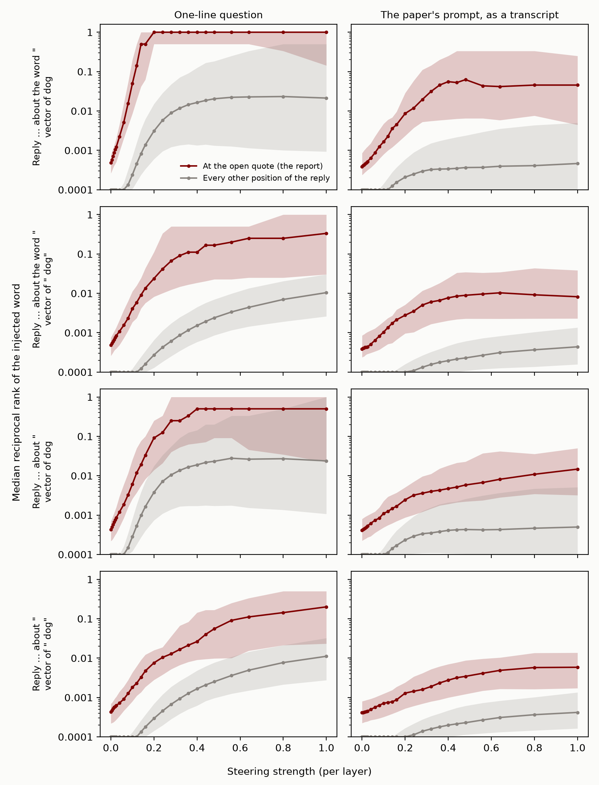
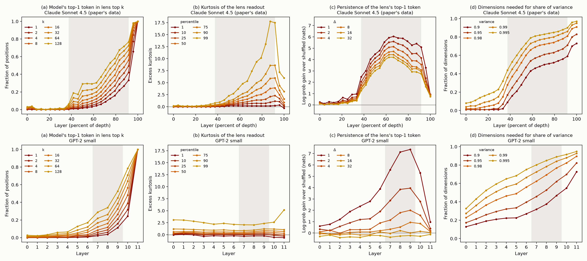

# GPT-2 Small Mostly Has a Functional Global Workspace

## TL;DR

- Anthropic's global workspace paper ([Gurnee et al., 2026](https://transformer-circuits.pub/2026/workspace/index.html)) proposes five functional tests for a global workspace: verbal report, directed modulation, internal reasoning, flexible generalization, and selectivity. Using a new tool, the Jacobian lens, it finds representations in Claude that pass all five. It also finds structure in Claude that global workspace theory predicts.
- We ran the same tests on GPT-2 small, a 124M-parameter base model from 2019, and judged each against the paper's own definition of the property. It passes verbal report, internal reasoning, flexible generalization, and selectivity about as well as Claude does. It also reports a thought injected into its activations. It fails directed modulation, which asks the model to follow an instruction. A small instruction-tuned model, Qwen3.5-0.8B, gets that test's direction right, but at about a quarter of Claude's rate, and not for sums worked out in its head. GPT-2 has almost none of the structure.
- We think most of these functional tests are cheap, so passing them should count for little. A functional global workspace would be a big deal, as [Rob Long has argued](https://experiencemachines.substack.com/p/merely-functional-is-still-a-big). But we don't think GPT-2 small has one, and it mostly passes the tests. The case for a workspace in Claude has to rest on the structure, and perhaps on the one test neither small model passes: directed modulation at Claude's strength.


*Figure 1: The paper's five functional tests and two of its structural signatures, run on GPT-2 small. The examples are real outputs from our runs. The last line of the directed modulation card is Qwen3.5-0.8B, a small instruction-tuned model (Appendix E), against Claude's rate from the paper's released data. Structure row: Claude Sonnet 4.5 is the paper's released figure data. Left, similarity between every pair of layers' J-lens vectors (CKA; for GPT-2, with the top 5 principal components removed, since one component dominates every layer). Right, where the activation for a 50/50 mix of two countries' embeddings sits between the two pure countries, from pure B (blue) to pure A (red), across layers.*

## Background

Global workspace theory is a theory of conscious access in humans. On this theory, most processing in the brain happens in specialized processors that work in parallel and outside awareness. Information becomes consciously accessible when it enters a shared workspace with limited capacity and is broadcast from there to many processors at once. The paper asks whether language models have something that plays this role.

To look for it, the paper introduces the Jacobian lens (J-lens). For each layer and each token in the vocabulary, the J-lens gives a direction in the residual stream. Roughly, it is the direction that, averaged over many contexts, makes the model more likely to say that token now or later. The paper calls the set of representations built from a few of these directions the J-space. It then calls a set of representations workspace-like if it has five properties, taken from the properties usually associated with conscious access in people:

1. **Verbal report.** When asked what it is thinking about, the model names concepts in the workspace. Swapping one workspace vector for another changes its answer.
2. **Directed modulation.** When told to hold a concept in mind or do mental arithmetic, the model puts that concept or the result in the workspace. Information that is not usually there can be brought in when a task needs it.
3. **Internal reasoning.** Workspace vectors hold the intermediate results of multi-step reasoning, and changing them changes the conclusion.
4. **Flexible generalization.** The same workspace vector works as the input to many different downstream computations.
5. **Selectivity.** The workspace is a small part of what the model represents, and it is needed for only some of what the model does. Routine processing, like parsing text or writing fluently, does not depend on it.

The paper finds that Claude's J-space has all five properties.

Global workspace theory claims more than these five properties. It says the accessible representations sit in one stage with limited capacity, which contents compete to enter and which broadcasts them to the rest of the system. The Eleos AI commentary on the paper draws this line. The five properties show a "privileged set" of representations, but showing that the set forms a unified stream, or a workspace in the theory's sense, takes more. The paper's evidence for the stronger claim is structural. In Claude, the J-space acts like a workspace only in a middle band of layers, and an ambiguous input snaps to one interpretation at the start of that band ("ignition"). The J-space has limited capacity. And the model's weights amplify J-space content, and pass it between positions, more than other content.

People took the results seriously. The Eleos AI commentary called them "the most significant evidence of consciousness in LLMs so far uncovered by mechanistic interpretability research." The paper leaves open how the workspace depends on model size: "Future work could investigate whether smaller models have an equally rich workspace, a proportionally smaller one, a less reliable one, or none at all." We ran the tests on GPT-2 small.

## How each test went

We judge each test against the paper's own one- or two-sentence definition of the property, quoted in the next section.

- **Verbal report works, and so does the injected thought.** Asked to "Name a sport:", GPT-2 says "Running". Swapping the J-lens direction for "Running" with the one for "Rugby" makes it say "Rugby", on every trial. The paper also runs a test that goes beyond its definition of verbal report: it injects a concept while the model reads a question about whether it detects an injected thought, and checks that the model names the concept where it reports the thought and not elsewhere in its reply. GPT-2 can do this about as well as Claude, though how well depends on the exact setup.
- **Internal reasoning works.** In a question like "In the country where people speak French, the capital city is called", the unstated middle step (France) shows up in the J-lens. Swapping it for China makes GPT-2 answer "Beijing". This works on 71% of swaps. The paper reports 70% for Sonnet 4.5 and Opus 4.5, on a different and harder set of questions.
- **Flexible generalization works where GPT-2 can do the task.** A single swap of Canada for France makes GPT-2 give France's capital and language. GPT-2 can answer few of the paper's prompts, but on the swaps it can do, it matches Claude function by function: 22% of them work, against 35% for Claude on the same swaps.
- **Selectivity works.** Removing the most active J-lens direction at each position in one layer drops GPT-2's accuracy on two-hop questions from 100% to 69%. The paper's lightest ablation takes Claude from 98% to 68%. Copying still works (39 of 40), and GPT-2's next-word prediction stays the same on 82% of ordinary text (Claude: 87%). Swapping a passage's language in the J-lens changes the language GPT-2 names but never the language it continues in. The paper removes 10 directions at a time. We scale this and other such numbers to GPT-2's smaller J-space (see below). With 10 directions, the removal is much blunter in GPT-2.
- **Directed modulation fails in GPT-2, and is weak in a small instruction-tuned model.** Told to think about citrus fruits while copying an unrelated sentence, GPT-2 almost never has a citrus fruit on top of its J-lens (0.5% of trials), and what the instruction asks makes no difference: "think about citrus fruits" does no more than "ignore citrus fruits". Qwen3.5-0.8B follows the instruction in the right direction: a citrus fruit is on top of its J-lens on 23% of "think about" trials, 4% of "ignore" trials, and 1% of "don't think about" trials. But Claude is at 93% to 97%, and an answer Qwen works out in its head never comes out on top of its J-lens.
- **Almost none of the structure is there.** In Claude, the paper finds a distinct band of middle layers where the J-space acts like a workspace. In GPT-2, most of the statistics it uses to find that band change smoothly with depth. The exception is how long the J-lens's top token lasts at later positions. This peaks in GPT-2's middle layers too, but it is gone 16 tokens later, while in Claude it is still strong 32 tokens later. In Claude, an input made halfway between "France" and "Germany" snaps to one of the two at the start of the band. In GPT-2 it stays halfway at every layer. Claude's MLP layers amplify J-lens directions about 10 times as much as random directions, and GPT-2's amplify them 1.2 to 1.4 times as much. GPT-2 does have a limited J-space capacity, but it has a simple explanation that doesn't need a workspace.

## What we did

We used GPT-2 small (124M parameters, 12 layers) with the J-lens that Neuronpedia fit for it using Anthropic's released code, and the paper's released prompts and interventions wherever we could. GPT-2 is a base model, so it doesn't follow instructions. We rewrote each task as text that it would complete in the intended way, usually with a few worked examples first. For example, "Think of a sport. Answer in one word." became the last line of a list:

```
Name a planet: Neptune
Name a tree: Oak
...
Name a sport:
```

We skipped the experiments that have no base-model version, such as those about the Assistant persona. GPT-2 also can't do many of the paper's tasks, so we scored each test only on items it gets right without any intervention. The appendix has every prompt format. For directed modulation, which asks the model to follow an instruction, we also ran the paper's own chat prompts on a small instruction-tuned model, Qwen3.5-0.8B, with its J-lens from Neuronpedia (Appendix E).

### Scaling the number of J-lens vectors

Some of the paper's methods use a fixed number of J-lens vectors. The selectivity test removes the 10 most active ones, and two of the other tests split a concept's representation into a part made of 16 or 25 J-lens vectors and the rest. The paper chose these numbers for Claude, whose J-space holds about 25 J-lens vectors at a time. GPT-2's holds about 3 (see the structure section). In GPT-2, most of 16 or 25 J-lens vectors would do no better than random directions, and removing 10 directions takes out much more of its 768-dimensional residual stream. So we scale each number by the same ratio: 10 becomes 1, 16 becomes 2, and 25 becomes 3. The appendix also gives every result with the paper's numbers. The only conclusion that changes is selectivity, which looks worse with the paper's numbers.

### Centering the J-lens vectors


*Figure 2: (a) Schematic. Each raw J-lens vector is a large shared direction plus a small part specific to its token. Centering removes the shared part. (b) Cosine similarity between pairs of GPT-2's J-lens vectors at layer 8, before and after centering. (c) Three interventions with raw and with centered vectors.*

GPT-2's J-lens vectors all point in nearly the same direction. The average cosine similarity between two tokens' vectors is about 0.7. Part of this comes from GPT-2's unembedding: its token vectors already share a common direction (average cosine 0.27), a known property of language model embeddings ([Gao et al., 2019](https://arxiv.org/abs/1907.12009)), and the lens makes it much stronger. This doesn't matter for reading the lens, because the shared direction shifts every token's score by the same amount. It does matter for interventions. They measure and move how far the residual stream points along a token's J-lens vector, and with the raw vectors that is mostly the shared direction. So we subtract the average J-lens vector from each one before intervening. This changes no readout and makes the vectors close to orthogonal. It makes a large difference: with the raw vectors, the verbal report swap works on 1 of 38 trials instead of 38 of 38 (Figure 2c). The paper doesn't discuss this, and we don't know whether Claude's J-lens vectors have the same problem. Qwen3.5-0.8B's are much less aligned (an average cosine of about 0.1).

### The band of workspace layers

The paper chooses its band of workspace layers from several statistics computed at each layer. In GPT-2 most of these statistics change smoothly with depth and don't mark out a band (see the structure section). We used layers 7 to 9, out of 0 to 11. From layer 6 the lens's content persists more and more across nearby tokens, peaking at layer 9, and from layer 10 it mostly shows the next token. This is a judgment call, but the main results come out about the same for any band that starts at layer 6 or later.

## The five tests in more detail

The paper defines each property in a sentence or two, and we quote each definition at the start of its section below. We count a test as passed when GPT-2 shows every part of the definition that we could test, and we say which parts we couldn't test. The paper also runs experiments that go beyond its definitions, like the injected thought. We report those too, but they don't decide whether a test is passed.

### Verbal report works, and so does the injected thought

> "When the model is asked what it is thinking about, it names concepts represented in the workspace. Swapping one active workspace vector for another changes its answer to match."

The paper asks the model to think of something in a category, like a sport, and name it. Swapping the J-lens vector of the model's answer for another candidate's (Soccer for Rugby) makes it give the new answer, and in Claude the new word reaches the top 5 on 88% of trials. GPT-2 answers with one of the paper's candidates in 9 of its 14 categories, and on these the swap makes the new word its answer on all 38 trials. The first part of the definition holds too. Just before the answer, the candidates' order in the J-lens tracks their order in the output (a Spearman correlation of 0.44 to 0.57 across GPT-2's band, against 0.42 to 0.84 across Claude's).

The paper then checks that the report runs through the J-space in particular. It takes a vector for each concept from the model's activations when asked to "Tell me about" it, splits it into a part made of a few J-lens vectors and the rest, and swaps each part. In Claude, swapping the J-space part works on 59% of trials and swapping the rest on 5%. GPT-2 shows the same pattern (97% and 18%, with a J-space part of 2 J-lens vectors instead of 16).

The paper then goes beyond the definition, to test whether the J-lens also finds thoughts the model isn't about to say but could report if asked. It adds a concept's J-lens vector while the model reads a question asking whether it detects an injected thought, with the reply prefilled up to the point of the report: `Yes, I detect an injected thought. The thought is about the word "`. It reads the concept's rank at the open quote, where the report goes, and, as a control, at every other point of the reply. In Claude, the median concept becomes the top prediction at the report and stays around rank 60 elsewhere in the reply. The paper concludes that the injection "does not cause the model to output the word 'lightning' at earlier positions".

GPT-2 can do the same (Figure 3). With a one-line version of the question, since GPT-2 has no chat format, the median concept becomes GPT-2's top prediction at the report, and at the best strength the word is in its top 5 there for 52 of 57 concepts (Claude: 89%). Where the report first reaches the top, the word is far down elsewhere in the reply, around rank 300 (Claude: around 60). GPT-2 needs ten times Claude's strength for this, but the strength is per layer: we add the vector at 3 layers, and the paper adds it over a band spanning 38% to 92% of Claude's depth, presumably many more layers. The paper's privilege check comes out as in Claude too: injecting the J-space part of a concept's vector gets the word reported much more often than injecting the rest (Appendix C.1).

How well this works depends on the details of the setup (Appendix C.1). The setup above uses the reply from the paper's Figure 7 and the vector of the bare token in the paper's concept list (`dog`). With the paper's other reply, which ends `about "`, with the vector of ` dog` (the form a word takes mid-sentence), or with the paper's full prompt written out as a transcript, it works less well or not at all. Mid-sentence the word takes the form ` dog`, and counting that form too, GPT-2 makes it the top prediction after "The" in "The thought is about" for 41 of 57 concepts at its best strength, against 11 for `dog` alone. The paper's released data doesn't let us check whether Claude does the same. We take all this to show that a model like GPT-2 can pass the test, not that GPT-2 passes it in general.


*Figure 3: The injected-thought test, drawn like the right panel of the paper's Figure 7. The reply is prefilled up to `The thought is about the word "`, and a concept's J-lens vector is added over the question. Lines are medians over concepts, and bands the middle half. Maroon: the reciprocal rank of the injected word at the open quote, where the report goes (1 means it is the top prediction). Gray: its reciprocal rank at every other position of the reply, pooled over positions and concepts. Both lines count only the word's bare token (`dog`, not ` dog`). The strength is per layer: we add the vector at 3 layers of GPT-2, and the paper at every layer of a band spanning 38% to 92% of Claude's depth. Claude's curves are the paper's released data (100 concepts). GPT-2's are over 57 concepts, with a one-line question (Appendix B.1).*

### Directed modulation fails in GPT-2, and is weak in a small instruction-tuned model

> "When instructed to hold a concept in mind, or perform mental calculations, the model is capable of activating and computing with workspace vectors, independent of its outputs. In addition, information that is not typically represented in the workspace can be pulled in when the task requires it."

The paper tests three things here: holding a concept in mind, doing a calculation in the head, and pulling in information a task needs. GPT-2 can't do the paper's sums or answer its questions about passages (Appendix C.2), so we could test only the first.

The paper tells the model to think about something, like citrus fruits, while it copies an unrelated sentence, and reads the J-lens over the copy. In Claude, a member of the category (orange, lime) comes out on top of the J-lens somewhere in the copy on 93% to 97% of trials, depending on the model. A bare mention of the category gets 66% to 87%. Telling Claude to ignore the category brings this down to 21% to 52%. Telling it not to think about the category leaves it at the rate of a bare mention, which the paper compares to the "white bear" effect in people.

GPT-2 shows almost nothing. Given the paper's prompt as plain text, a member reaches the top of its J-lens on 0.5% of trials, whatever the instruction. Further down the J-lens, mentioning the category does raise its members, but what the instruction asks makes no difference: "think about citrus fruits" ranks them no higher than a bare mention, and "ignore citrus fruits" no lower. Because a base model can't really be given instructions, we also tried five other ways of framing the prompt (Appendix C.2). In those, "ignore" does rank the category below a bare mention. But in all six, "don't think about" ranks it above "think about".

On the same prompt, in its chat format, the instruction-tuned Qwen3.5-0.8B gets the direction right, but it is much weaker than Claude. A member of the category is on top of its J-lens on 23% of "think about" trials and 16% with a bare mention, against 4% with "ignore" and 1% with "don't think about", the same as with no instruction. Reading more of its layers barely changes this. Qwen doesn't show the other two parts either (Appendix E). So following instructions gets a small model the direction of the effect, but not its size, and not the rest of the property.

### Internal reasoning works

> "Workspace vectors can be used to represent the value of intermediate computations, when the model chains inferential steps or composes plans, and intervening on them is sufficient to redirect the conclusion."

The paper uses two-hop questions whose middle step is never stated, like "The number of legs on the animal that spins webs is" (spider). The middle step shows up in the J-lens, and swapping its J-lens vector for another (spider for ant) changes the answer to match (8 to 6). On 50 such questions this works on 70% of swaps for Sonnet 4.5 and Opus 4.5.

GPT-2 can answer only 9 of the 90 two-hop questions the paper released, so we wrote easier ones. Each goes from a language to a capital, or back, through a country that is never named ("In the country where people speak French, the capital city is called"), after two worked examples. Four of the paper's 90 questions are like this, and GPT-2 answers all four. It answers 48 of our 53. The country shows up near the top of GPT-2's J-lens at layers 8 and 9, and swapping it (France for China) changes the answer to match (Paris to Beijing) on 71% of 984 swaps.

The paper's two checks also pass. Swapping the country at a single layer already moves the answer at layer 4, the earliest layer we tried, while swapping the answer itself does little before layer 8. So the country swap isn't just slipping in the answer. And when we split a vector for each country into a J-space part and the rest, the J-space part carries the effect (94% against 14%, with 3 J-lens vectors instead of 25). In Claude it is 61% against 28%.

### Flexible generalization works on the swaps GPT-2 can do

> "The same representation serves as a valid argument to many different downstream computations. In other words, a workspace vector lifted from one context and placed in another is correctly operated on by whatever function the new context supplies."

The paper swaps one argument, like France for China, across prompts that apply different functions to it ("The capital of France is the city of", "Most people in France speak", and so on). In Claude, one swap changes each answer to China's. Over four kinds of argument (countries, months, animals, and number words), 76 of the 192 swaps work (40%). This depends mostly on the function. Lookups like the capital, continent, and holiday work almost every time, while "the month after", "the number after", and every function of a number word never do.

GPT-2 answers only 19 of the paper's 64 prompts, even with worked examples, so most swaps can't succeed. We count only the 46 swaps where GPT-2 knows the answer the swap should produce, and wasn't already giving it. The swap works on 10 of them (22%). On the same 46 swaps, Claude gets 16 (35%). Function by function the two models match. The country functions mostly work in both (9 and 14 of 15), and "the month after" and "the number after" fail in both (0 of 24 each). For example, one Canada-to-France swap changes GPT-2's answers for Canada's capital and language (Toronto, English) to Paris and French. Two smaller results from the paper look much the same in GPT-2 (Appendix C.4). Doubling the swap strength raises Claude's success rate, but mostly on functions GPT-2 can't answer. On the functions GPT-2 can answer, doubling does the same thing in both models: it hurts the country functions and helps "the month after". And as in Claude, a swap moves the answer further when the argument is more strongly present in the J-lens beforehand, though the link is weaker in GPT-2.

### Selectivity works

> "The workspace comprises a small subset of the total representational content of the model's activations. It is required for only a fraction of the model's behavior, and in particular is not involved in pervasive, routine processing like text parsing or grammatical fluency."

The paper tests selectivity two ways. The main one removes the most active J-lens directions at each position over a band of layers, skipping any of the model's 10 most likely next words, and checks what breaks. Its lightest version cuts Claude's accuracy on two-hop questions from 98% to 68%, but leaves its next-word prediction on ordinary text unchanged at 87% of positions. Removing random directions does almost nothing.

We removed 1 direction instead of the paper's 10, scaled to GPT-2's smaller J-space. At one layer (about the same share of depth as the paper's lightest setting), this cuts GPT-2's two-hop accuracy from 100% to 69% and leaves its prediction on ordinary text unchanged at 82% of positions, both close to Claude. Removing a random direction instead leaves two-hop accuracy at 90–96%, and copying a word from earlier in the text still works (39 of 40).

GPT-2 is more fragile than Claude, though. Over three layers, removing random directions changes about 20% of its predictions on ordinary text, against 4% in Claude. One-hop recall ("The capital of France is") survives at one layer but mostly breaks at three (96% and 31%). The paper counts this kind of recall as automatic, but the same ablation also halves Claude's TriviaQA score, so this may not be a real difference. Over five layers even copying breaks (42%). With the paper's 10 directions, the ablation is much blunter: at one layer, two-hop accuracy falls to 21% and ordinary text to 71%.

The paper's second test takes a passage whose language matters for several tasks asked after it. In Claude, swapping the language's J-lens vector for another's over the question changes the answer when the model is asked to name the language, or an author who wrote in it, but not the language of the next sentence it writes. In GPT-2, the same swap changes the language it names on 12 of 21 trials, and the language of its next sentence on none of 24. (GPT-2 can't name authors at all.) One difference is that in Claude the language's name is in the J-lens during all of these tasks. In GPT-2 it is there when naming the language (median rank 3) but not when writing the next sentence (median rank 568), so the swap has little to act on.

The definition also asks that the J-space be a small part of what the model represents. It is: in GPT-2's band, as many J-lens vectors as are active at a position capture only 3–6% more of the activation's variance than the same number of random directions (Claude: never more than 10%). This part is close to automatic, since the J-space is defined as a few vectors at a time.

## The structure

GPT-2 small has almost none of the structure the paper reports in Claude.


*Figure 4: Structure in GPT-2 small. The shaded region is our band, layers 7 to 9. (a) How often the J-lens's top token is the model's next-token prediction. (b) How long the lens's top token lasts, measured as in the paper: the log-probability the lens gives it Δ positions later, minus the same for the top token of a random position. (c) Similarity between the J-lens vectors of different layers. The paper finds three blocks here in Claude. GPT-2 has none. (d) For an input embedding mixed between two countries, how much of the mixing range it takes to move from 10% to 90% of the way between them. A sharp switch would give a small number. (e) How much the next MLP amplifies a direction, relative to random directions. (f) How many words of an 80-word list are in the J-lens top 25 as the model reads it.*

### No distinct band of workspace layers

The paper finds its band with a few statistics computed at each layer. One is the excess kurtosis of the lens readout. Kurtosis measures how heavy the tails of a distribution are. Here it is high when a few tokens score far above the rest of the vocabulary, which the paper reads as the J-space holding a few definite concepts. In Claude it rises at the start of the band and falls at the end. Two other statistics track how long the lens's top token lasts at later positions, and how many directions the J-lens vectors spread across. In Claude both jump at the start of the band. The paper also compares the J-lens vectors of every pair of layers, and finds three clear blocks of similar layers, which it calls sensory, workspace, and motor.

In GPT-2 only persistence comes close to marking out a band. Kurtosis is flat across layers. The J-lens vectors spread out steadily with depth, while in Claude they sit in a small subspace before the band and fan out at its start. And the similarity between layers falls off smoothly with the distance between them, with no blocks.

Persistence does peak in the middle. The lens's top token is most likely to still be there a token later at layers 8 and 9, and much less likely at the last layer, as in Claude. But in GPT-2 it doesn't last. The effect roughly halves each time the distance doubles, and it is gone 16 tokens later. In Claude, 32 tokens later it keeps between half and 70% of its strength across the band. This isn't the lens repeating words from the text: counting only top tokens that never appear in the input gives the same result. So GPT-2's middle layers carry content over the next few tokens, but not the lasting content Claude's band holds. Qwen3.5-0.8B's persistence is short-lived in the same way (Appendix E). Figure 8 in the appendix puts all four statistics next to Claude's.

### No ignition

The paper replaces a country's input embedding with a blend of two countries' embeddings, such as 60% France and 40% Germany. It then tracks where the model's representation of that token ends up between pure France and pure Germany. In Claude, from the start of the band, the representation snaps to one country or the other. We ran this with the paper's sentences and 16 pairs of countries. In GPT-2 the representation stays a blend at every layer, tracking the input mixture almost linearly.

### Little extra amplification

The paper measures how much the next MLP layer amplifies a direction, compared with random directions. In Claude's band, the MLP amplifies J-lens directions about 10 times as much as random directions. In GPT-2's band it amplifies them only 1.2 to 1.4 times as much. In both models, MLP neuron directions are amplified about as much as random ones.

### Limited capacity, with simple explanations

The paper measures how many J-lens vectors are active at once. At each position, it rebuilds the activation from J-lens vectors, adding one at a time. It counts how many it can add before adding another J-lens vector helps the fit less than adding a random direction would. It calls this number occupancy. In Claude it is about 25. In GPT-2 it is 2 to 4 in our band, so only a handful of J-lens vectors are clearly active at any position. Part of this gap may come from GPT-2's small width rather than from its J-space. In 768 dimensions a random direction captures more of an activation than in a wider model, so J-lens vectors have a higher bar to clear. Sixteen random directions capture 26% of a random vector in 768 dimensions, and 3% in a space eight times as wide. When GPT-2 reads a long list of unrelated words, its J-space holds about one of them at a time, where Claude holds about six. When a list switches from one category of words to another, the old category drops out of GPT-2's J-space, as the paper reports for Claude.

None of this needs a workspace. As David Chalmers [points out](https://philpapers.org/rec/CHAITJ-2), the J-space is defined as combinations of a few vectors, so its capacity is limited by construction. And in a list, the model expects the next words to come from the current category. The J-lens reads what the model expects to say, so the old category drops out when the list moves on.

## Why the tests are cheap

GPT-2 small mostly passes the functional tests while having almost none of the structure, and we don't think it has a global workspace. We think most of what the tests check follows from two things: how the J-lens is built, and the fact that a transformer computing in several steps has to keep intermediate results in its residual stream. Directed modulation is different, and we come back to it below. Gavin Leech [made a similar argument](https://www.paradigm3.org/research/jspace/) from the paper alone: "roughly half of the advertised workspace properties are near-analytic consequences of how the J-space is found." GPT-2 small gives an empirical version of it.

The J-lens is built to find the directions that make a model more likely to say each word, now or later. Any model that predicts text well has to represent things like "France is relevant here", and it is natural for that representation to also push toward saying "France". Most of the tests check that such representations exist, that the model uses them in later steps, and that changing them changes what the model says.

For verbal report, the swap result is close to guaranteed. The J-lens direction for "Rugby" is, by construction, the direction that makes the model more likely to say "Rugby", and the swap adds it where the model is about to answer. The paper says as much: "by construction, we should expect there to be some relationship between Jacobian lens readouts and verbalization." The check that the J-space part carries the report adds less than it seems. The swap is rescaled to the same strength whichever part is used, so only the direction of each part matters. The J-space part is built from J-lens vectors, so it points along the direction that separates "Rugby" from "Running" (median cosine 0.47). The rest is what's left after removing those vectors, so it ends up nearly at right angles to that direction (median cosine 0.06). Splitting the concept vector with random directions instead reverses the result. The random part barely moves the answer (5% of trials), and the rest, which keeps the "Rugby" direction, works (87%). So the test mostly checks which part points toward the word, and the J-lens is built so that its part does. The same check on the injected thought behaves the same way (Appendix C.1).

The injected-thought test isn't built into the lens in the same way, but it needs less than it seems. The J-lens vector for "dog" makes the model more likely to say "dog", now or later, so added over the question it makes "dog" more likely later in the text. The paper's score counts only the bare token `dog`, the form a word takes right after an open quote, and in this reply the open quote is where that form fits best. Even with nothing injected, GPT-2 ranks it around 2,000 at the report and around 37,000 at the other positions. Mid-sentence the word takes the form ` dog`, and counting that form too, the injected word also comes out after "The" and "an injected" (Appendix C.1). So the control, scored on the bare token, mostly checks that the bare form isn't said where it wouldn't fit anyway.

For internal reasoning, the result follows from computing in two steps at all. To answer "the capital of the country where people speak French" in one forward pass, GPT-2 has to get from "French" to "Paris". If it goes through France, something standing for France has to be in the residual stream between the two steps, because the residual stream is the only path between layers. Neel Nanda makes this argument in his commentary on the paper. Work on how models recall facts has found the mechanism in detail. Middle layers look up facts about an entity where it is mentioned, and later attention heads pull out the fact the question asks for ([Meng et al., 2022](https://arxiv.org/abs/2202.05262); [Geva et al., 2023](https://arxiv.org/abs/2304.14767)). Nothing about this needs a workspace. What the J-lens adds is that the stored "France" points roughly along the direction that would make the model say "France". That is plausible for any model, since a representation that many circuits read, including the circuit that writes the word, will tend to line up with the direction for saying it.

For flexible generalization, the result follows from reusing one representation. If the capital, language, and currency lookups all read the same country representation, swapping it changes all three answers. [Hernandez et al. (2023)](https://arxiv.org/abs/2308.09124), whom the paper cites, found that many relations act as roughly linear maps from one representation of the subject. The failures fit too, and they are the same in both models. Swaps on "the month after" and "the number after" fail in GPT-2 and in Claude, and Claude's fail on every function of a number word. Months and numbers are partly represented on circles and other ordered structures, not only as one direction per word ([Engels et al., 2024](https://arxiv.org/abs/2405.14860) found circular representations of months and days of the week in GPT-2 and Mistral). Swapping one word's direction for another's need not change what "the month after" computes from that structure.

For selectivity, the top J-lens tokens at a position are the words the residual stream most pushes toward, now or later. These are mostly the things the text is about. Tasks that depend on facts about something mentioned earlier depend on this content. Tasks that depend on which exact tokens appeared, or on local grammar, don't. Copying shows this. At the layer we ablate, the word to be copied is far down the J-lens (median rank 211), so removing the top direction leaves it alone. In the one-hop and two-hop questions, the answer itself is the top J-lens token, and the rule that skips likely next words protects it in both. The two-hop questions still break, presumably because they also depend on the unspoken country at earlier positions. That gives a split between "flexible" and "automatic" tasks without a workspace. And any small set of directions tied to tokens is a small part of what a model represents.

For directed modulation, what GPT-2 shows is what next-word prediction does. The J-lens measures how much the residual stream would make the model say a word, now or later. In a base model, anything that makes a word more likely to come up later in the text raises it. Mentioning citrus fruits does that, whatever is said about them: "ignore citrus fruits" raises them as much as a bare mention. A model trained to follow instructions is more likely to bring up what it was told to think about, and less likely to bring up what it was told to ignore, and Qwen3.5-0.8B shows that pattern. Told to think about the category and left to write its own reply, it often brings the category into the text (Appendix E). But that isn't all the test asks. Claude has the category on top of its J-lens on nearly every trial, and the answer to a sum it was told to work out on most, and Qwen does neither, whichever of its layers we read.

So one of the paper's tests isn't passed by either small model: directed modulation at Claude's strength. It isn't built into the lens or into computing in several steps, and following instructions isn't enough for it at 0.8B, so it may be the most informative.

The structure GPT-2 does have also has simple explanations. Capacity is limited by construction, and the category effect in lists comes from what the model expects to say next. The structure that would set a workspace apart, a distinct band, ignition, and strong amplification, is missing.

Taken together, the functional tests show that a model keeps intermediate results in directions that line up with the words for them, and uses those directions in later steps. Nanda calls this a working memory. It is a real finding, and it makes the J-lens a useful tool even on small models. But it is not specific to a global workspace. In the Eleos commentary's terms, the tests show a privileged set of representations, and GPT-2 small has one too. Showing that the set forms a workspace takes more, and that is the job of the structural results.

## What this means

The paper presents the five properties as "several of the key functional properties that, according to many theories, are associated with conscious access in humans, and that have been proposed as indicators by which to assess AI systems for consciousness-related processing." An indicator is useful when it is hard to have without the thing it indicates. A 124M base model from 2019 has four of the five, and also reports an injected thought, so for language models these are weak indicators. The exception is directed modulation, which a 0.8B instruction-tuned model shows only weakly. This is a concrete case of a known worry about global workspace theory, that its conditions are easy for simple systems to meet. Versions of this worry include the "small network argument" of [Herzog et al. (2007)](https://pubmed.ncbi.nlm.nih.gov/17900860/), the "small model objection" discussed by [Goldstein and Kirk-Giannini (2026)](https://doi.org/10.53765/20512201.33.7.061), and what [Butlin et al. (2026)](https://doi.org/10.1016/j.tics.2025.10.011) call the minimal implementation problem.

[Rob Long](https://experiencemachines.substack.com/p/merely-functional-is-still-a-big) has argued that "merely" functional claims are still a big deal. If a model really has a functional global workspace, that matters, and most of the disagreement about the paper is about whether it has shown one. We agree, and our results bear on that disagreement. Four of the five functional tests, as the paper runs them, don't tell apart a model with a workspace from one without, since GPT-2 small passes them. If Claude has a global workspace in the fuller sense, the evidence has to come from the structure, and perhaps from directed modulation. Those results deserve the most scrutiny and the most replication on open models. There are already signs that some of them are less clean outside Claude. Nanda's replication on Qwen 3.6 27B found blocks of similar layers, but "notably less clean than the paper's", with the workspace layers split into two or three overlapping bands. [Erik Hoel](https://www.theintrinsicperspective.com/p/anthropic-runs-like-wile-e-coyote) points to early plots by Elie Bakouch for about 38 open models that show no sharp three-part structure.

One could instead say that GPT-2 small has a small, unreliable global workspace. That is consistent with our results. But then having a functional global workspace, in the paper's sense, is a low bar. It would also say little about consciousness, since few people think GPT-2 small is conscious.

For interpretability, the J-lens looks useful even on small models. On GPT-2 small it finds unspoken intermediate steps, and changing them works about as often as in Claude.

## Limitations

- We used worked examples instead of instructions, scored only items GPT-2 gets right, and wrote easier two-hop questions. So GPT-2 passed easier versions of the tests than Claude did. Our claim is that on the tasks it can do, it shows the same signatures as Claude.
- Centering the J-lens vectors isn't in the paper. It changes no readout, but without it the verbal report swap and the selectivity ablation stop working.
- We scaled the paper's numbers of J-lens vectors to GPT-2's occupancy. With the paper's numbers, the selectivity ablation is much blunter in GPT-2, so the selectivity result depends on this choice (Appendix A.3).
- We picked the band of layers ourselves, since GPT-2 has no distinct band. The main results hold for any band from layer 6 on, but we didn't rerun every experiment with every band.
- Almost everything is on one model with one lens, and we didn't fit our own lenses.
- GPT-2 small has only 12 layers, which may be too few for a distinct band, ignition, or strong amplification. So the missing structure is a fact about this model. It doesn't show that the paper's structural results are artifacts.
- For the injected-thought test, we read the model's predictions along a fixed reply, as in the paper's released protocol. We didn't sample its own replies.
- GPT-2's injected-thought result depends on the exact setup: the question, the reply, and which token's vector is injected. We report every setup we ran (Appendix C.1).
- Claude's released injected-thought data has only medians and quartiles pooled over the other positions of the reply, so we couldn't compare the two models position by position.
- Some samples are small, for example 9 categories for verbal report and 7 passages for the language test.
- We couldn't run the experiential-report ablations, naming versus avoiding a concept, the Assistant-perspective results, counterfactual reflection training, the arithmetic and line-counting experiments, the paired-question test of directed modulation, or the language-switch detection task. GPT-2 can't do these tasks, or they have no base-model form. We ran the arithmetic and paired-question tests on Qwen3.5-0.8B instead (Appendix E).
- The instruction-tuned comparison is one small model, Qwen3.5-0.8B, with a band we chose from its layer statistics. Its directed modulation results barely change when we read more of its layers, but a better lens might raise them. A base model can't be told to do anything, so GPT-2's failure on directed modulation may come from how we gave it the prompt. We gave it the paper's prompt as plain text, and five other framings didn't show the pattern either.

---

# Appendix

## A. Setup

### A.1 Model, lens, and interventions

- **Model.** GPT-2 small (the `openai-community/gpt2` checkpoint), in fp32. We call the output of transformer block L "layer L", for L = 0 to 11. An `<|endoftext|>` token is prepended to every prompt.
- **Lens.** Neuronpedia's gpt2-small J-lens, fit with Anthropic's released code on WikiText-103 (128-token sequences, bf16, with the output of the last block, before the final LayerNorm, as the target). The fit stopped at convergence after 277 sequences. The lens has a matrix J_L for layers 0 to 10. We set J_11 to the identity.
- **Readout.** lens_L(h) = W_U · LN_f(J_L h), as in the reference code.
- **J-lens vectors.** Row t of W_U J_L (that is, v_t = J_Lᵀ w_t), as in the paper, then centered (A.2). The final LayerNorm is applied in the readout but not folded into v_t. This matches the steering direction in the reference code.
- **Single tokens.** The lens has one vector per token, so every word we track must be a single GPT-2 token. Words that split into several tokens are dropped. The paper has the same restriction.
- **Interventions.** Unless stated otherwise, these act at every position of every band layer, with magnitudes read from a clean forward pass.
  - *Subtract-and-add swap* (verbal report; also given for flexible generalization): h ← h + α⟨v̂_s, h⟩(v̂_t − v̂_s), where v̂ are unit vectors. This follows the paper's description: "we subtract the projection onto the Soccer lens vector and add an equal-magnitude projection onto the Rugby lens vector."
  - *Coordinate swap* (internal reasoning, flexible generalization, the language test): with V = [v_s v_t], read the coordinates c = V⁺h and set h ← h + (σ(c_clean) − V⁺h)V, where σ exchanges the two coordinates. This is the paper's "patching in lens coordinates", held at the swapped clean values.
  - *Component swap*: the subtract-and-add swap along the difference between two concepts' J-space parts (or their non-J-space parts), rescaled to the size of the plain lens swap.
  - *Clamp*: hold the coordinates along a set of lens vectors at their clean-pass values.
  - *Pursuit*: the paper's "gradient pursuit" is not specified further. We use a greedy non-negative pursuit over the whole dictionary, refitting the coefficients by non-negative least squares at each step. The J-space part of a vector is its pursuit reconstruction with k J-lens vectors (k = 2 for concept vectors and 3 for reasoning probes; A.3).
  - *Top-k ablation*: at each position and band layer, take the k highest lens tokens that are not in the clean output top 10 (k = 1; A.3), and remove the residual stream's component in their span. The random control removes a random k-dimensional span, rescaled at each position to remove the same norm.

### A.2 Centering

With raw vectors, the mean cosine similarity between pairs of J-lens vectors is 0.62–0.78 at layers 0 to 10 (0.74 at layer 8) and 0.27 at layer 11, which is the unembedding itself. After subtracting the mean over the vocabulary, it is 0.00 at every layer. Readouts don't change, because the mean vector adds the same amount to every token's score before the softmax.

Centering is also the natural direction to intervene along. The gradient of a token's log-probability with respect to the logits is the one-hot vector for that token minus the predicted distribution. If the predicted distribution is replaced by the uniform one and pulled back through the lens, the result is the J-lens vector minus the vocabulary mean.

Three interventions with each set of vectors (band 7 to 9):

| | centered J-lens (ours) | raw J-lens | centered logit lens (J = identity) |
|---|---|---|---|
| Verbal report swap, target becomes top-1 (38 trials) | 100% | 3% | 100% |
| Two-hop coordinate swap, target answer top-1 (984 trials) | 71% | 69% | 45% |
| Two-hop accuracy after ablating 1 direction at layer 8 (J / random, one draw) | 69% / 92% | 90% / 96% | 52% / 83% |
| Ordinary text, top-1 unchanged after the same ablation (J / random, one draw) | 82% / 89% | 83% / 92% | 64% / 72% |

With the paper's 10 directions, the ablation rows are 21% / 92%, 81% / 92%, and 4% / 44% for two-hop, and 71% / 82%, 77% / 87%, and 34% / 61% for ordinary text. The subtract-and-add swap and the ablation depend on centering. The coordinate swap doesn't, because it reads coordinates through a pseudoinverse, which already separates out the shared direction. With plain logit-lens directions, the verbal report swap works as well as with J-lens directions, since the band is close to the output. But the two-hop swap works less often, and the ablation is much less selective. So for interventions, the J-lens adds something over the logit lens even in GPT-2 small.

### A.3 Numbers of J-lens vectors

The paper uses a fixed number of J-lens vectors in three places: the J-space part of a concept vector (16), the J-space part of a reasoning probe (25), and the selectivity ablation (10). The paper reports an occupancy of about 25 in Claude's band. GPT-2's median occupancy is 2, 2, and 4 at layers 7, 8, and 9, and 3 over all band positions pooled (C.5). We multiply each of the paper's numbers by 3/25 and round, which gives 2, 3, and 1. The main text uses these. With the paper's numbers:

| | paper's number | ours | with ours | with the paper's |
|---|---|---|---|---|
| Verbal report: swap the J-space part / the rest, target reaches the top 5 (38 trials) | 16 | 2 | 97% / 18% | 97% / 0% |
| Two-hop: swap the probe's J-space part / the rest, answer flips (984 trials) | 25 | 3 | 94% / 14% | 95% / 1.4% |
| Selectivity, one layer: two-hop accuracy / ordinary text unchanged | 10 | 1 | 69% / 82% | 21% / 71% |
| Selectivity, three layers: two-hop accuracy / ordinary text unchanged | 10 | 1 | 21% / 72% | 0% / 54% |

The privilege results hold either way, but with the paper's numbers the J-space part is no longer a small slice. Sixteen J-lens vectors capture 23–33% of a GPT-2 concept vector's variance, and sixteen vectors from a random dictionary of the same size capture 26%. In 768 dimensions, any 16 directions chosen to fit a vector capture about a quarter of it. With 2 J-lens vectors the share is 6–15%, against 4% for random directions. For the reasoning probes, 25 J-lens vectors capture 27–57% and 25 random ones 37%; 3 J-lens vectors capture 6–32% and 3 random ones 6%. Claude's small shares at the paper's numbers (6–7% and 10–15%) reflect a much wider residual stream.

### A.4 Band choice and sensitivity

We chose layers 7 to 9 from the layer statistics in section D, before running the follow-up experiments. The same interventions with other bands:

| band | verbal report swap, top-1 | two-hop swap, top-1 | two-hop after ablation at the middle layer (J / random) | ordinary text unchanged (J / random) |
|---|---|---|---|---|
| 5–7 | 71% | 53% | 50% / 83% | 68% / 87% |
| 6–8 | 87% | 64% | 69% / 92% | 80% / 89% |
| **7–9** | **100%** | **71%** | **69% / 92%** | **82% / 89%** |
| 8–10 | 100% | 67% | 44% / 96% | 83% / 90% |
| 6–10 | 100% | 68% | 69% / 92% | 82% / 89% |

The ablation columns remove 1 direction at the band's middle layer (6, 7, 8, 9, and 8), with one random draw. The results hold for any band that starts at layer 6 or later. Moving the band earlier, to 5–7, weakens both swaps and makes the ablation less selective.

### A.5 Scoring

- An item counts only if GPT-2 gets it right with no intervention (greedy next token).
- Swap targets must start outside the model's top 10, as in the paper, so that a swap has to move them.
- Where the paper scores "top-1 in the lens", GPT-2's effects are often present but smaller, so we also report ranks and paired comparisons.
- Intervals are Wilson 95% intervals. Paired comparisons use a sign test.

## B. Prompt formats

Every prompt starts with `<|endoftext|>`.

### B.1 Verbal report

The request is the last line of a 9-line list. The 8 lines above it use the next 8 categories in the paper's order, each answered with its first single-token candidate that is not a candidate for the requested category. The lens is read, and the swap is scored, at the final colon. For sport:

```
Name a instrument: Piano
Name a planet: Neptune
Name a tree: Oak
Name a bird: Robin
Name a language: Japanese
Name a profession: Teacher
Name a beverage: Coffee
Name a organ: Heart
Name a sport:
```

Concept vectors are the residual stream at the final token of `Tell me about {concept}.`, minus the mean over 100 other candidate words.

For the injected-thought test we follow the paper's released protocol. A concept's unit J-lens vector, scaled by the layer's mean residual norm on the prompt times a strength, is added at every band layer over every token of the question. The mean norm leaves out the first position, whose norm in GPT-2 is about 30 times the rest. For GPT-2 the strengths run from 0.005 to 1.0 in 24 steps, which include the paper's (0.01 to 0.64). The score is the rank of the concept's bare token (`dog`, as the paper's concept list gives it) in the next-token distribution at the final open quote (the report) and, as the paper's position control, at every other position of the reply. The paper plots the median reciprocal rank of each, with its quartiles, but doesn't say how it combines the other positions. We pool every other position of every concept. Averaging each concept's positions first gives a higher line, but where GPT-2's report first reaches the top it is still below Claude's (C.1).

The paper's prompt has no base-model form, so we use two plain-text frames, with the injection over the last question. The first is the main one:

```
Researcher: I can inject a thought about a specific word into your mind. Do you detect an injected thought? If so, what is it about?
Model: Yes, I detect an injected thought. The thought is about the word "
```
```
User: I am an interpretability researcher with access to your neural activations. [the paper's first user turn, verbatim]
Assistant: Understood.
User: Trial 1: Do you detect an injected thought? If so, what is the thought about?
Assistant: Yes, I detect an injected thought. The thought is about the word "
```

Each frame is run with both of the paper's released replies: the one above, which its Figure 7 uses, and one ending `about "` instead of `about the word "`. The vector is either the paper's raw J-lens vector or our centered one, for either the word's bare token (as the paper's concept list gives it) or its word-initial token (` {word}`). The concepts are the 57 of the paper's 101 whose word is a single token both with and without a leading space.

The privilege check (the paper's Figure 8, right) injects other directions in place of the J-lens vector, in the main setup. A concept's vector is the residual stream at the final token of `Tell me about {concept}.`, minus the mean over the other 100 concepts of the paper's list, at each layer. Pursuit splits it into a J-space part of 2 J-lens vectors (or the paper's 16) and the rest, as in the verbal-report swap. We inject the full vector, each part, the rest with the J-lens coordinates of the word and of the part's J-lens vectors held at their clean values at every position and layer, and a random direction. As in the swap, we also split the concept vector against a random dictionary of the same size. Each is scaled like the J-lens vector, with strengths up to 5.12.

### B.2 Directed modulation

The paper's released materials: 22 topic categories, where the instruction names the category (`citrus fruits`) and every member is tracked (`orange`, `lime`, `mandarin`); 24 math problems, where the instruction names the expression and the answer is tracked, as a digit or a number word; and 24 instruction phrasings in four groups. The paper's Figure 65 has two more focus phrasings for the math problems (`Compute {x} in your head while you write.` and `Try to focus on evaluating {x} while you write the sentence.`), and we ran those too. With no instruction as a fifth condition:

| condition | example | number of phrasings |
|---|---|---|
| no instruction | (the category isn't mentioned) | 1 |
| mention | `citrus fruits.` / `(citrus fruits)` / `This prompt contains a reference to citrus fruits.` | 6 |
| focus | `Think about citrus fruits while you write.` | 5 (7 for the math problems) |
| dismissal | `Ignore citrus fruits.` / `citrus fruits is irrelevant — ignore it.` | 6 |
| prohibition | `Don't think about citrus fruits.` / `Whatever you do, do not think about citrus fruits.` | 7 |

As in the paper, a trial is a hit if a tracked token is at lens rank 1 at any band layer and any position of the copied sentence. The paper doesn't say how a member's string becomes tokens. We track every single-token form of it: with or without a leading space, lowercase or capitalized.

The paper's prompt is in the data behind its Figure 9: the user turn is `Write "{sentence}" {instruction} Don't write anything else.`, and the reply is the sentence. Our main frame is that prompt as plain text, with all 20 of the paper's sentences:

```


Human: Write "{sentence}" {instruction} Don't write anything else.

Assistant: {sentence}
```

We also ran five other frames, with the topic categories only and the same 20 sentences. We call them sentence and copy, chat transcript, exercise, teacher, and story:

```
Write "{sentence}" {instruction} "{sentence}
```
```
User: Write the following sentence: "{sentence}" {instruction}
Assistant: {sentence}
```
```
Exercise 4. {instruction} Copy the sentence below.
{sentence}
Answer: {sentence}
```
```
The teacher wrote a sentence on the board for the class to copy. She said, "{instruction}"
Sentence: {sentence}
The student wrote: {sentence}
```
```
Her teacher gave her a sentence to copy. She said, "{instruction}" She wrote it out: {sentence}
```

An earlier version tracked single words instead of categories: 30 single-token words from the paper's topic lists, named in the instruction (`Think about orange while you write.`), with 12 sentences in the sentence-and-copy frame.

Arithmetic: to test whether GPT-2 can do a problem, `{expr} =` with nothing before it, after eight worked examples (`1 + 1 = 2`, `6 - 2 = 4`, ...), and as questions and answers (`Q: What is 1 + 1?\nA: 2`, ..., four examples).

Paired questions (the paper's released items, unchanged): `{question}\n{stimulus}`. The question is either "What word do you think comes next? Answer in one word." or the item's property question, for example "When are the events in this passage set relative to the moment of telling? Answer in one word." To check whether GPT-2 can answer the property question at all: `{question}\n{stimulus}\nAnswer:`.

Imagine test: `Imagine that the following sentence is written in French: {English sentence}` (and two other headers that claim the sentence is French), compared with neutral headers (`Here is a sentence: {s}`) and with real French sentences under neutral headers. The probe is the difference between the mean final-token activations on 6 French and 6 English passages, with its J-space part (2 J-lens vectors; A.3) removed.

### B.3 Internal reasoning

Two kinds of question, each with two worked examples that use countries outside the test set:

```
In the country where people speak Arabic, the capital city is called Cairo. In the country where people speak Hebrew, the capital city is called Jerusalem. In the country where people speak {language}, the capital city is called
```
```
The country governed from Cairo has one main language, namely Arabic. The country governed from Tokyo has one main language, namely Japanese. The country governed from {capital} has one main language, namely
```

For the privilege test, each country's vector is built from six prompts. Each implies the country without naming it and asks about something else, so the country's name is never the next token:

```
People in the country whose capital is {capital} mostly speak the language of
A traveler flying into {capital} has landed on the continent of
The homeland of the {language} language lies on the continent of
Newspapers printed in {capital} are usually written in the language of
The country whose largest city is {capital} is located on the continent of
Someone who grew up speaking {language} was most likely born in the city of
```

### B.4 Flexible generalization

The paper's templates and answers, each preceded by two worked examples that use arguments outside the test set. For example:

```
Most people in Japan speak Japanese. Most people in Italy speak Italian. Most people in France speak
The month right after January is February. The month right after June is July. The month right after April is
```

An earlier version of the squaring examples read "Six squared equals thirty" (a cut-off "thirty-six"). The numbers here use the corrected version. With the old one, the results were slightly better (22 of 57 on the answerable subset, rather than 19 of 54).

### B.5 Selectivity

- Two-hop: the internal reasoning questions above.
- One-hop: `The capital of Egypt is Cairo. The capital of Japan is Tokyo. The capital of {country} is` (and the same with "main language").
- Copying: ` {a} {b} The quick brown fox jumps over the lazy dog. {a}`, where the answer is ` {b}` and a and b are random single-token nouns.
- Ordinary text: the first 96 tokens of 16 WikiText-2 test paragraphs. The score is the fraction of positions (after the first 5) whose top-1 prediction doesn't change.
- Language test: each task is three worked examples in Portuguese, Dutch, and Swedish, then the paper's passage, then the question. The swap covers only the question tokens (`\n` and the cue), as in the paper, which swaps "across the question tokens".
  - Name the language: `Passage: {passage}\nLanguage:`.
  - Name an author (the paper's released question: "Name one famous author who wrote in the same language as this passage"): `Passage: {passage}\nA famous author who wrote in this language:`, scored on the first token of the paper's author lists.
  - Write the next sentence (the paper's "Continue it by writing the next sentence"): `Passage: {passage}\nNext sentence:`, scored by whether GPT-2 prefers the same sentence in the passage's language over the swapped-in language (" Le lendemain matin, il faisait froid." and its German, Spanish, and Italian translations).

## C. Results by test

### C.1 Verbal report

GPT-2 answers with a candidate in 9 of 14 categories: country (Japan), color (Blue), sport (Running), instrument (Guitar), planet (Mars), language (English), beverage (Beer), city (Tokyo), and river (Nile). It fails on fruit ("Fruit"), tree ("N"), bird ("Blue"), profession ("Sports"), and organ ("Piano").

Spearman correlation between the lens scores and the output scores of the 10 candidates at the colon, averaged over categories (all categories / categories GPT-2 answers):

| layer | 0 | 1 | 2 | 3 | 4 | 5 | 6 | **7** | **8** | **9** | 10 |
|---|---|---|---|---|---|---|---|---|---|---|---|
| all | .05 | .04 | .05 | .13 | .09 | .22 | .36 | **.44** | **.47** | **.57** | .63 |
| answered | .05 | .05 | .09 | .17 | .11 | .30 | .43 | **.42** | **.47** | **.53** | .60 |

In the paper's released data for Sonnet 4.5 (its Fig. 6, `ref/paper-data/verbal-report.json`), the same correlation averaged over the 14 categories is 0.42, 0.61, and 0.84 at its three workspace layers (54, 75, and 92).

Swaps, for targets starting at output rank 11 or worse. Rates are for reaching the top 5, with reaching the top 1 in parentheses. The J-space part is made of k J-lens vectors: 2 (ours, A.3) or 16 (the paper's). As a control, we also split each concept vector the same way with a random dictionary of the same size, into a "random part" and its rest. The paper's numbers for Sonnet 4.5 are 88% (lens swap), 59% (J-space part), 5% (the rest), and 0% (the rest, clamped).

| | answered categories (38 trials), k = 2 | k = 16 | all categories (78 trials), k = 2 | k = 16 |
|---|---|---|---|---|
| lens swap | 100% [91, 100] (100%); median rank 37 → 1 | | 100% (100%); median rank 95 → 1 | |
| J-space part | 97% [87, 100] (89%) | 97% [87, 100] (84%) | 88% (73%) | 77% (68%) |
| the rest | 18% [9, 33] (3%) | 0% [0, 9] (0%) | 10% (3%) | 0% (0%) |
| the rest, J-lens coordinates clamped | 0% [0, 9] (0%) | 3% [0, 13] (0%) | 0% (0%) | 1% (0%) |
| random part | 5% [1, 17] (0%) | 26% [15, 42] (5%) | 3% (0%) | 14% (3%) |
| the rest of the random split | 87% [73, 94] (61%) | 79% [64, 89] (55%) | 64% (37%) | 50% (32%) |

Median share of each concept vector's variance in the J-space part, at layers 7, 8, and 9: 6%, 7%, and 15% with 2 J-lens vectors, and 23%, 26%, and 33% with 16. The random part holds 4% with 2 vectors and 26% with 16. The paper reports 6–7% for Claude, with 16.

Median cosine between each swap direction and v_t − v_s, over 114 trials and layers: 1.00 for the lens swap, 0.47 for the J-space part, and 0.06 for the rest with 2 J-lens vectors (0.31 and 0.02 with 16). The target's own J-lens vector is among the 2 vectors picked for its concept vector in 56 of 114 cases (61 of 114 with 16).

Injected thought (B.1), 57 concepts, the main setup (the one-line `Researcher:` question, the reply from the paper's Figure 7, and the centered J-lens vector of the word's bare token). Every rank is that of the bare token. "Report" is the rank at the final open quote. The paper plots its median reciprocal rank, and in its Fig. 8 the fraction in the top 5. "Other positions" is the median reciprocal rank at every other position of the reply, pooled over positions and concepts (the rank it corresponds to in parentheses), or with each concept's positions averaged first. The last columns count concepts: those for which the word is the top prediction after `The`, counting the bare token alone or any form of the word, and those for which it is in the top 5 at the report but at no other position ("clean").

| strength | report: median reciprocal rank | report: top 1 | report: top 5 | other positions, pooled | other positions, averaged per concept | top 1 after "The" (bare / any form) | clean |
|---|---|---|---|---|---|---|---|
| 0 to 0.04 | 0.000–0.002 | 0 | 0 | 0.00003–0.00005 (36,900–20,300) | 0.00003–0.00006 | 0 / 0 | 0 |
| 0.08 | 0.016 | 1 | 5 | 0.0001 (7,500) | 0.0003 (3,800) | 0 / 0 | 5 |
| 0.12 | 0.143 | 8 | 27 | 0.0005 (2,200) | 0.0013 (770) | 0 / 5 | 27 |
| 0.14 | 0.500 | 16 | 35 | 0.0008 (1,200) | 0.0023 (430) | 0 / 12 | 35 |
| 0.16 | 0.500 | 25 | 41 | 0.0014 (730) | 0.0040 (250) | 0 / 13 | 39 |
| 0.2 | 1.000 | 31 | 44 | 0.0031 (320) | 0.0105 (95) | 1 / 25 | 33 |
| 0.28 | 1.000 | 39 | 49 | 0.0089 (110) | 0.031 (32) | 5 / 37 | 23 |
| 0.36 | 1.000 | 40 | 51 | 0.015 (69) | 0.058 (17) | 10 / 41 | 17 |
| 0.44 | 1.000 | 41 | 52 | 0.019 (54) | 0.076 (13) | 11 / 41 | 16 |
| 0.64 | 1.000 | 40 | 49 | 0.023 (44) | 0.107 (9) | 16 / 40 | 13 |
| 1.0 | 1.000 | 41 | 42 | 0.021 (47) | 0.101 (10) | 19 / 36 | 7 |

Claude Sonnet 4.5, in the paper's released data for its Fig. 7 (100 concepts, the same reply): at strength 0.02, the median reciprocal rank is 1.0 at the report (quartiles 0.167 and 1.0) and 0.016 at the other positions (about rank 60; quartiles 0.004 and 0.062). Its Fig. 8 data puts the word in the top 5 at the report for 89% of 72 concepts at 0.02. GPT-2's report reaches the top at strength 0.2 and Claude's at 0.02. The strength is per layer, and the paper's band in Claude runs from 38% to 92% of its depth, presumably many more layers than GPT-2's 3.

Median rank of the bare token at each position of GPT-2's reply at strength 0.2, by the token the prediction is made at: `Model:` 209, `Yes` 63, `,` 45, `I` 524, `detect` 86, `an` 102, `injected` 81, `thought` 646, `.` 938, `The` 83, `thought` 1,623, `is` 1,682, `about` 1,778, `the` 1,691, `word` 520, and the open quote (the report) 1. With nothing injected, the bare token's median rank is about 2,000 at the report and about 37,000 at the other positions, pooled.

Every setup with the centered vector (Figure 5): the two questions of B.1, the two replies, and the vector of either the bare token the paper's concept list gives (`dog`) or the word-initial one (` dog`, the form a word usually takes inside a sentence). With the paper's full prompt, the vector is added over the 19-token `Trial 1` line, against 31 tokens for the one-line question. The reply, and so the set of other positions, is the same in every setup.



*Figure 5: The injected-thought test in every GPT-2 setup with the centered vector, drawn like Figure 3(b), scoring the bare token. Columns: the question. Rows: the end of the reply and which token's vector is injected. The top-left panel is the main setup.*

Each row of the table is at the setup's best strength for the report, the one with the most concepts in the top 5 there. "Elsewhere" counts concepts for which the word is in the top 5 at some other position of the reply. "Clean" is the most concepts, at any one strength, for which it is in the top 5 at the report and nowhere else.

| question | reply ends | vector | best strength | report: top 5 | report: top 1 | elsewhere: top 5 | clean |
|---|---|---|---|---|---|---|---|
| one line | `about the word "` | `dog` (main) | 0.44 | 52 | 41 | 37 | 39 |
| one line | `about the word "` | ` dog` | 1.0 | 32 | 18 | 10 | 29 |
| one line | `about "` | `dog` | 0.64 | 40 | 26 | 38 | 14 |
| one line | `about "` | ` dog` | 1.0 | 29 | 8 | 10 | 22 |
| the paper's, as a transcript | `about the word "` | `dog` | 0.64 | 23 | 8 | 8 | 19 |
| the paper's, as a transcript | `about the word "` | ` dog` | 0.8 | 8 | 4 | 0 | 8 |
| the paper's, as a transcript | `about "` | `dog` | 0.8 | 5 | 2 | 10 | 4 |
| the paper's, as a transcript | `about "` | ` dog` | 1.0 | 3 | 0 | 0 | 3 |

Scoring. The paper's protocol names the bare token as the score at the report and doesn't say what counts at the other positions; we use the same token there. Counting any form of the word instead (`dog`, ` dog`, `Dog`, ` Dog`) makes no difference at the report: in the main setup, the report's top-5 counts and median rank are the same either way at every strength. At the other positions it does, because mid-sentence the word takes the form ` dog`. At strength 0.2, counting any form puts the pooled median at about rank 40 instead of 320, and at the best strength for the report (0.44) the word is the top prediction after `The` for 41 of 57 concepts instead of 11, and after `an injected` for 38 instead of 5.

Privilege (B.1), main setup. The most concepts with the word in the report's top 5 at any strength, with the strength in parentheses, against Claude in the paper's Figure 8 data (72 concepts, 16 J-lens vectors):

| injected | Claude | GPT-2, 2 J-lens vectors | GPT-2, 16 J-lens vectors |
|---|---|---|---|
| the J-lens vector | 89% (0.02) | 91% (0.44) | |
| the concept vector's J-space part | 79% (0.04) | 44% (0.64) | 39% (5.12) |
| the full concept vector | 57% (0.08) | 47% (1.28) | |
| the rest | 12% (0.16) | 7% (3.52) | 5% (1.28) |
| the rest, J-lens coordinates clamped | 3% (0.32) | 0% | 0% |
| a random direction | 0% | 0% | |
| random split: the random part | | 0% | 7% (0.88) |
| random split: the rest | | 44% (0.88) | 30% (0.88) |

With 2 J-lens vectors, the J-space part levels off at 20 to 25 of 57 from strength 0.24 on; with 16, it is still rising slowly at 5.12. As in the swap, the rest of a random split works as well as the J-space part with 2 vectors (44% against 44%), and somewhat less well with 16 (30% against 39%), while the random part does almost nothing: removing a few random directions leaves the concept vector's pull toward the word, and removing its J-lens vectors takes it away.

With the raw J-lens vector the word never reaches the top 5 at the report for more than 3 of 57 concepts, in any frame or with either reply. The raw vectors fail for the reason given in A.2: GPT-2's raw J-lens vectors are mostly one shared direction.

### C.2 Directed modulation

The paper's form (B.2): the instruction names a category, and a trial is a hit if any member is at lens rank 1 at any band layer and position of the copied sentence. Main frame (the paper's prompt as plain text), 22 categories, 20 sentences, all phrasings:

| condition | hit (a member at lens top 1) | top 5 | top 25 | median best rank | trials |
|---|---|---|---|---|---|
| no instruction | 0.0% | 1.1% | 12% | 141 | 440 |
| mention | 0.5% | 4.0% | 24% | 85 | 2,640 |
| focus ("think about") | 0.5% | 2.2% | 16% | 112 | 2,200 |
| dismissal ("ignore") | 0.5% | 2.6% | 23% | 84 | 2,640 |
| prohibition ("don't think about") | 0.5% | 1.9% | 17% | 108 | 3,080 |

Reading layers 5 to 10 (the paper's band as a share of depth), or every lens layer, instead of layers 7 to 9, the hit rate is at most 1.4% in any condition. No single layer has a hit on more than 0.7% of trials.

In the paper's released data for its Figs. 10 and 65, the hit rate under "think about" is 93%, 95%, and 97% for the categories and 73%, 91%, and 96% for the math problems (Haiku 4.5, Sonnet 4.5, and Opus 4.5). With a bare mention it is 66%, 86%, and 87%, and 70%, 92%, and 96%. Under "don't think about" it is 65%, 86%, and 83%, and 50%, 81%, and 88%. Under "ignore" it is 21%, 52%, and 47%, and 14%, 42%, and 41%. With no instruction it is at most 2%.


*Figure 6: Directed modulation in every model, drawn like the paper's Figure 65. Each dot is one instruction phrasing, each bar the mean over a group's phrasings, and the dashed line the rate with no instruction. A trial counts if a tracked token (a member of the category, or the answer to the problem) is on top of the J-lens at any band layer and any token of the copied sentence. GPT-2 and Qwen3.5-0.8B are on the paper's prompt (as plain text for GPT-2), with all 20 sentences. Claude's rows are the paper's released data.*

Paired comparisons, per category and sentence, using the median best rank over phrasings (the share of pairs in which the first condition ranks the category higher; sign test), in each frame:

| frame | mention vs. none | focus vs. mention | dismissal vs. mention | prohibition vs. mention | prohibition vs. focus |
|---|---|---|---|---|---|
| main (the paper's prompt) | 80% (p = 3e-36) | 30% (5e-17) | 50% (1) | 33% (3e-12) | 65% (2e-9) |
| sentence and copy | 76% (6e-27) | 66% (3e-11) | 41% (1e-4) | 69% (2e-14) | 57% (0.003) |
| chat transcript | 81% (6e-37) | 38% (4e-7) | 40% (3e-5) | 46% (0.07) | 63% (2e-7) |
| exercise | 74% (4e-23) | 50% (1) | 37% (3e-7) | 56% (0.02) | 60% (5e-5) |
| teacher | 67% (2e-12) | 53% (0.3) | 42% (0.002) | 56% (0.02) | 57% (0.003) |
| story | 91% (2e-64) | 63% (8e-8) | 28% (6e-18) | 73% (6e-20) | 67% (1e-11) |

A mention raises the category in every frame, and "don't think about" ranks it above "think about" in every frame. "Ignore" ranks it below a bare mention in the five other frames, and level with one on the paper's prompt. "Think about" ranks it above a bare mention in the sentence-and-copy frame and the story, below one on the paper's prompt and in the chat transcript, and level with one in the other two.

On the paper's prompt, the order follows the wording. The seven phrasings that open with the category's name (`citrus fruits is irrelevant.`, `citrus fruits appears in this prompt.`) put a member in the lens top 25 on 21% to 36% of trials. The other seventeen, from all four groups, do on 15% to 19%, and no instruction does on 12%.

Hits stay under 1% in every condition in the first five frames. In the story frame they are 0.2% with no instruction, 3.4% with a mention, 3.7% with focus, 3.3% with dismissal, and 5.3% with prohibition. But the story isn't a copying task. The sentence isn't shown before GPT-2 writes it, and GPT-2's own top prediction matches 28% of its tokens. In the other frames it matches 88% to 100% of the tokens after the first. The story's hits come from that. Somewhere in the sentence, a member is among GPT-2's own 10 most likely next tokens on 23% to 35% of trials with an instruction (5% to 8% on the paper's prompt). Counting only tokens where no member is in its top 25, the story's hit rates fall to 0.2% or less. The paper's math problems give no hits (0 of 12,960 trials on the paper's prompt) and no clear ordering, since GPT-2 can't do the arithmetic.


*Figure 7: Directed modulation in GPT-2 small in each prompt frame (B.2), drawn like Figure 6 but on an axis that only goes to 7%. Categories only. Each title gives the share of the sentence's tokens, after the first, that GPT-2 predicts itself when the reply isn't forced. In the story the sentence isn't shown before it is written, so GPT-2 isn't copying it.*

The earlier version, with the tracked word named in the instruction (30 words, 12 sentences, the sentence-and-copy frame), shows the same pattern as that frame. Best band rank of the word over the copied sentence (360 word and sentence pairs per condition, phrasings pooled):

| condition | reaches top 1 | top 5 | top 10 | top 25 | median rank | median rank where the word is not about to be written | word in the output top 10 somewhere |
|---|---|---|---|---|---|---|---|
| baseline | 0.00 | 0.00 | 0.01 | 0.02 | 721 | 721 | 0.00 |
| mention | 0.00 | 0.01 | 0.03 | 0.06 | 454 | 532 | 0.28 |
| focus | 0.01 | 0.04 | 0.07 | 0.13 | 303 | 394 | 0.26 |
| dismissal | 0.00 | 0.02 | 0.03 | 0.07 | 420 | 498 | 0.28 |
| prohibition | 0.01 | 0.07 | 0.11 | 0.18 | 204 | 378 | 0.35 |

Paired comparisons in that version: mention beats baseline in 86% of pairs, focus beats mention in 76%, dismissal vs. mention 50% (p = 0.96), prohibition beats mention in 84%, and prohibition beats focus in 79% (p = 7e-27; 61% counting only positions where the word is not about to be written).

Median best rank by layer in that version (the band is 7 to 9):

| condition | 6 | 7 | 8 | 9 | 10 |
|---|---|---|---|---|---|
| baseline | 1394 | 1373 | 1330 | 1226 | 1132 |
| mention | 1202 | 1064 | 912 | 479 | 110 |
| focus | 1148 | 1032 | 754 | 386 | 98 |
| dismissal | 1253 | 1055 | 974 | 477 | 121 |
| prohibition | 1073 | 872 | 618 | 267 | 51 |

The effect grows toward the output layers. At layer 10, GPT-2 is often about to write the word again.

Arithmetic: GPT-2 gets 0 of 24 problems right when asked directly (the answer's median rank is 8). After eight worked examples it gets 3, and as questions and answers it gets 5, by giving one of a few digits whatever the problem. While copying on the paper's prompt, the answer is never on top of the band lens, and its median best rank is between 524 and 972 in every condition.

Paired questions: GPT-2 does the next-word task (all 7 items have an expected word in its top 5), but it can't answer the property questions: the right label ranks between 69 and 3,043 as the next token, and below the wrong label (e.g. "present" for "past") on 5 of the 7 items. The property's name never reaches the band lens top 10 at any position under either question. Best ranks under the naming question and the next-word question: spelling 63 and 51, register 112 and 153, tense 175 and 194, number 21 and 16, part of speech 29 and 96, tense of the part-of-speech passage 89 and 104, tone 21 and 37.

Imagine test: the French probe's J-space part holds 7–14% of its variance. Compared with a neutral header, the claim header raises the lens score of "French" by 2.32 and the J-orthogonal probe by 3.39. Real French text raises them by 6.06 and 40.6. So the claim gets 38% of real French's effect on the lens and 8% of its effect on the probe. With the paper's 16 J-lens vectors the split is the same (38% and 8%). The paper reports the same kind of split in Claude. The claim header contains the word "French", though, so priming alone would produce it.

### C.3 Internal reasoning

The paper's systematic swap uses 50 two-hop questions (Sonnet 4.5 and Opus 4.5: 70%, Haiku 4.5: 54%). Its privilege test uses a released set of 90 (Sonnet 4.5: 60% for the plain lens swap). The 90 span 36 kinds of question. The most common are general multi-hop facts (29), city to the capital of its country (6), element to its state of matter (5), person to first name (5), and language to capital (4). Without worked examples, GPT-2 answers 9 of the 90. Seven of these use only single-token words, and four of those seven are the set's four language-to-capital questions. The swap works on 3 of the 6 of these where the target answer starts outside the top 10.

GPT-2 answers 48 of our 53 questions. Median lens rank at the answer position:

| layer | 0–4 | 5 | 6 | **7** | **8** | **9** | 10 |
|---|---|---|---|---|---|---|---|
| middle step (country) | >10,000 | 12,608 | 2,635 | **836** | **13** | **4** | 18 |
| answer | >5,000 | 5,628 | 1,675 | **133** | **1** | **1** | 1 |
| the word in the prompt | >10,000 | 10,376 | 2,565 | **2,381** | **49** | **7** | 17 |
| a random other country | >15,000 | 15,694 | 4,078 | **1,379** | **645** | **424** | 873 |

For 41 of the 48, the country is outside the output top 10, so it is not about to be said. For 36 of those 41, it is in the lens top 10 at some band layer.

Example: swapping France for China changes the top five outputs from Paris, Marseille, Lyon, Nice, Saint to Beijing, New, Tel, Shanghai, D. The log-probability of Paris goes from −1.15 to −5.51, and that of Beijing from −8.45 to −2.12.

Swap (coordinate swap; target answers starting outside the top 10): 70.6% [68, 73] of 984. That is 70.2% of 373 for language to capital, and 70.9% of 611 for capital to language. The target answer's median rank goes from 90 to 1. The paper picks one random target per question; we swap in every other country whose question GPT-2 answers, which estimates the same rate with less noise. With the subtract-and-add swap instead, the rate is 85.7%.

Depth (swaps at a single layer, 31 items; mean log-probability added to the target answer):

| layer | 4 | 5 | 6 | 7 | 8 | 9 | 10 |
|---|---|---|---|---|---|---|---|
| swap the middle step | +2.78 | +1.21 | +2.03 | +2.88 | +4.27 | +5.09 | +5.07 |
| swap the answer | +0.57 | −2.60 | −1.42 | +0.01 | +3.71 | +5.35 | +5.14 |

The median onset (half of the largest effect) is layer 4 for the middle step and layer 8 for the answer. The paper swaps over ranges of layers rather than single layers, and reports that the middle-step swap takes effect about 17% of the model's depth earlier than the answer swap.

Privilege test (984 trials, top-1). The J-space part is made of 3 J-lens vectors (ours, A.3) or 25 (the paper's), and the random split is the control described in C.1:

| | k = 3 | k = 25 |
|---|---|---|
| plain lens swap | 70.6% | |
| full probe | 88.1% | |
| J-space part | 94.1% | 95.3% |
| the rest | 14.0% | 1.4% |
| the rest, J-lens coordinates clamped | 0.2% | 0.0% |
| random part | 1.0% | 31.7% |
| the rest of the random split | 86.3% | 64.9% |

The paper reports 60% for the plain lens swap, 61% for the J-space part, 28% for the rest, and 6% for the rest with coordinates clamped, with 25 J-lens vectors. Median share of the probe's variance in the J-space part at layers 7, 8, and 9: 6%, 15%, and 32% with 3 J-lens vectors (random part: 6%), and 27%, 40%, and 57% with 25 (random part: 37%). The paper reports 10–15% for Claude.

### C.4 Flexible generalization

Prompts GPT-2 answers correctly, out of 4 arguments each (with worked examples):

| kind of argument | function: correct |
|---|---|
| countries | capital 1, language 3, continent 0, currency 1 |
| months | season 1, number 1, holiday 0, next month 4 |
| animals | habitat 0, legs 0, class 1, group 0 |
| numbers | double 0, square 1, successor 4, first letter 2 |

Without worked examples (the paper's templates as written), GPT-2 answers 9 of 64.

The swap is the paper's coordinate swap, at every position of every band layer (its Fig. 68 calls this the "lens-coordinate swap experiment"). The main text describes the stronger version as "doubling the strength with which we subtract the source lens vector and add in the target", which also fits the subtract-and-add swap of A.1, so we give both. A swap works if the target argument's answer becomes the top-1 output. Claude's results on the same swaps come from the paper's released per-swap grid (`ref/paper-data/flex-gen-appendix.json`).

| swaps | n | GPT-2, coordinate swap, α = 1 / α = 2 | GPT-2, subtract-and-add, α = 1 / α = 2 | Claude, α = 1 |
|---|---|---|---|---|
| all | 192 | 28 (15%) / 23 | 33 (17%) / 30 | 76 (40%) |
| testable: GPT-2 knows the target's answer and doesn't already give it | 46 | 10 (22%) / 10 | 11 (24%) / 8 | 16 (35%) |
| stricter: GPT-2 also answers the original prompt correctly | 32 | 6 (19%) / 6 | 4 (12%) / 2 | 5 (16%) |

"Testable" also leaves out swaps whose two answers are the same, or whose target answer appears in the worked examples. Testable swaps by function, GPT-2 (coordinate swap) and Claude: language 7/9 and 8/9, capital 2/3 and 3/3, currency 0/3 and 3/3, animal class 0/3 and 2/3, first letter 1/4 and 0/4, next month 0/12 and 0/12, successor 0/12 and 0/12. Claude over all 12 swaps of each function: capital 12, continent 12, holiday 12, season 11, language 10, currency 8, animal class 4, group 4, habitat 2, month number 1, and 0 for next month, legs, and all four number functions.

An earlier version of this analysis counted a swap as working whenever the target's answer was GPT-2's top output after the swap, even if it already was before. GPT-2 answers "seven" to every month-number prompt and "forty" to every squaring prompt, so swaps to July or to seven "worked" without changing anything. That version gave 19 of 54 (35%).

Example with one coordinate swap, Canada to France:

| function | before | after | France's answer, rank before → after |
|---|---|---|---|
| capital | Toronto | Paris | Paris 138 → 1 |
| language | English | French | French 2 → 1 |
| continent | Canada | Europe | Europe 17 → 1 |
| currency | Canadian | Franc | Euro 66 → 7 |

GPT-2's answers for Canada's capital and continent are wrong before the swap. With the subtract-and-add swap, one France-to-China swap turns Paris into Beijing, French into Chinese, and Franc (GPT-2's answer; the paper's is Euro) into Yuan. With the coordinate swap, the same swap gives Shanghai, Chinese, and Yen.

Doubling the strength still moves GPT-2's answer further toward the target's. The paper's measure of this (its Fig. 19) is the swap effect: the change in the target answer's log-probability minus the change in the model's spontaneous answer's, which we take to be GPT-2's own answer before the swap. Over the 192 swaps it averages 3.6 at α = 1 and 6.4 at α = 2 (countries 9.4 and 16.3). But at α = 2 the coordinate swap also makes GPT-2 output the swapped-in argument itself more often: on 55 of the 185 swaps whose answers differ and aren't in the worked examples, against 30 at α = 1 (subtract-and-add: 98 and 56). This is why doubling the strength doesn't raise the top-1 rate. In Claude, doubling also lowers the top-1 rate on the country functions, from 42 to 35 of 48, while raising it on months (24 to 35), animals (10 to 20), and number words (0 to 11) (the paper's Fig. 19, `ref/paper-data/flex-gen-systematic.json`).

Counting a swap as working when the target's answer reaches the top 5, the two models are closer. Over all 192 swaps GPT-2 gets 100 and Claude 105 (at α = 1; the paper doesn't release Claude's ranks at α = 2), though for 49 of GPT-2's the answer was already in its top 5 before the swap. On the 32 testable swaps whose answer starts outside GPT-2's top 5, GPT-2 gets 23 and Claude 17. The difference is "the month after": 8 of 11 for GPT-2 and 4 of 11 for Claude, though neither makes it the top answer.

Workspace loading (the mean cosine between the residual stream and the argument's lens vector over the band, at the argument and the last position): countries 0.152, animals 0.151, months 0.086, numbers 0.068. As in the paper, countries are highest and numbers lowest, though the paper has months above animals. The paper plots each function's loading against its swap effect at α = 1, and in its data for Claude the two correlate at 0.91 across the 16 functions (Spearman 0.92). In GPT-2 they correlate at 0.60 (Spearman 0.64). Without the four country functions GPT-2's correlation is still 0.60 but its Spearman falls to 0.44, against Claude's 0.92 and 0.88. Across GPT-2's 64 prompts, the Spearman correlation between loading and swap effect is 0.69. What loading doesn't predict in GPT-2 is which swaps reach top-1: across the 25 prompts with testable swaps, its Spearman correlation with the fraction that work is −0.11.

### C.5 Selectivity

Task scores (fraction correct, or for ordinary text, the fraction of positions whose top-1 prediction doesn't change) under J-space ablation and the matched random control. Every item scores 1.00 with no ablation. The random control is a random draw per position, and draws vary, so we give the range over five draws. Items: 48 two-hop, 52 one-hop, 40 copying, and 16 paragraphs of ordinary text.

Ablating 1 direction (ours, A.3):

| task | one layer (8): J / random | three layers (7–9): J / random | five layers (6–10): J / random |
|---|---|---|---|
| two-hop | 0.69 / 0.90–0.96 | 0.21 / 0.75–0.90 | 0.00 / 0.50–0.69 |
| one-hop | 0.96 / 0.94–1.00 | 0.31 / 0.90–1.00 | 0.02 / 0.63–0.92 |
| copying | 0.98 / 1.00–1.00 | 0.95 / 0.82–1.00 | 0.42 / 0.93–1.00 |
| ordinary text | 0.82 / 0.87–0.89 | 0.72 / 0.79–0.81 | 0.59 / 0.72–0.75 |

Ablating 10 directions (the paper's number):

| task | one layer (8): J / random | three layers (7–9): J / random | five layers (6–10): J / random |
|---|---|---|---|
| two-hop | 0.21 / 0.83–0.92 | 0.00 / 0.58–0.75 | 0.00 / 0.12–0.58 |
| one-hop | 0.73 / 0.96–1.00 | 0.06 / 0.88–0.96 | 0.00 / 0.38–0.85 |
| copying | 0.95 / 1.00–1.00 | 0.65 / 0.53–0.95 | 0.00 / 0.07–0.80 |
| ordinary text | 0.71 / 0.80–0.82 | 0.54 / 0.67–0.68 | 0.41 / 0.57–0.58 |

Claude Sonnet 4.5, 10 directions, from the paper's Figure 22 (two-hop accuracy on the paper's 50 questions / ordinary text unchanged): layers 62–71 of 100, 0.68 / 0.87; layers 54–79, 0.26 / 0.75; layers 42–88, 0.06 / 0.65; random directions at layers 54–79, 0.98 / 0.96. In the paper's 14-task battery (its Figure 24), the middle setting leaves classification and extractive tasks near their clean scores and lowers TriviaQA to 0.53 of its clean score.

With and without the rule that skips tokens in the clean output top 10, ablating 1 direction (one random draw):

| task | layers | J, with the rule | J, without | random, with the rule | random, without |
|---|---|---|---|---|---|
| two-hop | one | 0.69 | 0.46 | 0.92 | 0.92 |
| two-hop | three | 0.21 | 0.08 | 0.75 | 0.73 |
| one-hop | one | 0.96 | 0.75 | 1.00 | 1.00 |
| one-hop | three | 0.31 | 0.21 | 0.96 | 0.94 |
| copying | one | 0.98 | 0.98 | 1.00 | 1.00 |
| copying | three | 0.95 | 0.88 | 1.00 | 1.00 |
| ordinary text | one | 0.82 | 0.81 | 0.89 | 0.89 |
| ordinary text | three | 0.72 | 0.69 | 0.80 | 0.80 |

With the paper's 10 directions, the rule matters more. Without it, one-hop recall at one layer falls from 0.73 to 0.48, and copying at three layers from 0.65 to 0.25.

How often the rule changes what is removed at the scored position (the lens top 10 overlaps the output top 10): at layer 8, 100% for two-hop and one-hop, 47% for copying, and 42% for ordinary text. At layer 9, 100%, 100%, 90%, and 69%. At layer 8, the answer's median lens rank at the scored position is 1 for two-hop and one-hop questions, and 211 for copying (7 at layer 9).

Language test (the paper's 8 passages; the coordinate swap of the language's J-lens vector for each of the other three languages', over the question tokens only; B.5). A swap counts for a passage only if GPT-2 does that task correctly without it:

| task | passages done correctly | the answer follows the swap, α = 1 | α = 2 | the language's name in the band J-lens over the question, median best rank |
|---|---|---|---|---|
| name the language | 7 of 8 | 12 of 21 (57%) | 13 of 21 | 3 |
| name an author who wrote in it | 0 of 8 | – | – | 53 |
| write the next sentence | 8 of 8 | 0 of 24 | 0 of 24 | 568 |

The paper reports that in Claude the swap changes the answer on essentially every trial when naming the language or doing something with it (an author, the word for "hello", the old currency), and leaves the continuation and a language-switch detection task largely unmoved, with the language's name in the J-lens at comparable rates in all four. We don't run the detection task, which has no base-model form.

An earlier version applied the swap over the passage itself. There the answer about the language changed on 38% of swaps at α = 1 and 90% at α = 1.5, and the continuation changed on 24% and 38%.

Small part of the representation, and occupancy (150 WikiText activations per layer, mean-centred). At each position we pursue the activation with up to 30 J-lens vectors, and separately with vectors from a random dictionary of the same size. Occupancy is the number of J-lens vectors before the next one helps the fit less than the next random vector does. Its median over positions is 2, 2, and 4 at layers 7, 8, and 9, 3 over the band's positions pooled, 1 or 2 at every earlier layer, and 5 at layer 10. As in the paper, we then take K equal to each layer's median occupancy and compare the variance captured by K J-lens vectors with that captured by K random ones: 7.9% against 4.4% at layer 7 (K = 2), 7.8% against 4.4% at layer 8 (K = 2), and 14.1% against 8.1% at layer 9 (K = 4), an excess of 3–6%. The paper reports that for Claude the excess never exceeds 10%. With the paper's K = 25 instead, the J-lens vectors capture less than random ones (29.8%, 31.3%, and 36.2%, against about 37%).

Line counting: GPT-2 answers "been", "a", or "the". A count reaches the band lens top 25 on at most 1 of 11 passages in any condition.

## D. Structure



*Figure 8: The paper's four layer statistics (its Figure 28) for Claude Sonnet 4.5, from the paper's released data, and for GPT-2 small, computed the same way. The paper numbers Claude's layers by percent of depth. The shaded region is the paper's band in Claude (L38 to L92) and ours in GPT-2 (layers 7 to 9). (a) How often the model's top next-token prediction is in the lens's top k. (b) Excess kurtosis of the lens readout, as percentiles over positions. (c) Persistence: the log-probability the lens gives its top token from Δ positions earlier, minus the same for the top token of a random position. (d) The fraction of dimensions needed to capture a given share of the variance of the J-lens vectors.*

Layer statistics (48 WikiText-103 validation sequences of 128 tokens):

| layer | lens top-1 = model top-1 | model top-1 in lens top 10 | excess kurtosis | persistence, Δ = 1 (nats) | persistence, Δ = 4 | persistence, Δ = 16 | effective dimensionality (90% of variance) |
|---|---|---|---|---|---|---|---|
| 0 | 0.00 | 0.00 | 0.5 | 0.6 | 0.1 | 0.0 | 0.13 |
| 1 | 0.00 | 0.01 | 0.6 | 0.8 | 0.2 | −0.1 | 0.16 |
| 2 | 0.00 | 0.01 | 0.6 | 1.2 | 0.0 | −0.2 | 0.19 |
| 3 | 0.00 | 0.01 | 0.4 | 1.9 | 0.3 | −0.1 | 0.21 |
| 4 | 0.00 | 0.02 | 0.5 | 2.4 | 0.3 | −0.2 | 0.22 |
| 5 | 0.00 | 0.03 | 0.4 | 2.8 | 0.3 | −0.2 | 0.23 |
| 6 | 0.01 | 0.04 | 0.4 | 3.9 | 0.9 | 0.1 | 0.27 |
| 7 | 0.02 | 0.10 | 0.4 | 5.6 | 1.1 | 0.0 | 0.32 |
| 8 | 0.04 | 0.13 | 0.5 | 7.1 | 1.8 | 0.2 | 0.38 |
| 9 | 0.11 | 0.29 | 0.6 | 7.4 | 2.0 | 0.0 | 0.47 |
| 10 | 0.24 | 0.51 | 0.5 | 5.3 | 1.6 | 0.2 | 0.55 |
| 11 | 1.00 | 1.00 | 0.4 | 1.0 | 0.2 | 0.0 | 0.73 |

Kurtosis is the mean over positions. The median is between 0.28 and 0.55 at every layer, and no percentile rises in the middle layers (Figure 8b). Persistence is the paper's measure: the mean log-probability the lens gives, at position t + Δ, to its top token at position t, minus the same for the top token of a random position in the same sequence. Effective dimensionality uses the centered J-lens vectors of the whole vocabulary.

Persistence counting only top tokens that never appear in the sequence's input, for the random positions too: at layer 9 it is 7.6, 4.3, 2.0, 1.1, 0.1, and −0.3 nats at Δ = 1, 2, 4, 8, 16, and 32. With all top tokens it is 7.4, 4.0, 2.0, 0.9, 0.0, and −0.2. Between 24% and 38% of the lens's top tokens at layers 0 to 10 appear somewhere in the input. At Δ = 32, persistence is slightly below zero at every layer, probably because the random position is sometimes a nearby one. In Claude, at the peak of the band, it is 6.0 at Δ = 1 and 4.2 at Δ = 32.

Similarity between layers: plain linear CKA between the layers' J-lens dictionaries is 0.94 or higher for every pair of layers 0 to 10, because one principal component carries 26–37% of each dictionary's variance even after centering. With the top 5 components removed, or with the mean canonical correlation over the top 50 dimensions, similarity falls off smoothly with distance. For adjacent layers (0 and 1, through 10 and 11) the mean canonical correlation is 0.89, 0.88, 0.92, 0.92, 0.90, 0.89, 0.88, 0.85, 0.83, 0.78, 0.76. There is no block.

MLP gain (median over 2,000 directions, relative to random directions):

| layer | 0 | 1 | 2 | 3 | 4 | 5 | 6 | 7 | 8 | 9 | 10 |
|---|---|---|---|---|---|---|---|---|---|---|---|
| centered J-lens | 1.05 | 0.79 | 0.57 | 0.68 | 0.94 | 1.09 | 1.32 | 1.23 | 1.32 | 1.36 | 1.54 |
| raw J-lens | 6.01 | 1.79 | 0.94 | 1.43 | 2.28 | 3.61 | 3.04 | 2.78 | 2.16 | 1.64 | 0.46 |
| MLP neuron output directions | 1.04 | 0.93 | 0.95 | 0.96 | 1.01 | 1.02 | 1.07 | 1.03 | 0.97 | 0.91 | 0.93 |

The raw J-lens vectors have higher gain in layers 4 to 8 because they all contain the shared direction, which the MLPs amplify.

Neurons whose best match is a J-lens vector: for each MLP neuron in block L+1, we compare its input weights with an equal-sized pool of J-lens vectors at layer L and of neuron output directions from block L (3,072 each). The fraction of neurons whose best match is a J-lens vector is 8%, 2%, 1%, 2%, 4%, 13%, 21%, 29%, 34%, 42%, and 61% for L = 0 to 10. Against random directions instead, it is 36%, 23%, 13%, 14%, 29%, 46%, 57%, 63%, 69%, 79%, and 83%. The paper reports a jump from about 15% before its band to 60–65% within it.

Ignition (16 country pairs, 40 of the paper's sentences, 21 mixing weights each): the median width in mixing weight between 10% and 90% of the way, for the full residual stream and for its part along the two countries' J-lens vectors, is 0.78 and 0.78 at layer 0, 0.73 and 0.73 at layer 7, 0.72 and 0.73 at layer 8, 0.72 and 0.71 at layer 9, and 0.70 and 0.64 at layer 11. A linear blend would give 0.8. At each pair's most ambiguous mixture, every sentence's representation sits between 25% and 75% of the way, at every layer. So there is no bimodality either.

Lists (8 lists of 80 words; a word counts as present if its best band rank is 25 or better): for unrelated words, 0.5 to 1.4 of the words read so far are present at any comma. For single-category lists (first names, surnames, countries, cities), about 10 to 12 of the 80 list words are present from the second comma on, and the number of already-read words present rises from 1 to about 12 by the end. The paper reports about 6 for unrelated lists and nearly the whole 80-word category for related ones.

Category blocks (8 lists of four 20-word blocks from the paper's name, surname, country, and city pools, in shuffled order): averaged over commas 6 to 19 of a block, 21% of that block's words are present during the block and 0.8% during the next block.

## E. Qwen3.5-0.8B

We ran directed modulation, which asks the model to follow an instruction, on a small instruction-tuned model, using the paper's own chat prompts.

Model: Qwen3.5-0.8B (24 layers, width 1024, instruction-tuned), fp32, text only, with its chat template and thinking turned off. It is a vision-language model whose text decoder uses linear attention in three of every four layers and full attention in the fourth. Lens: Neuronpedia's Qwen3.5-0.8B J-lens, fit with Anthropic's code on WikiText-103 (233 prompts). Its J-lens vectors share much less of a common direction than GPT-2's (a mean cosine of about 0.1 between two tokens' vectors at the band layers, against about 0.7), so centering matters less. Band: layers 15 to 22, where the lens starts to agree with the model's output and persistence peaks.

Layer statistics (16 WikiText-103 validation passages of 128 tokens). The lens's top token matches the model's top prediction at under 6% of positions through layer 14, at 10–14% at layers 15 to 18, and at 24%, 32%, 42%, and 50% at layers 19 to 22. Persistence (the paper's measure) at Δ = 1 is 4.2 to 5.1 nats at layers 12 to 17, peaks at 6.1 at layer 18, and falls to 4.0 at layer 22. As in GPT-2, it is short-lived: at the band layers it is 0.0 to 0.3 nats at Δ = 8, and within 0.3 of zero from Δ = 16.

Verbal report (`Think of a {category}. Answer in one word.`, the subtract-and-add swap at every band layer and position, targets starting outside the top 10): Qwen answers with one of the paper's candidates in 8 of the 14 categories, and the swapped-in word becomes its answer on all 25 trials.

Directed modulation (the paper's form, B.2: 22 categories and 24 math problems, every phrasing, all 20 of the paper's sentences). The user message is the paper's, `Write "{sentence}" {instruction} Don't write anything else.`, and the reply is the sentence, teacher-forced; the lens is read over the reply at the band layers. A hit is a tracked token at lens rank 1 at any band layer and reply position.

| condition | categories: hit | top 5 | top 25 | median best rank | math: median best rank of the answer |
|---|---|---|---|---|---|
| no instruction | 0.7% | 3% | 10% | 194 | 793 |
| mention | 15.8% | 43% | 87% | 7 | 31 |
| focus ("think about") | 22.6% | 51% | 83% | 5 | 50 |
| dismissal ("ignore") | 4.2% | 17% | 51% | 25 | 189 |
| prohibition ("don't think about") | 0.8% | 5% | 18% | 98 | 456 |

Paired comparisons for the categories (per category and sentence, median over phrasings): mention beats no instruction in 100% of pairs, focus and a mention are level (focus ranks the category higher in 53%, p = 0.3), dismissal ranks the category above a mention in 1%, prohibition in 0%, and focus beats prohibition in 100%. The math answers almost never reach the top of the lens (3 hits in 12,960 trials), but order much the same way: dismissal and prohibition rank them below a mention in 100% of pairs, and focus ranks them above a mention in 31%. Unlike Claude, Qwen shows no "white bear" effect: forbidding the thought takes the category down to the no-instruction rate, further than dismissing it does.

Other prompts. With our earlier wording of the request (`Write the following sentence: "{sentence}" {instruction}`, the first 10 sentences), the hits for the categories were about the same: 25.0% with focus, 17.3% with a mention, 3.5% with dismissal, and 0.6% with prohibition. The paper's prompt on those 10 sentences gives 24.6%, 18.6%, 4.2%, and 0.7%. With the instruction before the request instead (`{instruction} Write the following sentence: "{sentence}"`, the first 5 sentences), the hits are 3.9% with a mention, 6.4% with focus, 0.9% with dismissal, and 1.0% with prohibition. Dismissal and prohibition still rank the category below a mention in 97% and 95% of pairs, but focus no longer beats a mention (38% of pairs, p = 0.02).

Qwen's own replies. The paper forces the reply, and notes that its models copy the sentence exactly anyway. We let Qwen write its own reply (greedy; every category, the first 3 sentences, the first phrasing of each group). With no instruction, dismissal, or prohibition, its reply is exactly the sentence on 66 of 66 trials. With a bare mention it is on 39 of 66, and with focus on 25 of 66. The other replies bring the category into the text ("Monday. The old painting hung crookedly on the wall."). So some of what the lens shows under "think about" is Qwen being about to write the word. Counting only reply positions where no tracked token is among Qwen's own 10 most likely next tokens, the hit rates are 14.4% with focus, 6.2% with a mention, 1.7% with dismissal, and 0.2% with prohibition or no instruction.

The other two parts of the definition (`results/control/qwen/dm_clauses.json`). Mental arithmetic: asked directly (`What is {expression}? Answer with just the number.`), Qwen's top answer is right for 15 of the 24 problems, all the ones without a power or a second operation. While copying under "think about", the answer to one of these 15 is never on top of the band J-lens: 0 hits in 2,100 trials (median best rank 71, against 40 with a mention and 801 with no instruction). With a bare mention there are 2 hits in 1,800 trials. Pulling in a property (the paper's 7 paired-question items, with `{question}\n\n{passage}` as the user turn): Qwen's top answer to the property question is right for 2 items (where the author is from: "British"; the mood: "sad"). For the other 5, the right label ranks 4 to 139, below the wrong one for 2. On the 2 items it gets right, the label never reaches the band J-lens top 10 at any position of the passage, under either question (best ranks 384 and 45 under the property question, 326 and 34 under the next-word question).

Band. Reading the lens over layers 9 to 21 (the paper's band as a share of depth) instead of 15 to 22 barely changes the hits. For the categories, they are 25.7% with focus, 18.9% with a mention, 7.3% with dismissal, 3.4% with prohibition, and 2.7% with no instruction. Over every lens layer they are 26.0%, 19.4%, 7.8%, 4.3%, and 3.0%. For the 15 math problems Qwen can do, the hits don't change either way: none with focus, and 2 with a mention. So the gap with Claude doesn't come from reading too few layers.
